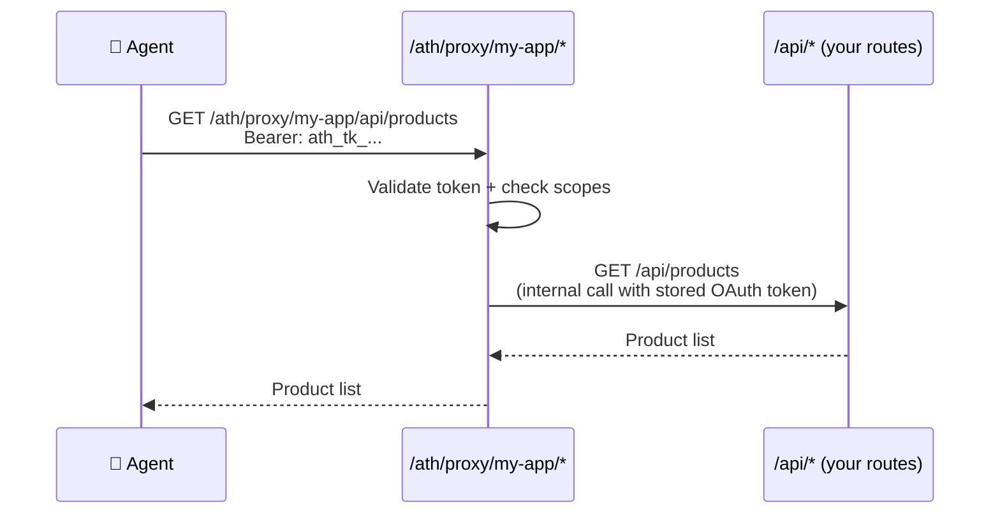

## Before: A Typical Express App

You probably have something like this:

```typescript
// app.ts
import express from "express";
import productRoutes from "./routes/products";
import cartRoutes from "./routes/cart";
import orderRoutes from "./routes/orders";

const app = express();
app.use(express.json());

app.use("/api/products", productRoutes);
app.use("/api/cart", cartRoutes);
app.use("/api/orders", orderRoutes);

app.listen(3000);
```

Users access your API through a web frontend or mobile app, authenticated with your existing session/JWT system.

---

## After: Same App + ATH (the diff)

Here's what you add — **your existing routes don't change at all:**

```diff
  // app.ts
  import express from "express";
  import productRoutes from "./routes/products";
  import cartRoutes from "./routes/cart";
  import orderRoutes from "./routes/orders";
+ import athRoutes from "./routes/ath";

  const app = express();
  app.use(express.json());

+ const BASE_URL = process.env.BASE_URL || "http://localhost:3000";  // your server's URL

+ // ATH Discovery — tells agents what's available
+ app.get("/.well-known/ath-app.json", (req, res) => {
+   res.json({
+     ath_version: "0.1",
+     app_id: "com.my-company.my-app",
+     name: "My App",
+     auth: {
+       type: "oauth2",
+       authorization_endpoint: `${BASE_URL}/oauth/authorize`,
+       token_endpoint: `${BASE_URL}/oauth/token`,
+       scopes_supported: ["products:read", "cart:write", "orders:write"],
+       agent_attestation_required: true,
+     },
+     api_base: `${BASE_URL}/api`,
+   });
+ });

  app.use("/api/products", productRoutes);
  app.use("/api/cart", cartRoutes);
  app.use("/api/orders", orderRoutes);
+ app.use("/ath", athRoutes);  // ATH protocol endpoints

  app.listen(3000);
```

And one new file — `routes/ath.ts` — which is the ~70-line file from the [tutorial](/add-ath-to-your-app/tutorial).

---

## Mapping Your Scopes

The most important decision: **what scopes do you expose?** Map them to what your API actually does:

| Your API Route | HTTP Method | Suggested Scope |
|---------------|:-----------:|----------------|
| `/api/products` | GET | `products:read` |
| `/api/cart` | GET | `cart:read` |
| `/api/cart/add` | POST | `cart:write` |
| `/api/orders` | GET | `orders:read` |
| `/api/orders` | POST | `orders:write` |

Put these in your `availableScopes` array and discovery document:

```typescript
availableScopes: ["products:read", "cart:read", "cart:write", "orders:read", "orders:write"],
```

---

## How the Proxy Connects to Your API

The ATH proxy doesn't replace your API — it sits **in front** of it and forwards authenticated requests:



Your existing auth middleware on `/api/*` still works for browser users. The proxy handles agent auth separately.

---

## File Structure After Integration

```
my-app/
├── routes/
│   ├── products.ts    ← unchanged
│   ├── cart.ts        ← unchanged
│   ├── orders.ts      ← unchanged
│   └── ath.ts         ← NEW (50-70 lines)
├── app.ts             ← +15 lines (discovery + mount)
└── package.json       ← +2 dependencies
```

**Total change: ~85 lines of code, 2 new dependencies.**
