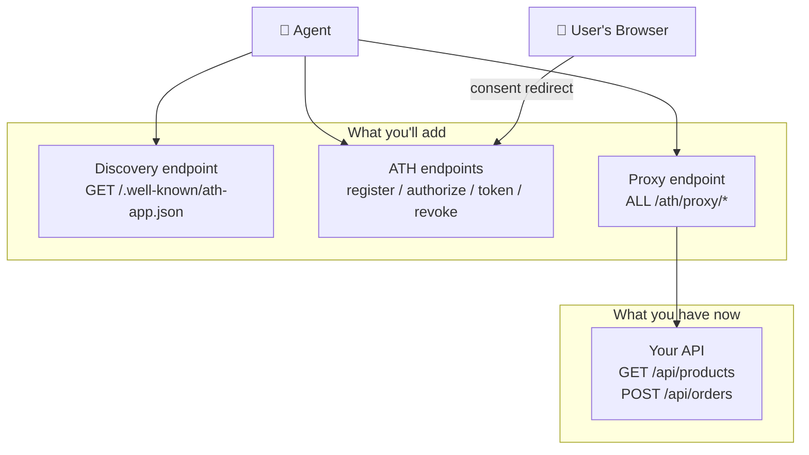
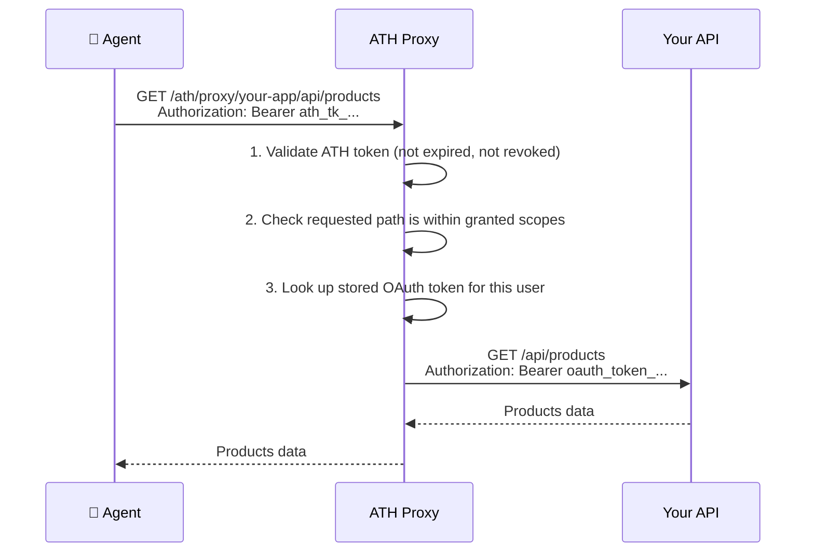
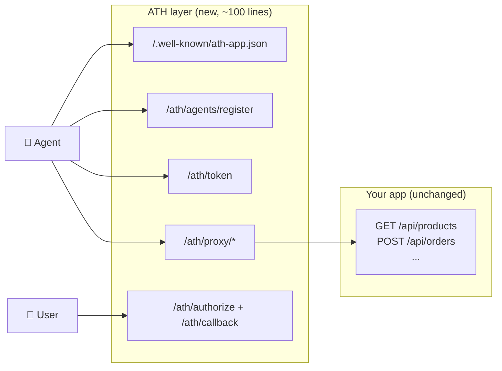

## What We're Building

You have a backend with an API. You want AI agents to call that API — but only with the service's approval and the user's consent. By the end of this tutorial, your app will support the full ATH protocol.



---

## Before You Start

### What you need

| Requirement | Why you need it | Don't have it? |
|-------------|----------------|----------------|
| **A backend with an API** | The thing agents will access | This tutorial uses Express, but any HTTP framework works |
| **An OAuth server** | Agents need user consent, which happens through OAuth. The user sees a consent screen in their browser and clicks "Approve" | Use your existing one (Auth0, Clerk, etc.) or the demo's built-in OAuth server |
| **A callback URL reachable by the user's browser** | After the user clicks "Approve", their browser gets redirected to this URL. It doesn't need to be public on the internet — it just needs to be reachable from wherever the user opens their browser | If your server is on localhost during development, `http://localhost:3000/ath/callback` works fine as long as the user's browser is on the same machine |

<Accordion title="Why does ATH need OAuth?">
ATH doesn't replace OAuth — it adds a layer on top. Here's what each part does:

- **ATH** handles: "Does the service trust this agent?" (registration) and "What's the intersection of permissions?" (scope intersection)
- **OAuth** handles: "Does the user consent?" (consent screen in browser)

When an agent calls your `/ath/authorize` endpoint, your server builds an OAuth authorization URL and sends it back. The agent tells the user "please open this URL." The user's browser goes to your OAuth server, the user sees the consent screen, approves, and the browser gets redirected to `/ath/callback`. 

That's why you need a callback URL reachable by the user's browser.
</Accordion>

<Accordion title="What if I don't have a public URL?">
For **local development**, localhost callback URLs work fine — the user's browser and your server are on the same machine.

For **production** where your app is behind a firewall, you have two options:
1. Expose the `/ath/callback` route through a reverse proxy or tunnel
2. Use **[gateway mode](/setup-gateway/tutorial)** instead — the gateway has the public URL and handles callbacks for you
</Accordion>

### What you don't need

- ❌ Deep security knowledge — the SDK handles JWT signing, PKCE, and token management
- ❌ An agent to test with — we'll use the `athx` CLI tool to simulate one
- ❌ A public internet URL during development — localhost works

---

## Step 1: Install the SDK

```bash
npm install @ath-protocol/server @ath-protocol/types jose
```

`@ath-protocol/server` provides ready-made handlers for all ATH endpoints. You're wiring them to your routes — not implementing the protocol from scratch.

---

## Step 2: Add the Discovery Endpoint

This is a simple JSON file that tells agents: "Here's who I am, what permissions I offer, and where to connect."

```typescript
// In your main app file (e.g., app.ts)
const BASE_URL = process.env.BASE_URL || "http://localhost:3000";

app.get("/.well-known/ath-app.json", (req, res) => {
  res.json({
    ath_version: "0.1",
    app_id: "com.your-company.your-app",
    name: "Your App Name",
    auth: {
      type: "oauth2",
      authorization_endpoint: `${BASE_URL}/oauth/authorize`,
      token_endpoint: `${BASE_URL}/oauth/token`,
      scopes_supported: [
        "products:read",    // what agents can request
        "cart:write",
        "orders:write",
      ],
      agent_attestation_required: true,
    },
    api_base: `${BASE_URL}/api`,
  });
});
```

<Accordion title="What are scopes and how do I choose mine?">
**Scopes** define the specific permissions an agent can request. Map them to what your API actually does:

| Your API Route | Method | Suggested Scope |
|---------------|:------:|----------------|
| `/api/products` | GET | `products:read` |
| `/api/cart/add` | POST | `cart:write` |
| `/api/orders` | POST | `orders:write` |
| `/api/orders` | GET | `orders:read` |

Use the format `resource:action` (e.g., `products:read`, `cart:write`). The user will see these on the consent screen, so make them human-readable.
</Accordion>

---

## Step 3: Create the ATH Route File

Create `routes/ath.ts`. This file wires the SDK's handlers to your Express routes:

```typescript
import { Router } from "express";
import {
  createATHHandlers,
  createProxyHandler,
  InMemoryAgentRegistry,
  InMemoryTokenStore,
  InMemorySessionStore,
  InMemoryProviderTokenStore,
} from "@ath-protocol/server";

const BASE_URL = process.env.BASE_URL || "http://localhost:3000";

// These stores hold agent registrations, sessions, and tokens.
// ⚠️ In-memory = lost on restart. Use a database in production.
const registry = new InMemoryAgentRegistry();
const tokenStore = new InMemoryTokenStore();
const sessionStore = new InMemorySessionStore();
const providerTokenStore = new InMemoryProviderTokenStore();

const handlers = createATHHandlers({
  registry,
  tokenStore,
  sessionStore,
  providerTokenStore,
  config: {
    // audience: who is this server? Agents include this in their identity proof.
    audience: BASE_URL,

    // callbackUrl: where the user's browser goes after approving.
    // Must be reachable from the user's browser.
    callbackUrl: `${BASE_URL}/ath/callback`,

    // The permissions your app offers to agents.
    availableScopes: ["products:read", "cart:write", "orders:write"],

    // A unique identifier for your app.
    appId: "com.your-company.your-app",

    // ⚠️ DEVELOPMENT ONLY: skip cryptographic verification of agent identity.
    // Remove this line in production.
    skipAttestationVerification: true,

    // Your OAuth server's endpoints. This is where the user gets sent
    // to see the consent screen ("Allow this agent to...?").
    oauth: {
      authorize_endpoint: `${BASE_URL}/oauth/authorize`,
      token_endpoint: `${BASE_URL}/oauth/token`,
      client_id: "your-oauth-client-id",
      client_secret: "your-oauth-client-secret",
    },
  },
});

// The proxy forwards authenticated agent requests to your real API.
const proxy = createProxyHandler({
  tokenStore,
  providerTokenStore,
  upstreams: { "your-app": BASE_URL },
});

const router = Router();

// Helper: convert Express request → ATH handler format
function toATH(req) {
  return {
    method: req.method,
    url: `${BASE_URL}/ath${req.originalUrl.replace(/^\/ath/, "")}`,
    headers: req.headers,
    body: req.body,
    query: req.query,
  };
}

// --- ATH Protocol Endpoints ---

// Phase A: Agent registers and requests approval
router.post("/agents/register", async (req, res) => {
  const result = await handlers.register(toATH(req));
  res.status(result.status).json(result.body);
});

// Phase B: Start user consent flow
router.post("/authorize", async (req, res) => {
  const result = await handlers.authorize(toATH(req));
  res.status(result.status).json(result.body);
});

// OAuth callback: user's browser lands here after approving
router.get("/callback", async (req, res) => {
  const result = await handlers.callback(toATH(req));
  if (result.status === 302) return res.redirect(result.headers.Location);
  res.status(result.status).json(result.body);
});

// Token exchange: agent gets its access token
router.post("/token", async (req, res) => {
  const result = await handlers.token(toATH(req));
  res.status(result.status).json(result.body);
});

// Revocation: agent gives up its access
router.post("/revoke", async (req, res) => {
  const result = await handlers.revoke(toATH(req));
  res.status(result.status).json(result.body);
});

// Proxy: agent calls your API through ATH
router.all("/proxy/your-app/*", async (req, res) => {
  const result = await proxy({
    method: req.method,
    path: req.path,
    headers: req.headers,
    query: req.query,
    body: req.body,
  });
  res.status(result.status).json(result.body);
});

export default router;
```

<Accordion title="What does each config field do?">

| Field | What it's for |
|-------|-------------|
| `audience` | Your server's URL. Agents include this in their identity proof (JWT `aud` claim) so the proof can only be used with your server, not replayed elsewhere. |
| `callbackUrl` | Where the user's browser goes after clicking "Approve" on the consent screen. Must be reachable from the user's browser. |
| `availableScopes` | The full list of permissions your app offers. Agents can request a subset. |
| `appId` | A unique identifier for your app (e.g., reverse domain like `com.acme.api`). |
| `skipAttestationVerification` | Skips cryptographic identity checks. **Development only** — remove in production. |
| `oauth.authorize_endpoint` | Your OAuth server's authorization URL. The user's browser is sent here to see the consent screen. |
| `oauth.token_endpoint` | Your OAuth server's token URL. ATH exchanges authorization codes for tokens here (server-side, the agent never sees this). |
| `oauth.client_id` / `client_secret` | Credentials for ATH to act as an OAuth client with your OAuth server. |
</Accordion>

---

## Step 4: Mount the Router

```typescript
import athRoutes from "./routes/ath";

app.use("/ath", athRoutes);
```

---

## Step 5: Connect Your OAuth Server

ATH needs an OAuth server to show the user a consent screen. Your options:

| Situation | What to do |
|-----------|-----------|
| I use **Auth0, Clerk, Firebase Auth**, etc. | Point `oauth.authorize_endpoint` and `oauth.token_endpoint` at your provider. See [Existing OAuth guide](/add-ath-to-your-app/existing-oauth). |
| I have a **custom OAuth server** | Same — point the config at your endpoints |
| I don't have OAuth yet | Use the demo's built-in OAuth server as a starting point, or set up a gateway instead |

### Registering ATH as an OAuth Client

The `oauth.client_id` and `oauth.client_secret` in your ATH config are **credentials for ATH to act as an OAuth client** with your OAuth server. You need to register these with your OAuth provider:

1. **In your OAuth server** (Auth0, Clerk, or your own), create a new "application" or "client"
2. Set the **allowed redirect URI** to `${YOUR_BASE_URL}/ath/callback` (e.g., `http://localhost:3000/ath/callback`)
3. Copy the **client ID** and **client secret** into your ATH config

This is the same process as registering any OAuth client — you're just registering ATH as one more client of your OAuth server.

<Accordion title="Why does ATH need to be an OAuth client?">
When an agent calls `/ath/authorize`, ATH needs to redirect the user to your OAuth server's consent screen. To do this, it acts as an OAuth client — it sends the user to the authorization URL with a `client_id`, `redirect_uri`, and `scope`.

After the user approves, your OAuth server redirects the user's browser to `/ath/callback` with an authorization code. ATH then exchanges this code for an OAuth token **server-side** (using the `client_secret`). This token is stored internally — the agent never sees it.

This is why the `client_id`/`client_secret` in ATH config are for your OAuth server, not for the agent. The agent gets its own separate `client_id`/`client_secret` during ATH registration.
</Accordion>

### How the Proxy Connects to Your API

The proxy endpoint (`/ath/proxy/your-app/*`) sits in front of your existing API. When an agent makes a request:



The proxy **swaps the ATH token for the stored OAuth token** before forwarding to your API. Your existing API auth middleware sees a valid OAuth token and works normally — it doesn't know an agent is involved.

This means:
- Your API routes **don't change at all**
- Your existing auth middleware **keeps working**
- The agent **never sees** the user's OAuth token

---

## Step 6: Test It

Start your app, then simulate an agent with the `athx` CLI:

```bash
npm install -g athx

# 1. Can agents discover your app?
athx discover --mode native --service $YOUR_APP_URL

# 2. Can an agent register?
athx register --mode native --service $YOUR_APP_URL \
  --agent-id https://test-agent.example/.well-known/agent.json \
  --provider your-app --scopes "products:read,cart:write"

# 3. Can an agent start the consent flow?
athx authorize --mode native --service $YOUR_APP_URL \
  --agent-id https://test-agent.example/.well-known/agent.json \
  --provider your-app --scopes "products:read"
# → You'll get an authorization_url. Open it in your browser.
```

Replace `$YOUR_APP_URL` with your server's actual URL (e.g., `http://localhost:3000`).

<Accordion title="What if athx register fails with INVALID_ATTESTATION?">
During development with `skipAttestationVerification: true`, this shouldn't happen. If it does:

- Make sure your server is running and reachable at the URL you specified
- Check that the URL in `--service` matches the `audience` in your ATH config
- Check your server logs for error details
</Accordion>

---

## What You Just Built



Your existing API routes didn't change. You added a **trust layer** in front of them that ensures:
- The agent is registered and approved (**Phase A**)
- The user consented in their browser (**Phase B**)
- The agent only gets the **intersection** of approved scopes

---

## Next Steps

- [Adding ATH to an existing Express app](/add-ath-to-your-app/existing-express-app) — see the exact before/after diff
- [Connecting to your existing OAuth](/add-ath-to-your-app/existing-oauth) — Auth0, Clerk, or custom OAuth configuration
- [Run the full demo](/start-here/run-the-demo) — see it working end-to-end with a real e-commerce app
