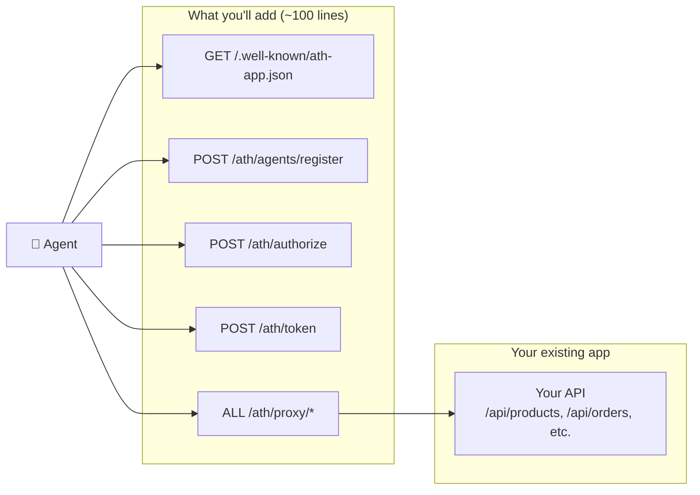
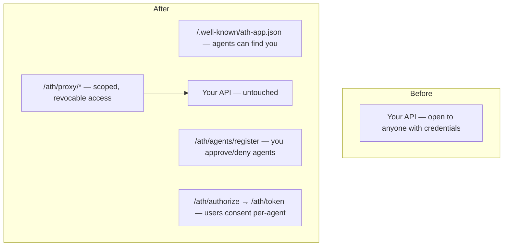

You have a backend with an API. You want AI agents to be able to call that API — but only with user permission and scoped access. This tutorial shows you how, using the demo shop as a working example.

**What you'll build:** The same ATH integration you saw in the demo — discovery, registration, authorization, token exchange, and proxied API access.

**Time:** ~30 minutes of hands-on work.

**Prerequisites:** Node.js 20+, basic familiarity with Express (or any HTTP framework).

---

## The Big Picture

You're adding **5 endpoints** to your app:



The good news: **`@ath-protocol/server` does the heavy lifting.** You're mostly wiring up its handlers to your routes.

---

## Step 1: Install the SDK

```bash
npm install @ath-protocol/server @ath-protocol/types jose
```

---

## Step 2: Create the ATH Route File

Create `routes/ath.ts` (or `routes/ath.js`). Here's the **complete file** from the demo — it's about 50 lines of setup:

```typescript
import { Router } from "express";
import {
  createATHHandlers,
  createProxyHandler,
  InMemoryAgentRegistry,
  InMemoryTokenStore,
  InMemorySessionStore,
  InMemoryProviderTokenStore,
} from "@ath-protocol/server";

const BASE_URL = process.env.BASE_URL || "http://localhost:3000";

// These are the stores that hold agent registrations, sessions, and tokens.
// In production, replace with database-backed implementations.
const registry = new InMemoryAgentRegistry();
const tokenStore = new InMemoryTokenStore();
const sessionStore = new InMemorySessionStore();
const providerTokenStore = new InMemoryProviderTokenStore();

// This one function creates all your ATH endpoint handlers:
const handlers = createATHHandlers({
  registry,
  tokenStore,
  sessionStore,
  providerTokenStore,
  config: {
    audience: BASE_URL,
    callbackUrl: `${BASE_URL}/ath/callback`,
    availableScopes: ["products:read", "cart:write", "orders:write"],
    appId: "com.my-app",
    skipAttestationVerification: true, // ⚠️ Remove in production
    oauth: {
      authorize_endpoint: `${BASE_URL}/oauth/authorize`,
      token_endpoint: `${BASE_URL}/oauth/token`,
      client_id: "ath-internal-client",
      client_secret: "ath-internal-secret",
    },
  },
});

// Proxy forwards agent requests to your real API
const proxy = createProxyHandler({
  tokenStore,
  providerTokenStore,
  upstreams: { "my-app": BASE_URL },
});

const router = Router();

// Helper: convert Express request to ATH handler format
function toATH(req) {
  return {
    method: req.method,
    url: `${BASE_URL}/ath${req.originalUrl.replace(/^\/ath/, "")}`,
    headers: req.headers,
    body: req.body,
    query: req.query,
  };
}

router.post("/agents/register", async (req, res) => {
  const result = await handlers.register(toATH(req));
  res.status(result.status).json(result.body);
});

router.post("/authorize", async (req, res) => {
  const result = await handlers.authorize(toATH(req));
  res.status(result.status).json(result.body);
});

router.get("/callback", async (req, res) => {
  const result = await handlers.callback(toATH(req));
  if (result.status === 302) return res.redirect(result.headers.Location);
  res.status(result.status).json(result.body);
});

router.post("/token", async (req, res) => {
  const result = await handlers.token(toATH(req));
  res.status(result.status).json(result.body);
});

router.post("/revoke", async (req, res) => {
  const result = await handlers.revoke(toATH(req));
  res.status(result.status).json(result.body);
});

router.all("/proxy/my-app/*", async (req, res) => {
  const result = await proxy({
    method: req.method,
    path: req.path,
    headers: req.headers,
    query: req.query,
    body: req.body,
  });
  res.status(result.status).json(result.body);
});

export default router;
```

<Accordion title="What's happening in createATHHandlers?">
This function creates handler objects for each ATH endpoint. Inside it:
- **register** verifies the agent's identity JWT, checks your approval policy, and issues `client_id`/`client_secret`
- **authorize** creates a PKCE-secured OAuth URL for the user to consent
- **callback** handles the OAuth redirect and stores the user's consent
- **token** computes the scope intersection and issues an opaque access token
- **revoke** marks a token as invalid

You don't need to implement any of this yourself — you just wire the handlers to your routes.
</Accordion>

---

## Step 3: Add the Discovery Endpoint

In your main app file, add:

```typescript
app.get("/.well-known/ath-app.json", (req, res) => {
  res.json({
    ath_version: "0.1",
    app_id: "com.my-app",
    name: "My App API",
    auth: {
      type: "oauth2",
      authorization_endpoint: `${BASE_URL}/oauth/authorize`,
      token_endpoint: `${BASE_URL}/oauth/token`,
      scopes_supported: ["products:read", "cart:write", "orders:write"],
      agent_attestation_required: true,
    },
    api_base: `${BASE_URL}/api`,
  });
});
```

This tells agents: "Here's my name, what permissions I support, and how to connect."

---

## Step 4: Mount the ATH Router

```typescript
import athRoutes from "./routes/ath.js";

app.use("/ath", athRoutes);
```

---

## Step 5: You Need an OAuth Server

ATH uses OAuth for user consent. The demo includes a **built-in OAuth server** (`server/src/routes/oauth.ts`). Your options:

| Option | When to use |
|--------|------------|
| **Use the demo's OAuth server** | Learning / prototyping |
| **Use your existing OAuth (Auth0, Clerk, etc.)** | You already have one → see [Existing OAuth guide](/add-ath-to-your-app/existing-oauth) |
| **Build a minimal one** | You want full control |

For this tutorial, we're using the demo's built-in OAuth. In production, you'd likely point `oauth.authorize_endpoint` and `oauth.token_endpoint` at your existing provider.

---

## Step 6: Test It

Start your app, then test with the athx CLI:

```bash
npm install -g athx

# Discover
athx discover --mode native --service http://localhost:3000

# Register an agent
athx register --mode native --service http://localhost:3000 \
  --agent-id https://my-agent.example/.well-known/agent.json \
  --provider my-app --scopes "products:read,cart:write"

# Start authorization
athx authorize --mode native --service http://localhost:3000 \
  --agent-id https://my-agent.example/.well-known/agent.json \
  --provider my-app --scopes "products:read"
```

You should see the discovery document, a successful registration, and an authorization URL.

---

## What You Just Built



Your existing API routes didn't change. You just added a **trust layer** in front of them.

---

## Next Steps

<CardGroup cols={2}>
  <Card title="I have an Express app" icon="node-js" href="/add-ath-to-your-app/existing-express-app">
    See the exact diff to add ATH to a real Express app
  </Card>
  <Card title="I already have OAuth" icon="lock" href="/add-ath-to-your-app/existing-oauth">
    Point ATH at your existing Auth0/Clerk/custom OAuth
  </Card>
</CardGroup>
