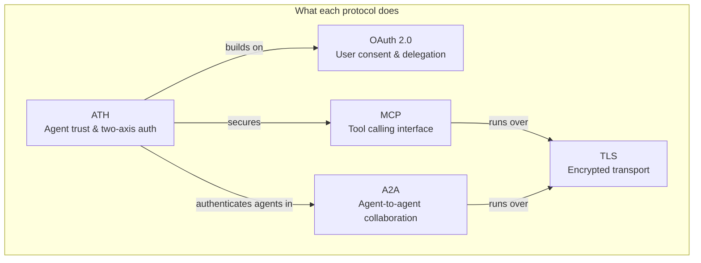
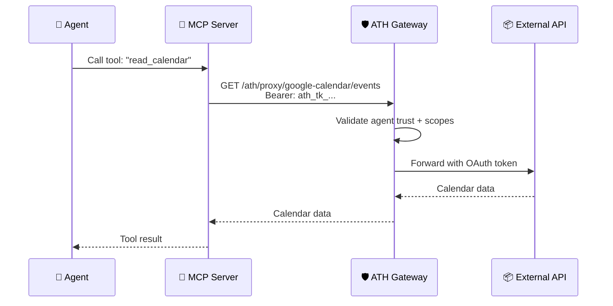
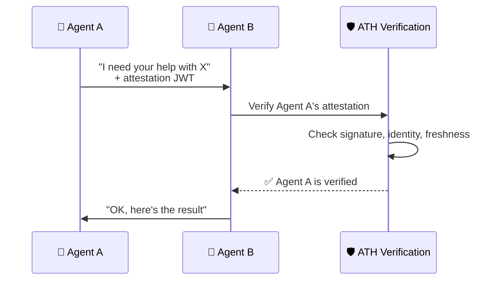

## Protocol Comparison

## Feature Matrix

| Feature | OAuth 2.0 | ATH | MCP | A2A |
|---------|:---------:|:---:|:---:|:---:|
| **User consent** | ✅ | ✅ (via OAuth) | ❌ | ❌ |
| **Service approval of agent** | ❌ | ✅ | ❌ | ❌ |
| **Agent identity verification** | ❌ | ✅ | ❌ | ❌ |
| **Scope intersection** | ❌ | ✅ | ❌ | ❌ |
| **Tool calling** | ❌ | ❌ | ✅ | ❌ |
| **Agent collaboration** | ❌ | ❌ | ❌ | ✅ |
| **Token management** | ✅ | ✅ | ❌ | ❌ |
| **PKCE** | Optional | Required | N/A | N/A |

## When to Use Each

| Scenario | Protocol |
|----------|---------|
| Human user authorizes an app | **OAuth 2.0** alone is sufficient |
| AI agent needs to access user data on external service | **ATH** (includes OAuth for user consent) |
| Agent needs to call tools on an LLM platform | **MCP** (ATH can secure the connection) |
| Two agents need to collaborate | **A2A** (ATH can authenticate the agents) |
| Agent needs secure access to multiple services | **ATH Gateway** mode |

## ATH + MCP

MCP defines **how** an agent calls tools. ATH defines **whether** the agent is allowed to call them. Together:

## ATH + A2A

When agents collaborate, ATH can verify that each agent is who it claims to be:

## Summary

**ATH does not replace any of these protocols.** It fills the **trust gap** that exists when AI agents interact with services. Use ATH alongside OAuth, MCP, and A2A for a complete, secure agent ecosystem.
