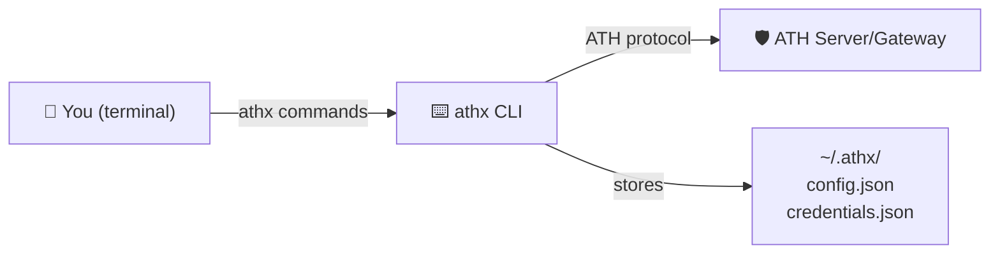

## Install

```bash
npm install -g athx
```

## How athx Fits In



athx is a command-line client for the ATH protocol. It handles key management, attestation signing, credential storage, and all HTTP communication. Each command maps to one step in the ATH flow.

## Configuration

```bash
athx config init                              # creates ~/.athx/
athx config set-gateway prod https://gw.example.com  # save a named gateway
athx config set agent-id https://your-agent.com/.well-known/agent.json
athx config set key-path ./private-key.pem    # optional persistent key
```

---

## Full Flow (Gateway Mode)

```bash
athx discover -g prod
athx register -g prod --provider github --scopes "read:user,repo"
athx authorize -g prod --provider github --scopes "read:user"
# → User visits URL and approves
athx token -g prod --code <code> --session <session_id>
athx proxy -g prod github GET /user
athx proxy -g prod github GET /user/repos
athx revoke -g prod --provider github
```

## Full Flow (Native Mode)

```bash
athx discover --mode native --service https://service.example.com
athx register --mode native --service https://service.example.com --provider default --scopes "read,write"
athx authorize --mode native --service https://service.example.com --provider default --scopes "read"
athx token --mode native --service https://service.example.com --code <code> --session <session_id>
athx proxy --mode native --service https://service.example.com default GET /data
```

---

## Command Reference

| Command | What it does |
|---------|-------------|
| `discover` | Fetch discovery document |
| `register` | Register agent (Phase A) |
| `authorize` | Get authorization URL (Phase B) |
| `token` | Exchange code+session for token |
| `proxy <provider> <method> <path>` | Call API with token |
| `revoke` | Revoke current token |
| `status` | Show saved credentials/tokens |
| `config init/show/set/set-gateway` | Manage configuration |

## Common Flags

| Flag | Description |
|------|-------------|
| `-g, --gateway <url or name>` | Gateway URL or saved name |
| `-m, --mode <gateway\|native>` | Deployment mode (default: gateway) |
| `-s, --service <url>` | Service URL (native mode) |
| `--agent-id <uri>` | Override agent identity |
| `--key <path>` | Path to ES256 PEM key |
| `--format <text\|json>` | Output format |
| `--provider <id>` | Provider to target |
| `--scopes <list>` | Comma-separated scopes |
| `--body <json>` | JSON body for POST/PUT |

---

## Scripting

Use `--format json` for machine-readable output:

```bash
# Get repos as JSON, pipe to jq
athx proxy -g prod github GET /user/repos --format json | jq '.[].full_name'

# Use in a loop
for repo in $(athx proxy -g prod github GET /user/repos --format json | jq -r '.[].full_name'); do
  echo "Issues in $repo:"
  athx proxy -g prod github GET "/repos/$repo/issues?state=open" --format json | jq length
done
```

---

## Where Credentials Are Stored

| File | Contents |
|------|----------|
| `~/.athx/config.json` | Gateway names, agent ID, key path |
| `~/.athx/credentials.json` | `client_id`/`secret` and tokens per gateway |

Credentials persist across runs. Use `athx status -g <gateway>` to check what's stored.
