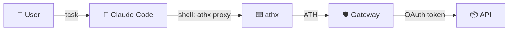

## How It Works

Claude Code can run shell commands. The athx CLI handles the ATH protocol. Together, Claude can access user-authorized APIs securely.



---

## Setup (One-Time)

Before a Claude Code session, pre-authorize access:

```bash
# Configure athx
athx config init
athx config set-gateway prod https://your-gateway.com
athx config set agent-id https://claude-agent.example/.well-known/agent.json
athx config set key-path ./keys/claude-agent.pem

# Register and get user consent
athx register -g prod --provider github --scopes "read:user,repo"
athx authorize -g prod --provider github --scopes "read:user,repo"
# → User visits URL, approves
athx token -g prod --code <code> --session <session_id>
```

Now `~/.athx/credentials.json` has a valid token. Claude Code can use it.

---

## Claude Code Usage

Once authorized, Claude Code can call `athx proxy` in any shell command:

```bash
# Claude runs these as part of its reasoning:
athx proxy -g prod github GET /user --format json
athx proxy -g prod github GET /repos/owner/repo/issues --format json
athx proxy -g prod github POST /repos/owner/repo/issues --body '{"title":"Bug fix","body":"..."}'
```

### Example Prompt

> "Look at the open issues in ath-protocol/demo and summarize the bugs."

Claude executes:
```bash
athx proxy -g prod github GET /repos/ath-protocol/demo/issues?state=open&labels=bug --format json
```

Gets the JSON, reasons about it, and gives you a summary.

---

## Security Model

| Property | How it works |
|----------|-------------|
| **Scoped** | Claude can only access scopes the user approved |
| **Time-limited** | Token expires (default: 1 hour) |
| **Revocable** | `athx revoke -g prod --provider github` |
| **No raw tokens** | Claude never sees GitHub/Google OAuth tokens |
| **Auditable** | All requests go through the gateway |

---

## Checking Token Status

```bash
athx status -g prod
```

If the token is expired, Claude (or a wrapper script) would need to re-authorize — which requires user interaction.
