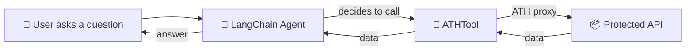

## The Idea

Your LangChain agent reasons about a task. When it needs external data, it calls an **ATHTool** — which makes the API call through ATH with proper user authorization.



---

## ATHTool Implementation

```python
"""ATHTool — wrap an ATH-proxied API as a LangChain tool."""

import json
from typing import Optional, Type
from pydantic import BaseModel, Field
from langchain_core.tools import BaseTool
from ath import ATHGatewayClient, ATHError


class ATHToolInput(BaseModel):
    method: str = Field(description="HTTP method: GET, POST, PUT, DELETE")
    path: str = Field(description="API path, e.g. /user/repos")
    body: Optional[str] = Field(default=None, description="JSON body for POST/PUT")


class ATHTool(BaseTool):
    """Call an API through ATH gateway with user-consented access."""

    name: str = "ath_api"
    description: str = "Call an external API securely through ATH."
    args_schema: Type[BaseModel] = ATHToolInput
    client: ATHGatewayClient
    provider: str

    class Config:
        arbitrary_types_allowed = True

    def _run(self, method: str, path: str, body: Optional[str] = None, **kwargs) -> str:
        try:
            parsed = json.loads(body) if body else None
            result = self.client.proxy(self.provider, method.upper(), path, body=parsed)
            return json.dumps(result, indent=2) if isinstance(result, dict) else str(result)
        except ATHError as e:
            return json.dumps({"error": e.code, "message": e.message})
```

---

## Using It With the Demo

```python
from ath import ATHGatewayClient
from langchain_openai import ChatOpenAI
from langchain.agents import AgentExecutor, create_tool_calling_agent
from langchain_core.prompts import ChatPromptTemplate

# Set up ATH client (assumes registration + token already done)
client = ATHGatewayClient(url="http://gateway.ath.local:4001", agent_id=..., private_key=pem)
client.load_credentials("creds.json")
client.set_token("ath_tk_...")

# Create tool
shop_tool = ATHTool(
    name="shop_api",
    description="Access ATH Shop: GET /products, POST /cart/add, POST /orders, GET /orders",
    client=client,
    provider="ath-shop",
)

# Create agent
llm = ChatOpenAI(model="gpt-4o")
prompt = ChatPromptTemplate.from_messages([
    ("system", "You help users shop. Use shop_api to browse and buy products."),
    ("human", "{input}"),
    ("placeholder", "{agent_scratchpad}"),
])
agent = create_tool_calling_agent(llm, [shop_tool], prompt)
executor = AgentExecutor(agent=agent, tools=[shop_tool])

# Run
result = executor.invoke({"input": "Find me a laptop under $1000 and add it to my cart"})
print(result["output"])
```

---

## What Makes This Secure

The LangChain agent can only access what was **approved at registration** AND **consented by the user**. If it tries to access a scope it doesn't have:

```python
# Agent tries to access orders but only has products:read
result = client.proxy("ath-shop", "GET", "/orders")
# → ATHError(code="SCOPE_NOT_APPROVED")
```

The agent cannot escalate its own permissions.
