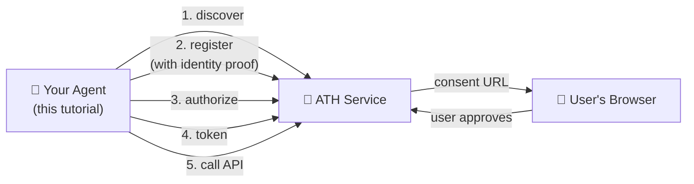
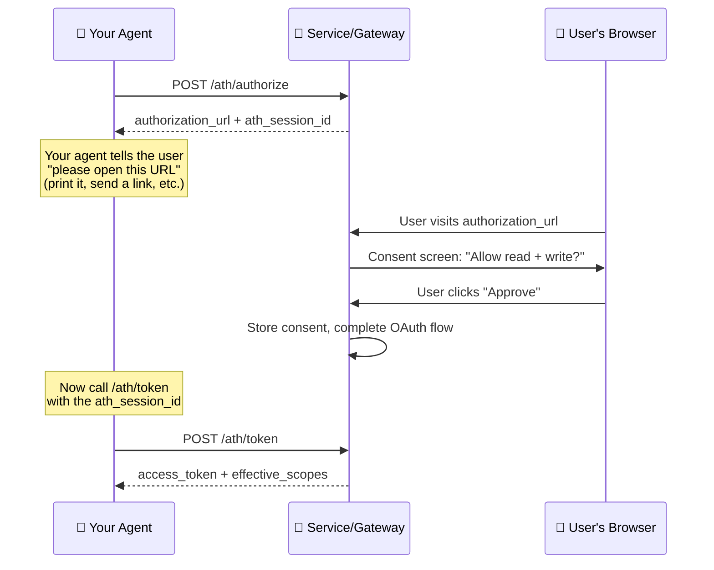

## What We're Building

An agent that connects to an ATH-protected service, proves its identity, gets user approval, and calls the service's API.



---

## Before You Start

### What you need

| Requirement | Why | Details |
|-------------|-----|---------|
| **An ATH-protected service to connect to** | Your agent needs something to talk to | Use the [demo](/start-here/run-the-demo), or any ATH-enabled service/gateway |
| **Node.js 20+ or Python 3.10+** | To run the SDK | Or use the `athx` CLI (Node.js only) |
| **An ES256 key pair** | To prove your agent's identity. Every ATH request includes a signed proof ("I am this agent") created with your private key. | The SDK can generate one for you. See Step 1 below. |

### What about `agentId` — do I need a public URL?

The `agentId` is a URL that points to your agent's **identity document** — a JSON file containing your agent's name, developer info, and public key. In production, the server fetches this URL to get your public key and verify your identity proofs.

| Scenario | Do you need a hosted `agentId`? | What to do |
|----------|:------------------------------:|------------|
| **Development** (server has `skipAttestationVerification`) | No | Use any URL as a placeholder. The server won't actually fetch it. |
| **Gateway mode** (production) | Depends on gateway config | Many gateways trust registered agents without fetching the identity document. |
| **Native mode** (production) | Yes | Host `agent.json` at a URL the server can reach. See Step 1. |

---

## Step 1: Set Up Your Agent Identity

Every agent in ATH has an **identity** — a key pair and a document that ties them together. Think of it like an ID card: the document is the card, and the private key proves you're the person on the card.

### Generate an ES256 Key Pair

<Tabs>
  <Tab title="TypeScript">
    ```typescript
    import { generateKeyPair, exportJWK, exportPKCS8 } from "jose";
    import fs from "fs";

    // Generate a key pair
    const { publicKey, privateKey } = await generateKeyPair("ES256", {
      extractable: true,
    });

    // Save the private key (keep this secret!)
    const privatePem = await exportPKCS8(privateKey);
    fs.writeFileSync("agent-private.pem", privatePem);

    // Export the public key as JWK (this goes in your identity document)
    const publicJwk = await exportJWK(publicKey);
    publicJwk.kid = "default";
    publicJwk.alg = "ES256";
    console.log("Public JWK:", JSON.stringify(publicJwk, null, 2));
    ```
  </Tab>
  <Tab title="Python">
    ```python
    from cryptography.hazmat.primitives.asymmetric import ec
    from cryptography.hazmat.primitives import serialization
    import json

    # Generate a key pair
    private_key = ec.generate_private_key(ec.SECP256R1())

    # Save the private key (keep this secret!)
    pem = private_key.private_bytes(
        serialization.Encoding.PEM,
        serialization.PrivateFormat.PKCS8,
        serialization.NoEncryption(),
    )
    with open("agent-private.pem", "wb") as f:
        f.write(pem)

    # The PEM string is what you pass to the SDK
    pem_str = pem.decode()
    print("Private key saved to agent-private.pem")
    ```
  </Tab>
  <Tab title="OpenSSL (any language)">
    ```bash
    # Generate private key
    openssl ecparam -genkey -name prime256v1 -noout -out agent-private.pem

    # Extract public key (for your identity document)
    openssl ec -in agent-private.pem -pubout -out agent-public.pem
    ```
  </Tab>
</Tabs>

<Accordion title="What is ES256?">
ES256 is a digital signature algorithm using the P-256 elliptic curve. It creates two keys:
- **Private key** — kept secret by your agent. Used to sign identity proofs.
- **Public key** — shared openly. Used by servers to verify your proofs.

You don't need to understand the cryptography. Just know: private key = secret, public key = shareable, and the SDK handles all the signing automatically.
</Accordion>

### Create Your Identity Document

This JSON file tells servers who your agent is and how to verify its identity:

```json
{
  "ath_version": "0.1",
  "agent_id": "https://your-agent.com/.well-known/agent.json",
  "name": "My Shopping Agent",
  "developer": {
    "name": "Your Company",
    "id": "your-company",
    "contact": "dev@your-company.com"
  },
  "capabilities": ["product-browsing", "order-placement"],
  "public_key": {
    "kty": "EC",
    "crv": "P-256",
    "x": "... from your exported JWK ...",
    "y": "... from your exported JWK ...",
    "kid": "default",
    "alg": "ES256"
  }
}
```

| Field | What it's for |
|-------|-------------|
| `agent_id` | The URL where this document is hosted. Servers fetch this URL to get your public key. |
| `name` | Human-readable name shown to users on consent screens |
| `developer` | Who built this agent — helps service operators evaluate trust |
| `capabilities` | What this agent does — informational, not enforced |
| `public_key` | Your public key in JWK format. Servers use this to verify your identity proofs. |

### Host the Identity Document (Production Only)

In production, host this JSON file at the URL specified in `agent_id`. For example, if your `agent_id` is `https://your-agent.com/.well-known/agent.json`, the file must be fetchable at that URL.

The demo includes a minimal identity server (`agent/server.ts`) that does this — it's just an Express server with one route.

<Accordion title="I'm in development — do I need to host this?">
**No.** If the server you're connecting to has `skipAttestationVerification: true` (like the demo), it won't fetch your identity document. You still need to provide an `agentId` string when creating the client, but it can be any URL — the server just stores it as a label, without fetching it.

In gateway mode, many gateways also skip or cache identity verification, so you may not need a reachable URL even in production. Check with your gateway operator.
</Accordion>

---

## Step 2: Connect to a Service

Now use your key pair to create an ATH client and walk through the protocol.

### What the SDK Does For You

When you call `register()`, `authorize()`, or `exchangeToken()`, the SDK automatically:
1. Creates a fresh **attestation JWT** (identity proof) containing your `agentId`, a timestamp, and a unique ID
2. Signs it with your **private key**
3. Includes it in the HTTP request to the server

The server receives the JWT, fetches your public key from your `agent_id` URL (or skips this in development), and verifies the signature. If it matches, the server knows the request really came from your agent.

You never need to build or sign JWTs yourself — the SDK handles it all.

### The Full Flow

<Tabs>
  <Tab title="TypeScript SDK">
    ```bash
    npm install @ath-protocol/client jose
    ```

    ```typescript
    import { ATHGatewayClient } from "@ath-protocol/client";
    import { importPKCS8 } from "jose";
    import fs from "fs";

    // Load your persistent private key (or generate ephemeral for dev)
    const pem = fs.readFileSync("agent-private.pem", "utf-8");
    const privateKey = await importPKCS8(pem, "ES256");

    const client = new ATHGatewayClient({
      url: "https://your-gateway.com",
      agentId: "https://your-agent.com/.well-known/agent.json",
      privateKey,
      keyId: "default",  // must match the "kid" in your identity document
    });

    // 1. DISCOVER — what providers and scopes are available?
    const discovery = await client.discover();
    console.log("Providers:");
    for (const p of discovery.supported_providers) {
      console.log(`  ${p.provider_id}: ${p.available_scopes.join(", ")}`);
    }

    // 2. REGISTER — "I'm an agent, may I access this provider?"
    //    The SDK automatically signs an attestation JWT with your private key.
    const reg = await client.register({
      developer: { name: "My Company", id: "my-company" },
      providers: [{ provider_id: "my-provider", scopes: ["read", "write"] }],
      purpose: "AI shopping assistant",
    });
    console.log("Agent status:", reg.agent_status);
    // reg.client_id and reg.client_secret are stored internally by the SDK

    // 3. AUTHORIZE — "Please ask the user to approve me"
    //    Returns a URL for the user to visit in their browser.
    const auth = await client.authorize("my-provider", ["read", "write"]);
    console.log("Send the user to this URL:", auth.authorization_url);
    console.log("Session ID (save this!):", auth.ath_session_id);

    // ⏳ WAIT — the user opens the URL in their browser, sees a consent
    //    screen listing the permissions, and clicks "Approve".
    //    The session expires after 10 minutes if the user doesn't act.

    // 4. TOKEN — "The user approved, give me my access token"
    const token = await client.exchangeToken("auth-code", auth.ath_session_id);
    console.log("Access token:", token.access_token);
    console.log("Granted scopes:", token.effective_scopes);
    console.log("Scope breakdown:", token.scope_intersection);
    // {
    //   agent_approved: ["read", "write"],   ← what the service approved
    //   user_consented: ["read", "write"],   ← what the user approved
    //   effective: ["read", "write"]         ← the intersection (what you got)
    // }

    // 5. USE THE API — call endpoints through the ATH proxy
    const products = await client.proxy("my-provider", "GET", "/products");
    console.log("Products:", products);

    // POST requests with a body:
    await client.proxy("my-provider", "POST", "/cart/add", {
      productId: "prod-123",
      quantity: 2,
    });

    // 6. REVOKE — clean up when done (token also expires naturally)
    await client.revoke();
    console.log("Token revoked. Done!");
    ```
  </Tab>
  <Tab title="Python SDK">
    ```bash
    pip install ath-sdk cryptography
    ```

    ```python
    from ath import ATHGatewayClient

    # Load your private key
    with open("agent-private.pem") as f:
        pem = f.read()

    with ATHGatewayClient(
        url="https://your-gateway.com",
        agent_id="https://your-agent.com/.well-known/agent.json",
        private_key=pem,
        key_id="default",
    ) as client:

        # 1. DISCOVER
        discovery = client.discover()
        for p in discovery.supported_providers:
            print(f"  {p.provider_id}: {p.available_scopes}")

        # 2. REGISTER — SDK signs attestation JWT automatically
        reg = client.register(
            developer={"name": "My Company", "id": "my-company"},
            providers=[{"provider_id": "my-provider", "scopes": ["read", "write"]}],
            purpose="AI shopping assistant",
        )
        print(f"Agent status: {reg.agent_status}")

        # 3. AUTHORIZE — get URL for user consent
        auth = client.authorize("my-provider", ["read", "write"])
        print(f"Send user to: {auth.authorization_url}")
        print(f"Session ID: {auth.ath_session_id}")

        # ⏳ WAIT for user to approve in browser (10 min timeout)

        # 4. TOKEN
        token = client.exchange_token("auth-code", auth.ath_session_id)
        print(f"Granted scopes: {token.effective_scopes}")

        # 5. USE THE API
        products = client.proxy("my-provider", "GET", "/products")
        print(f"Products: {products}")

        client.proxy("my-provider", "POST", "/cart/add", {
            "productId": "prod-123", "quantity": 2,
        })

        # 6. REVOKE
        client.revoke()

        # Save credentials for next session (avoids re-registration)
        client.save_credentials("my-agent-creds.json")
    ```
  </Tab>
  <Tab title="athx CLI">
    ```bash
    npm install -g athx

    # Configure (one-time)
    athx config init
    athx config set-gateway my-gw https://your-gateway.com
    athx config set agent-id https://your-agent.com/.well-known/agent.json
    athx config set key-path ./agent-private.pem  # your ES256 private key
    ```

    ```bash
    GATEWAY="my-gw"

    # 1. DISCOVER
    athx discover -g $GATEWAY

    # 2. REGISTER
    athx register -g $GATEWAY --provider my-provider --scopes "read,write"

    # 3. AUTHORIZE — prints a URL for the user to visit
    athx authorize -g $GATEWAY --provider my-provider --scopes "read,write"
    # Output:
    #   Session: ath_sess_abc123
    #   Please visit: https://...
    # → Open that URL in your browser, log in, click Approve

    # 4. TOKEN — after the user approved
    athx token -g $GATEWAY --code AUTH_CODE --session ath_sess_abc123

    # 5. USE THE API
    athx proxy my-provider GET /products -g $GATEWAY
    athx proxy my-provider POST /cart/add -g $GATEWAY \
      --body '{"productId":"prod-123","quantity":2}'

    # 6. REVOKE
    athx revoke -g $GATEWAY --provider my-provider
    ```

    If you don't configure `--key-path`, athx generates an **ephemeral key** each run. This works for development (with `skipAttestationVerification`) but means your identity changes every restart.
  </Tab>
</Tabs>

---

## Understanding Key Concepts

### The Attestation JWT (Identity Proof)

Every time the SDK calls register, authorize, or token, it creates and signs a JWT that looks like this:

```json
{
  "iss": "https://your-agent.com",
  "sub": "https://your-agent.com/.well-known/agent.json",
  "aud": "https://your-gateway.com",
  "iat": 1714500000,
  "exp": 1714503600,
  "jti": "unique-random-id-12345"
}
```

| Field | What it says |
|-------|-------------|
| `iss` | "I was created by the agent at this domain" |
| `sub` | "My identity document is at this URL" |
| `aud` | "I'm talking to this specific server" (prevents the proof from being replayed to a different server) |
| `iat` | "I created this proof at this time" (must be within 5 minutes of server time) |
| `exp` | "This proof expires at this time" |
| `jti` | "This is a unique proof" (prevents the same proof from being used twice) |

**You never build this yourself.** The SDK constructs and signs it automatically. But understanding what's inside helps you debug errors like `INVALID_ATTESTATION`.

### The User Consent Step

Step 3 (Authorize) returns a URL. This is the most confusing part for beginners, so here's exactly what happens:



Key points:
- **Your agent doesn't handle the OAuth redirect.** The service/gateway handles the callback.
- **Your agent just waits.** After getting the `authorization_url`, show it to the user and wait.
- **The session expires in 10 minutes.** If the user doesn't approve in time, call `authorize` again.
- **You pass the `ath_session_id` to token exchange** — this is how the server knows which consent to match with your token request.

### Gateway Mode vs Native Mode

| | Gateway | Native |
|-|---------|--------|
| **Connect to** | `ATHGatewayClient` / `--gateway` | `ATHNativeClient` / `--mode native` |
| **API calls via** | `proxy(provider, method, path)` | `api(method, path)` |
| **Agent needs public URL?** | No (in most configs) | Yes (production with verification) |
| **Use when** | Connecting through a gateway to external services | Connecting directly to an ATH-native service |

---

## Common Errors and What They Mean

| Error | Most likely cause | Fix |
|-------|------------------|-----|
| `INVALID_ATTESTATION` | Attestation JWT is expired, has wrong audience, or was already used | The SDK creates fresh JWTs automatically — check that your system clock is accurate and that the server URL matches your config |
| `AGENT_NOT_REGISTERED` | You called authorize or token before register | Call `register()` first |
| `SCOPE_NOT_APPROVED` | You requested scopes the service didn't approve | Check `reg.approved_providers` to see what was actually approved |
| `SESSION_EXPIRED` | More than 10 minutes passed between authorize and token | Call `authorize()` again to get a fresh session |
| `TOKEN_EXPIRED` | Token's `expires_in` has elapsed (default: 1 hour) | Call `authorize()` → user approves → `exchangeToken()` again |
| `PROVIDER_MISMATCH` | Token was issued for a different provider | Each token works for exactly one provider |

---

## Try It With the Demo

Run the [ATH Demo](/start-here/run-the-demo) to test against a real e-commerce service:

```bash
git clone https://github.com/ath-protocol/demo.git
cd demo && cd demo/native
docker compose up --build
```

Then point your agent at the demo and follow the steps above.

---

## Next Steps

- [TypeScript SDK reference](/build-an-agent/typescript-sdk) — full API, error handling patterns
- [Python SDK reference](/build-an-agent/python-sdk) — sync/async, credential persistence
- [athx CLI reference](/build-an-agent/athx-cli) — all commands, scripting with JSON output
- [LangChain integration](/build-an-agent/langchain) — wrap ATH APIs as LangChain tools
- [Claude Code integration](/build-an-agent/claude-code) — use athx from Claude Code agents
