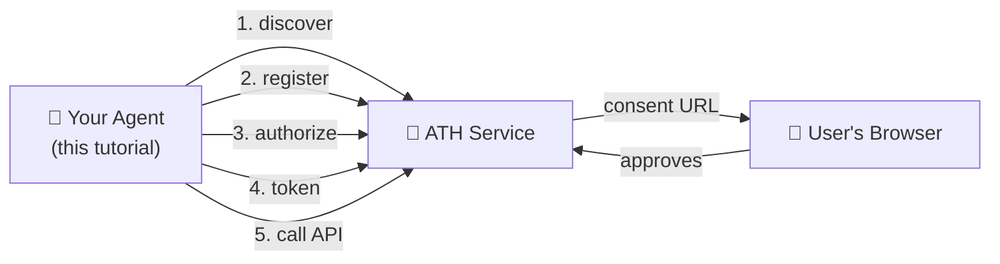
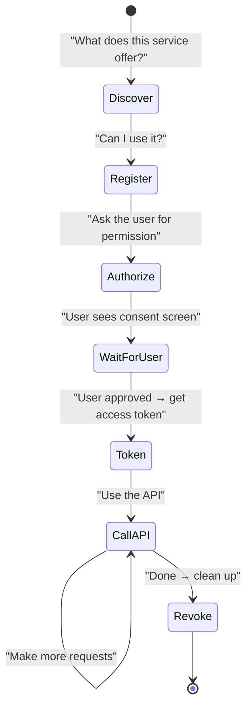
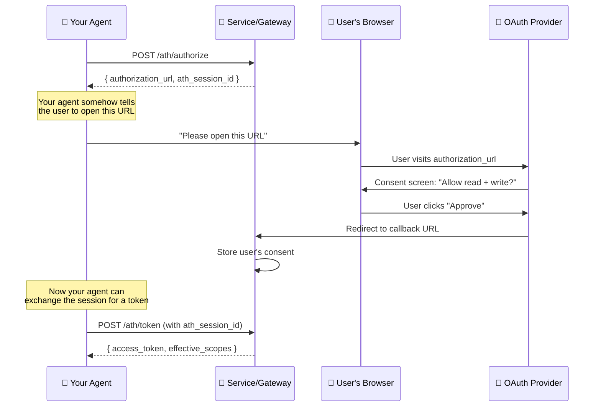

## What We're Building

An agent that connects to an ATH-protected service, gets user approval, and calls the service's API. We'll use the demo shop as the target service.



---

## Before You Start

### What you need

| Requirement | Why you need it | Details |
|-------------|----------------|---------|
| **An ATH-protected service to connect to** | Your agent needs something to talk to | Use the [demo](/start-here/run-the-demo), or any ATH-enabled service |
| **Node.js 20+ or Python 3.10+** | To run the SDK | Or use the `athx` CLI (Node.js only) |

### What you don't need (in most cases)

| You might think you need... | Reality |
|----------------------------|---------|
| A public URL for your agent | **Not in gateway mode.** The agent connects outward to the gateway — it doesn't receive inbound connections. In native mode with attestation verification enabled, the server does need to fetch your agent's identity document — but you can skip this in development. |
| To understand JWT or PKCE | **The SDK handles it.** You call `register()` and the SDK signs the attestation JWT automatically. You call `authorize()` and the SDK generates the PKCE challenge automatically. |
| An OAuth server | **No.** The service (or gateway) has the OAuth server. You're the client. |

### Gateway mode vs Native mode — which should I use?

| Your situation | Use |
|---------------|-----|
| The service has `/.well-known/ath-app.json` and you're connecting directly | **Native mode** — `ATHNativeClient` / `--mode native` |
| You're going through a gateway that has `/.well-known/ath.json` | **Gateway mode** — `ATHGatewayClient` / `--gateway URL` |
| You're not sure | **Gateway mode** — it's simpler and your agent doesn't need a public identity URL |

---

## The Flow

Every ATH agent interaction follows this sequence:



Pick your language:

<Tabs>
  <Tab title="TypeScript SDK">
    **Install:**
    ```bash
    npm install @ath-protocol/client jose
    ```

    **Gateway mode** (connecting through a gateway):
    ```typescript
    import { ATHGatewayClient } from "@ath-protocol/client";
    import { generateKeyPair } from "jose";

    // Generate an identity key pair.
    // In production, load a persistent key from disk instead.
    const { privateKey } = await generateKeyPair("ES256");

    const client = new ATHGatewayClient({
      url: "https://your-gateway.com",          // gateway URL
      agentId: "https://your-agent.com/.well-known/agent.json",
      privateKey,
    });

    // 1. Discover — what providers are available?
    const discovery = await client.discover();
    console.log("Providers:", discovery.supported_providers.map(p => p.provider_id));

    // 2. Register — request access to a provider
    const reg = await client.register({
      developer: { name: "My Company", id: "my-company" },
      providers: [{ provider_id: "my-provider", scopes: ["read", "write"] }],
      purpose: "AI assistant",
    });
    console.log("Status:", reg.agent_status);  // "approved"

    // 3. Authorize — get a URL for the user to approve
    const auth = await client.authorize("my-provider", ["read", "write"]);
    console.log("Send user to:", auth.authorization_url);
    console.log("Session ID:", auth.ath_session_id);  // save this!

    // 4. Token — after the user approves in their browser
    const token = await client.exchangeToken("auth-code", auth.ath_session_id);
    console.log("Token:", token.access_token);
    console.log("Effective scopes:", token.effective_scopes);

    // 5. Call the API
    const data = await client.proxy("my-provider", "GET", "/some-endpoint");
    console.log("Response:", data);

    // 6. Revoke when done
    await client.revoke();
    ```

    **Native mode** (connecting directly to a service):
    ```typescript
    import { ATHNativeClient } from "@ath-protocol/client";

    const client = new ATHNativeClient({
      url: "https://your-service.com",           // service URL (not gateway)
      agentId: "https://your-agent.com/.well-known/agent.json",
      privateKey,
    });

    await client.discover();  // fetches /.well-known/ath-app.json
    // ... register, authorize, token same as above ...

    // Use api() instead of proxy() — calls the service directly at {api_base}/{path}
    const data = await client.api("GET", "/some-endpoint");
    ```
  </Tab>
  <Tab title="Python SDK">
    **Install:**
    ```bash
    pip install ath-sdk
    ```

    **Gateway mode:**
    ```python
    from ath import ATHGatewayClient
    from cryptography.hazmat.primitives.asymmetric import ec
    from cryptography.hazmat.primitives import serialization

    # Generate an identity key pair.
    key = ec.generate_private_key(ec.SECP256R1())
    pem = key.private_bytes(
        serialization.Encoding.PEM,
        serialization.PrivateFormat.PKCS8,
        serialization.NoEncryption(),
    ).decode()

    with ATHGatewayClient(
        url="https://your-gateway.com",
        agent_id="https://your-agent.com/.well-known/agent.json",
        private_key=pem,
    ) as client:
        # 1. Discover
        discovery = client.discover()
        for p in discovery.supported_providers:
            print(f"  {p.provider_id}: {p.available_scopes}")

        # 2. Register
        reg = client.register(
            developer={"name": "My Company", "id": "my-company"},
            providers=[{"provider_id": "my-provider", "scopes": ["read", "write"]}],
            purpose="AI assistant",
        )
        print("Status:", reg.agent_status)

        # 3. Authorize
        auth = client.authorize("my-provider", ["read", "write"])
        print("Send user to:", auth.authorization_url)

        # 4. Token (after user approves)
        token = client.exchange_token("auth-code", auth.ath_session_id)
        print("Scopes:", token.effective_scopes)

        # 5. Call the API
        data = client.proxy("my-provider", "GET", "/some-endpoint")
        print("Response:", data)

        # 6. Revoke
        client.revoke()
    ```

    **Native mode** — use `ATHNativeClient` and `client.api()` instead of `client.proxy()`.
  </Tab>
  <Tab title="athx CLI">
    **Install:**
    ```bash
    npm install -g athx
    ```

    **Gateway mode:**
    ```bash
    GATEWAY="https://your-gateway.com"

    # 1. Discover
    athx discover --gateway $GATEWAY

    # 2. Register
    athx register --gateway $GATEWAY \
      --provider my-provider --scopes "read,write"

    # 3. Authorize
    athx authorize --gateway $GATEWAY \
      --provider my-provider --scopes "read,write"
    # → Copy the authorization_url and open it in your browser
    # → User approves → note the session_id from the output

    # 4. Token (after user approves)
    athx token --gateway $GATEWAY \
      --code AUTH_CODE --session SESSION_ID

    # 5. Call the API
    athx proxy my-provider GET /some-endpoint --gateway $GATEWAY

    # 6. Revoke
    athx revoke --gateway $GATEWAY --provider my-provider
    ```

    **Native mode** — use `--mode native --service URL` instead of `--gateway URL`.
  </Tab>
</Tabs>

---

## Understanding the User Consent Step

Step 3 (Authorize) returns a URL. This is the step most beginners find confusing, so let's break it down:



The key insight: **your agent doesn't handle the OAuth redirect.** The service (or gateway) handles the callback. Your agent just needs to:
1. Get the `authorization_url` from step 3
2. Show it to the user somehow (print it, open a browser, send a link)
3. Wait for the user to approve
4. Call `/ath/token` with the `ath_session_id` from step 3

---

## Try It With the Demo

Run the [ATH Demo](/start-here/run-the-demo) to test your agent code against a real service:

```bash
git clone https://github.com/ath-protocol/demo.git
cd demo && cd demo/native
docker compose up --build
```

Then point your agent at the demo service or gateway and follow the steps above.

---

## Next Steps

- [TypeScript SDK reference](/build-an-agent/typescript-sdk) — full API docs
- [Python SDK reference](/build-an-agent/python-sdk) — sync/async + credential persistence
- [athx CLI reference](/build-an-agent/athx-cli) — all commands and scripting
- [LangChain integration](/build-an-agent/langchain) — wrap ATH APIs as LangChain tools
- [Claude Code integration](/build-an-agent/claude-code) — use athx from Claude Code
