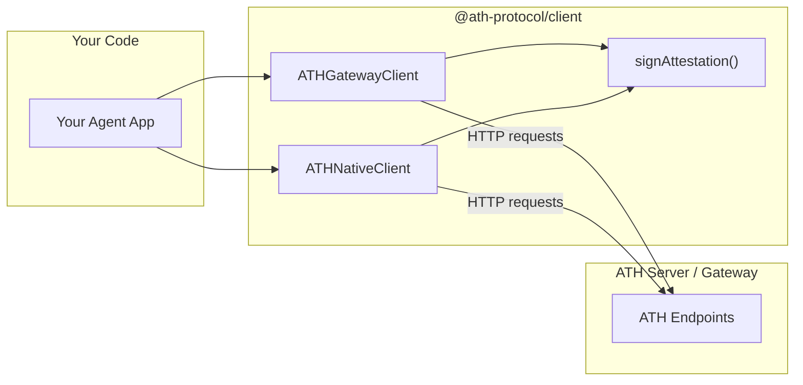

## Install

```bash
npm install @ath-protocol/client jose
```

## How the SDK Fits In



The SDK handles attestation signing, PKCE, state management, and HTTP communication. You call high-level methods like `discover()`, `register()`, `proxy()`.

## Quick Reference

```typescript
import { ATHGatewayClient, ATHNativeClient, ATHClientError } from "@ath-protocol/client";
import { generateKeyPair } from "jose";
```

| Class | When to use |
|-------|------------|
| `ATHGatewayClient` | Connecting through a gateway |
| `ATHNativeClient` | Connecting directly to an ATH-enabled service |

Both share the same registration/authorization/token flow. The difference is how they call the API after getting a token.

---

## Creating a Client

```typescript
const { privateKey } = await generateKeyPair("ES256");

// Gateway mode
const gateway = new ATHGatewayClient({
  url: "http://gateway.example.com",
  agentId: "https://your-agent.com/.well-known/agent.json",
  privateKey,
  keyId: "my-key-2024",  // optional, default: "default"
});

// Native mode
const native = new ATHNativeClient({
  url: "https://service.example.com",
  agentId: "https://your-agent.com/.well-known/agent.json",
  privateKey,
});
```

<Accordion title="About key management">
- **Development:** `generateKeyPair("ES256")` creates an ephemeral key each run. Simple but the server can't verify your identity across restarts.
- **Production:** Load a persistent PEM key with `importPKCS8(pem, "ES256")` from `jose`. Publish the matching public key at your `agentId` URL.
</Accordion>

---

## API Methods

### `discover()`

```typescript
// Gateway: returns DiscoveryDocument (providers list)
const doc = await gateway.discover();
doc.supported_providers.forEach(p => console.log(p.provider_id, p.available_scopes));

// Native: returns ServiceDiscoveryDocument (single service)
const doc = await native.discover();
console.log(doc.app_id, doc.auth.scopes_supported);
```

### `register(options)`

```typescript
const reg = await client.register({
  developer: { name: "Acme Corp", id: "acme" },
  providers: [
    { provider_id: "github", scopes: ["read:user", "repo"] },
  ],
  purpose: "Code review assistant",
  redirectUris: ["https://your-agent.com/callback"],  // optional
});

console.log(reg.client_id);        // "ath_abc123"
console.log(reg.agent_status);     // "approved" | "pending" | "denied"
console.log(reg.approved_providers[0].approved_scopes);
```

### `authorize(provider, scopes, options?)`

```typescript
const auth = await client.authorize("github", ["read:user"], {
  redirectUri: "https://your-agent.com/done",  // optional
  resource: "https://api.github.com",         // optional RFC 8707
});

console.log(auth.authorization_url);  // send user here
console.log(auth.ath_session_id);     // save for token exchange
```

### `exchangeToken(code, sessionId)`

```typescript
const token = await client.exchangeToken("auth-code", "ath_sess_...");

console.log(token.access_token);      // opaque ATH token
console.log(token.effective_scopes);  // what you actually got
console.log(token.scope_intersection); // breakdown of what each party approved
```

### `proxy()` / `api()`

```typescript
// Gateway: proxy(provider, method, path, body?)
const user = await gateway.proxy("github", "GET", "/user");
const repo = await gateway.proxy("github", "POST", "/user/repos", { name: "new-repo" });

// Native: api(method, path, body?)
const products = await native.api("GET", "/products");
const order = await native.api("POST", "/orders", { shippingAddress: "..." });
```

### `revoke()`

```typescript
await client.revoke();  // invalidates current token
```

---

## Error Handling

```typescript
import { ATHClientError } from "@ath-protocol/client";

try {
  await client.proxy("github", "GET", "/user");
} catch (e) {
  if (e instanceof ATHClientError) {
    switch (e.code) {
      case "TOKEN_EXPIRED":   /* re-authorize */ break;
      case "SCOPE_NOT_APPROVED": /* request different scopes */ break;
      case "AGENT_NOT_REGISTERED": /* register first */ break;
    }
  }
}
```

See [Error Codes](/reference/error-codes) for the complete list.
