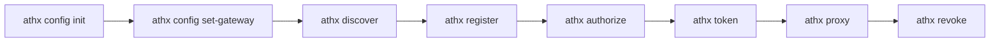

## Installation

```bash
npm install -g athx
# or
npx athx --help
```

## Quick Start



### 1. Initialize Configuration

```bash
athx config init
athx config set-gateway local http://localhost:3000
athx config set agent-id https://my-agent.example.com/.well-known/agent.json
athx config set key-path ./private-key.pem  # optional; ephemeral if omitted
```

### 2. Discover Providers

```bash
athx discover -g local
```

```
Gateway: http://localhost:3000
Version: 0.1

Providers:
  github (GitHub)
    Scopes: read:user, repo, gist
    Auth: OAUTH2
    Approval required: yes
```

### 3. Register Agent

```bash
athx register -g local \
  --provider github \
  --scopes read:user,repo \
  --purpose "CLI testing agent"
```

```
Registration successful!
  Client ID: ath_abc123def456
  Status: approved
  Provider: github
    Approved: read:user, repo
    Denied: (none)
```

### 4. Authorize (Start OAuth)

```bash
athx authorize -g local \
  --provider github \
  --scopes read:user
```

```
Authorization started!
  Session: ath_sess_def456
  Please visit: https://github.com/login/oauth/authorize?client_id=...

Open this URL in your browser to complete authorization.
```

### 5. Exchange Token

After the user completes OAuth:

```bash
athx token -g local \
  --code AUTH_CODE_HERE \
  --session ath_sess_def456
```

```
Token received!
  Provider: github
  Effective scopes: read:user
  Expires in: 3600s
  Scope intersection:
    Agent approved: read:user, repo
    User consented: read:user
    Effective: read:user
```

### 6. Call APIs

```bash
# GET request
athx proxy -g local github GET /user

# GET with path
athx proxy -g local github GET /user/repos

# POST with body
athx proxy -g local github POST /user/repos --body '{"name":"new-repo","private":true}'

# JSON output for scripting
athx proxy -g local github GET /user --format json | jq '.login'
```

### 7. Revoke Token

```bash
athx revoke -g local --provider github
```

### 8. Check Status

```bash
athx status -g local
```

```
Gateway: http://localhost:3000
  Agent: https://my-agent.example.com/.well-known/agent.json
  Client ID: ath_abc123def456
  Registered: 2025-06-01T12:00:00Z
  Tokens:
    github: active (expires in 2847s)
```

## Command Reference

### Global Options

| Flag | Description |
|------|-------------|
| `-m, --mode <mode>` | `gateway` (default) or `native` |
| `-g, --gateway <url>` | Gateway URL or configured name |
| `-s, --service <url>` | Native service URL |
| `--agent-id <uri>` | Override agent ID from config |
| `--key <path>` | Path to ES256 PEM private key |
| `--format <fmt>` | Output format: `text` (default) or `json` |

### Commands

| Command | Purpose |
|---------|---------|
| `discover` | Fetch discovery document |
| `register` | Register agent (Phase A) |
| `authorize` | Start OAuth authorization (Phase B) |
| `token` | Exchange code + session for ATH token |
| `proxy <provider> <method> <path>` | Make authenticated API call |
| `revoke` | Revoke active token |
| `status` | Show local credentials and token status |
| `config init` | Create config directory |
| `config show` | Display configuration |
| `config set-gateway <name> <url>` | Add/update a named gateway |
| `config set <key> <value>` | Set config values |

## Native Mode

```bash
athx discover -m native -s https://service.example.com
athx register -m native -s https://service.example.com --provider default --scopes read
athx authorize -m native -s https://service.example.com --provider default --scopes read
athx token -m native -s https://service.example.com --code CODE --session SESSION
athx proxy -m native -s https://service.example.com default GET /resources
```

## Scripting with athx

Use `--format json` for machine-readable output:

```bash
# Get all repos as JSON
REPOS=$(athx proxy -g local github GET /user/repos --format json)

# Parse with jq
echo "$REPOS" | jq '.[].full_name'

# Use in a script
for repo in $(echo "$REPOS" | jq -r '.[].full_name'); do
  echo "Processing $repo..."
  athx proxy -g local github GET "/repos/$repo/issues" --format json | jq length
done
```

## File Locations

| File | Purpose |
|------|---------|
| `~/.athx/config.json` | Gateway names, agent ID, key path |
| `~/.athx/credentials.json` | Stored client_id/secret and tokens per gateway |
