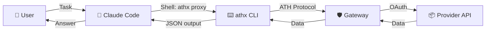
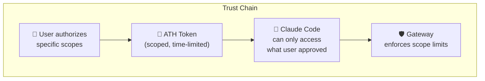

## Overview

[Claude Code](https://docs.anthropic.com/en/docs/agents-and-tools/claude-code/overview) (previously Claude Computer Use) can execute shell commands as part of its reasoning. By using the **athx CLI**, Claude Code agents can access ATH-protected APIs with proper user authorization.



## Setup

### 1. Pre-configure athx

Before starting a Claude Code session, set up athx with a gateway and credentials:

```bash
# Install athx
npm install -g athx

# Configure
athx config init
athx config set-gateway prod https://your-gateway.example.com
athx config set agent-id https://claude-agent.example.com/.well-known/agent.json
athx config set key-path /path/to/private-key.pem

# Register (one-time)
athx register -g prod --provider github --scopes read:user,repo

# Authorize (requires user interaction)
athx authorize -g prod --provider github --scopes read:user,repo
# User visits the URL and completes OAuth...
athx token -g prod --code AUTH_CODE --session SESSION_ID
```

### 2. Verify Setup

```bash
# Should return user data
athx proxy -g prod github GET /user --format json
```

## Claude Code Usage

Once athx is configured with a valid token, Claude Code can use it like any shell command:

```markdown
# Example Claude Code prompt:

"Look at the open issues in ath-protocol/gateway on GitHub and suggest
which ones should be prioritized for the next sprint."
```

Claude Code will execute commands like:

```bash
# Claude Code runs this:
athx proxy -g prod github GET /repos/ath-protocol/gateway/issues?state=open --format json
```

And receives structured JSON data it can reason about.

## Scripting Patterns

### List and Process

```bash
# Get all repos
REPOS=$(athx proxy -g prod github GET /user/repos --format json)

# Process each repo
echo "$REPOS" | jq -r '.[].full_name' | while read repo; do
  ISSUES=$(athx proxy -g prod github GET "/repos/$repo/issues?state=open" --format json)
  COUNT=$(echo "$ISSUES" | jq length)
  echo "$repo: $COUNT open issues"
done
```

### Create Resources

```bash
# Create a new issue
athx proxy -g prod github POST /repos/owner/repo/issues \
  --body '{"title":"Bug: Login timeout","body":"Users report...","labels":["bug"]}'
```

### Check Status Before Operations

```bash
# Verify we have a valid token
STATUS=$(athx status -g prod --format json)
TOKEN_OK=$(echo "$STATUS" | jq -r '.credentials.tokens.github // "none"')

if [ "$TOKEN_OK" = "none" ] || [ "$TOKEN_OK" = "EXPIRED" ]; then
  echo "Token expired. Please re-authorize."
  athx authorize -g prod --provider github --scopes read:user,repo
  exit 1
fi
```

## Security Considerations



- **Scoped access**: Claude can only access APIs and scopes the user explicitly approved
- **Time-limited**: ATH tokens expire (default: 1 hour)
- **Revocable**: User can revoke access at any time via `athx revoke`
- **Auditable**: All API calls go through the gateway and can be logged
- **No raw credentials**: Claude never sees OAuth tokens for upstream services
