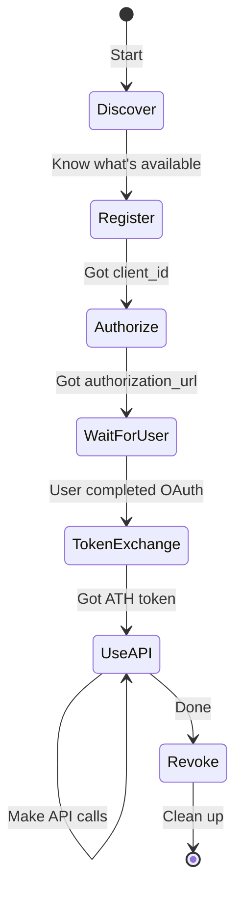
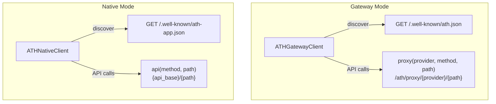
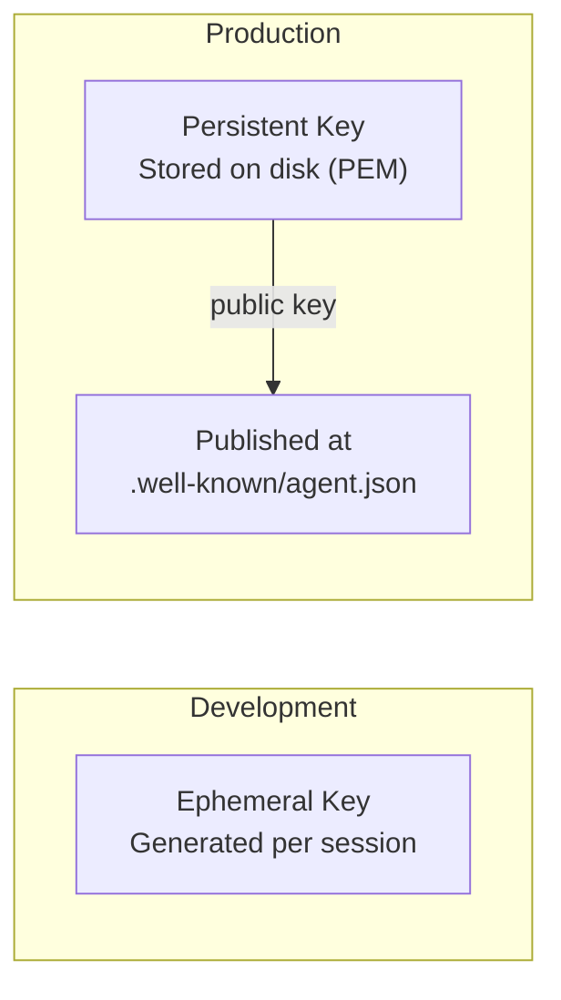

## The Agent Lifecycle

Every ATH agent follows the same lifecycle, regardless of which SDK or CLI you use:



<Steps>
  <Step title="Discover">
    Fetch the gateway/service discovery document to learn available providers and scopes.
  </Step>
  <Step title="Register">
    Present your agent identity (attestation JWT) and request approval for specific providers and scopes. Receive `client_id` and `client_secret`.
  </Step>
  <Step title="Authorize">
    Start the user consent flow. Get an `authorization_url` to send to the user and an `ath_session_id` to track the session.
  </Step>
  <Step title="Wait for User">
    The user visits the authorization URL, reviews permissions, and approves. The gateway handles the OAuth callback.
  </Step>
  <Step title="Token Exchange">
    Exchange the authorization code and session for an ATH access token. The token's scopes are the intersection of what was approved, consented, and requested.
  </Step>
  <Step title="Use API">
    Call provider APIs through the gateway proxy (or directly in native mode) using the ATH token.
  </Step>
  <Step title="Revoke">
    When done, revoke the token to clean up.
  </Step>
</Steps>

## Gateway vs Native Mode

The SDKs and CLI support both deployment models:



| Feature | Gateway Mode | Native Mode |
|---------|:----------:|:----------:|
| Discovery URL | `/.well-known/ath.json` | `/.well-known/ath-app.json` |
| API call method | `proxy(provider, method, path)` | `api(method, path)` |
| API URL pattern | `/ath/proxy/{provider}/{path}` | `{api_base}/{path}` |
| Provider in URL | Required (multi-provider) | Not needed (single service) |

## Key Management

ATH agents prove their identity with **ES256 key pairs**:



| Approach | When to use | Credential persistence? |
|----------|-------------|:----------------------:|
| **Ephemeral** (default) | Development, testing | No — new key each run |
| **Persistent PEM file** | Production, CI/CD | Yes — same key across runs |

For production, generate and store a key pair:

```bash
# Generate ES256 key pair
openssl ecparam -genkey -name prime256v1 -noout -out private-key.pem
openssl ec -in private-key.pem -pubout -out public-key.pem
```

Then publish the public key in your agent identity document:

```json
// https://my-agent.example.com/.well-known/agent.json
{
  "ath_version": "0.1",
  "agent_id": "https://my-agent.example.com/.well-known/agent.json",
  "name": "My Agent",
  "public_key": { /* JWK from public-key.pem */ }
}
```

## Credential Persistence

After registration, your agent receives a `client_id` and `client_secret`. After token exchange, you get an `access_token`. These should be persisted to avoid re-registration:

- **athx CLI**: Automatically stores in `~/.athx/credentials.json`
- **Python SDK**: Use `save_credentials()` / `load_credentials()` and `set_token()`
- **TypeScript SDK**: Manage persistence in your application code

## Error Handling

All SDKs throw structured errors with ATH error codes:

| Code | Meaning |
|------|---------|
| `INVALID_ATTESTATION` | Attestation JWT is invalid or expired |
| `AGENT_NOT_REGISTERED` | Agent must register before calling this endpoint |
| `AGENT_UNAPPROVED` | Registration is pending or denied |
| `SCOPE_NOT_APPROVED` | Requested scopes exceed what's approved |
| `SESSION_NOT_FOUND` | Unknown `ath_session_id` |
| `SESSION_EXPIRED` | Session is older than 10 minutes |
| `TOKEN_INVALID` | Unknown or malformed token |
| `TOKEN_EXPIRED` | Token has passed its `expires_in` |
| `TOKEN_REVOKED` | Token was revoked |
| `PROVIDER_MISMATCH` | Token's provider doesn't match the request |
| `AGENT_IDENTITY_MISMATCH` | Attestation doesn't match registered agent |

<CardGroup cols={3}>
  <Card title="TypeScript SDK" icon="js" href="/client/typescript-sdk">
    @ath-protocol/client
  </Card>
  <Card title="Python SDK" icon="python" href="/client/python-sdk">
    ath-sdk
  </Card>
  <Card title="athx CLI" icon="terminal" href="/client/athx-cli">
    Command-line tool
  </Card>
</CardGroup>
