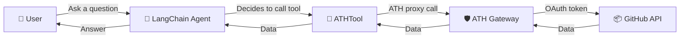
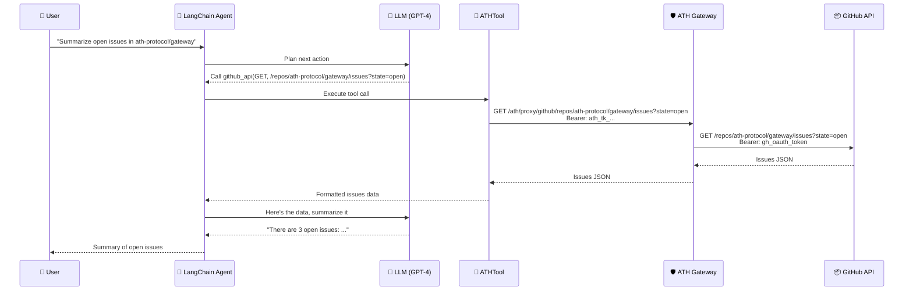

## Overview

[LangChain](https://www.langchain.com/) agents can call external tools during their reasoning process. By wrapping ATH-proxied APIs as LangChain tools, you give your agent **secure, user-consented** access to external services.



## Building an ATHTool

Here is a complete `ATHTool` implementation that wraps the ATH Python SDK as a LangChain tool:

```python
"""ATH Tool for LangChain — gives agents secure access to ATH-proxied APIs."""

from typing import Optional, Type
from pydantic import BaseModel, Field
from langchain_core.tools import BaseTool
from langchain_core.callbacks import CallbackManagerForToolRun
from ath import ATHGatewayClient


class ATHToolInput(BaseModel):
    """Input schema for ATHTool."""
    method: str = Field(description="HTTP method: GET, POST, PUT, DELETE")
    path: str = Field(description="API path, e.g. /user/repos")
    body: Optional[str] = Field(default=None, description="JSON request body for POST/PUT")


class ATHTool(BaseTool):
    """A LangChain tool that calls APIs through an ATH gateway.

    The tool handles the ATH proxy layer — the agent just specifies
    the HTTP method, path, and optional body, and gets back the API response.
    """

    name: str = "ath_api"
    description: str = "Call an external API through the ATH gateway."
    args_schema: Type[BaseModel] = ATHToolInput

    # ATH client (set up before passing to agent)
    client: ATHGatewayClient
    provider: str

    class Config:
        arbitrary_types_allowed = True

    def _run(
        self,
        method: str,
        path: str,
        body: Optional[str] = None,
        run_manager: Optional[CallbackManagerForToolRun] = None,
    ) -> str:
        """Execute the API call through ATH proxy."""
        import json

        parsed_body = json.loads(body) if body else None
        result = self.client.proxy(
            self.provider,
            method.upper(),
            path,
            body=parsed_body,
        )

        if isinstance(result, dict):
            return json.dumps(result, indent=2)
        return str(result)
```

## Usage Example: GitHub Issue Summarizer

```python
import json
from cryptography.hazmat.primitives.asymmetric import ec
from cryptography.hazmat.primitives import serialization
from langchain_openai import ChatOpenAI
from langchain.agents import AgentExecutor, create_tool_calling_agent
from langchain_core.prompts import ChatPromptTemplate
from ath import ATHGatewayClient

# --- 1. Set up ATH client ---
private_key = ec.generate_private_key(ec.SECP256R1())
pem = private_key.private_bytes(
    serialization.Encoding.PEM,
    serialization.PrivateFormat.PKCS8,
    serialization.NoEncryption(),
).decode()

client = ATHGatewayClient(
    url="http://localhost:3000",
    agent_id="https://my-agent.example.com/.well-known/agent.json",
    private_key=pem,
)

# Register + authorize (one-time setup)
client.discover()
client.register(
    developer={"name": "LangChainBot", "id": "langchain-dev"},
    providers=[{"provider_id": "github", "scopes": ["read:user", "repo"]}],
    purpose="Summarize GitHub issues for users",
)
auth = client.authorize("github", ["repo"])
print(f"Please authorize at: {auth.authorization_url}")

# After user authorizes:
code = input("Enter the authorization code: ")
client.exchange_token(code, auth.ath_session_id)

# --- 2. Create LangChain tool ---
github_tool = ATHTool(
    name="github_api",
    description=(
        "Call the GitHub API. Use GET /repos/{owner}/{repo}/issues to list issues. "
        "Use GET /user to get the authenticated user. "
        "Always use GET method unless creating/updating resources."
    ),
    client=client,
    provider="github",
)

# --- 3. Create LangChain agent ---
llm = ChatOpenAI(model="gpt-4o", temperature=0)
prompt = ChatPromptTemplate.from_messages([
    ("system", "You are a helpful assistant that can access GitHub via the github_api tool."),
    ("human", "{input}"),
    ("placeholder", "{agent_scratchpad}"),
])

agent = create_tool_calling_agent(llm, [github_tool], prompt)
executor = AgentExecutor(agent=agent, tools=[github_tool], verbose=True)

# --- 4. Run the agent ---
result = executor.invoke({
    "input": "Summarize the open issues in the ath-protocol/gateway repository"
})
print(result["output"])
```

## How It Works



## Multiple Providers

Create separate tools for each provider:

```python
github_tool = ATHTool(
    name="github_api",
    description="Call the GitHub API for repos, issues, and user data.",
    client=client,
    provider="github",
)

calendar_tool = ATHTool(
    name="calendar_api",
    description="Access Google Calendar for events and scheduling.",
    client=calendar_client,  # separate client or same client with different token
    provider="google-calendar",
)

agent = create_tool_calling_agent(llm, [github_tool, calendar_tool], prompt)
```

## Token Lifecycle Management

In a long-running LangChain application, handle token expiry gracefully:

```python
from ath import ATHError

class ResilientATHTool(ATHTool):
    """ATHTool with automatic token refresh on expiry."""

    def _run(self, method: str, path: str, body: str = None, **kwargs) -> str:
        try:
            return super()._run(method, path, body, **kwargs)
        except ATHError as e:
            if e.code == "TOKEN_EXPIRED":
                # Re-authorize (requires user interaction)
                auth = self.client.authorize(self.provider, ["read:user", "repo"])
                raise RuntimeError(
                    f"ATH token expired. User must re-authorize at: {auth.authorization_url}"
                )
            raise
```
