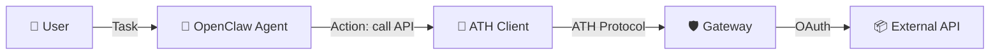
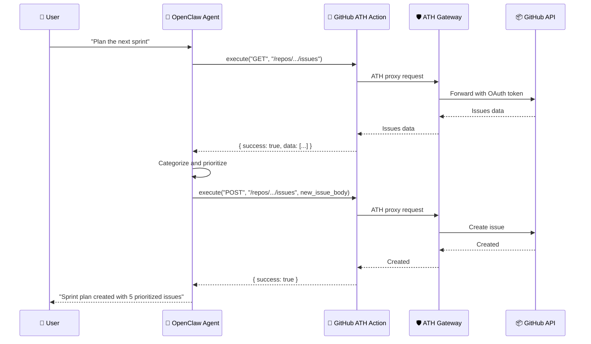

## Overview

[OpenClaw](https://github.com/openclaw) agents can be extended with custom tools and actions. By integrating the ATH Python SDK, OpenClaw agents gain **secure, user-consented** access to external services.



## Creating an ATH Action

Wrap the ATH client as an OpenClaw action:

```python
"""ATH Action for OpenClaw agents."""

from ath import ATHGatewayClient, ATHError


class ATHAction:
    """OpenClaw action that calls APIs through ATH gateway."""

    def __init__(self, client: ATHGatewayClient, provider: str):
        self.client = client
        self.provider = provider

    def execute(self, method: str, path: str, body: dict = None) -> dict:
        """Execute an API call through the ATH proxy.

        Args:
            method: HTTP method (GET, POST, PUT, DELETE)
            path: API path (e.g., /user/repos)
            body: Optional request body for POST/PUT

        Returns:
            API response as a dictionary
        """
        try:
            result = self.client.proxy(self.provider, method, path, body=body)
            return {"success": True, "data": result}
        except ATHError as e:
            return {"success": False, "error": e.code, "message": e.message}
```

## Multi-Step Agent Workflow

Here's an example OpenClaw workflow where the agent uses ATH to read GitHub issues and create a summary in a Google Doc:

```python
from ath import ATHGatewayClient
from cryptography.hazmat.primitives.asymmetric import ec
from cryptography.hazmat.primitives import serialization

# Generate keys
private_key = ec.generate_private_key(ec.SECP256R1())
pem = private_key.private_bytes(
    serialization.Encoding.PEM,
    serialization.PrivateFormat.PKCS8,
    serialization.NoEncryption(),
).decode()

# Set up ATH clients for multiple providers
github_client = ATHGatewayClient(
    url="http://localhost:3000",
    agent_id="https://openclaw-agent.example.com/.well-known/agent.json",
    private_key=pem,
)

# Register and authorize for GitHub
github_client.discover()
github_client.register(
    developer={"name": "OpenClawBot", "id": "openclaw-dev"},
    providers=[{"provider_id": "github", "scopes": ["repo"]}],
    purpose="Read issues for sprint planning",
)

# Create actions
github_action = ATHAction(github_client, "github")

# --- Agent workflow ---

# Step 1: Fetch open issues
issues_result = github_action.execute("GET", "/repos/ath-protocol/gateway/issues?state=open")

if issues_result["success"]:
    issues = issues_result["data"]
    print(f"Found {len(issues)} open issues")

    # Step 2: Categorize by labels
    bugs = [i for i in issues if any(l["name"] == "bug" for l in i.get("labels", []))]
    features = [i for i in issues if any(l["name"] == "enhancement" for l in i.get("labels", []))]

    # Step 3: Generate summary (agent's LLM would do this)
    summary = {
        "total": len(issues),
        "bugs": len(bugs),
        "features": len(features),
        "top_issues": [{"title": i["title"], "number": i["number"]} for i in issues[:5]],
    }
    print(summary)
```

## Workflow Diagram



## Error Handling in Workflows

```python
class ResilientATHAction(ATHAction):
    """ATH action with retry logic for transient errors."""

    def execute(self, method: str, path: str, body: dict = None, retries: int = 2) -> dict:
        for attempt in range(retries + 1):
            result = super().execute(method, path, body)
            if result["success"]:
                return result

            if result["error"] in ("TOKEN_EXPIRED", "TOKEN_REVOKED"):
                return {
                    "success": False,
                    "error": "AUTH_REQUIRED",
                    "message": "User must re-authorize access",
                }

            if attempt < retries and result["error"] in ("INTERNAL_ERROR", "OAUTH_ERROR"):
                import time
                time.sleep(2 ** attempt)
                continue

            return result
        return result
```
