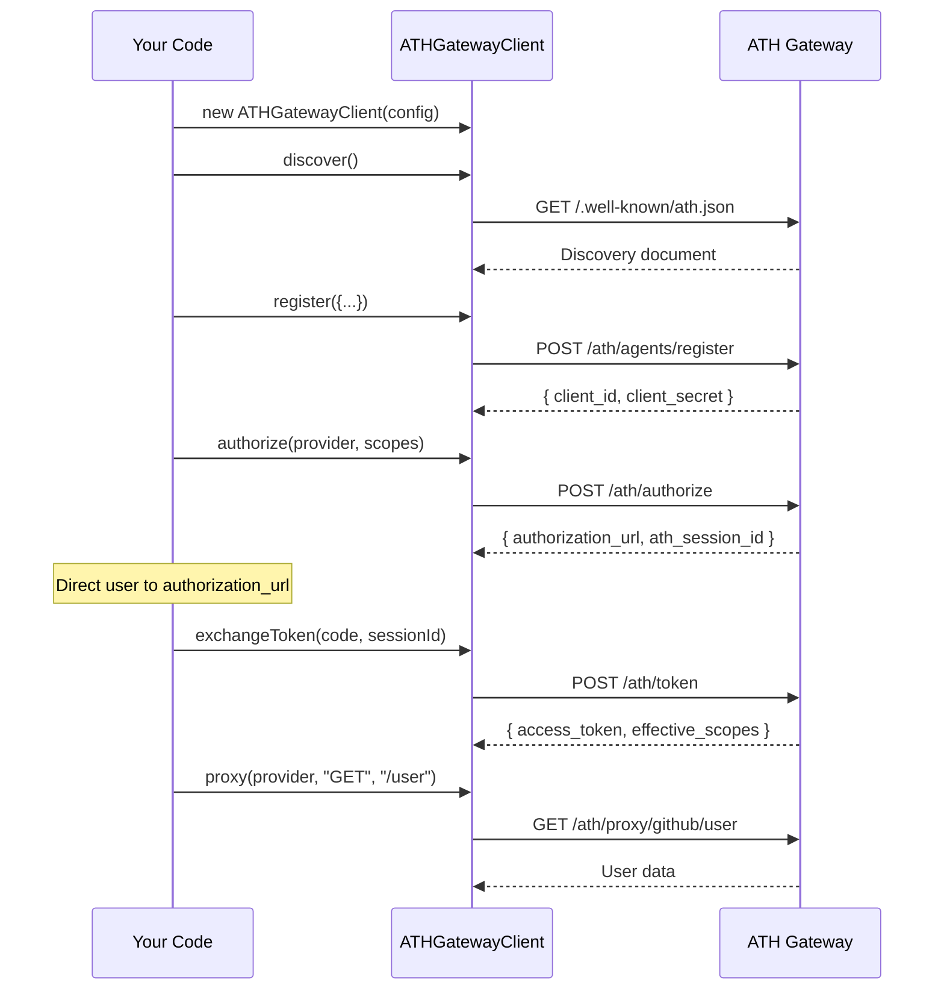

## Installation

```bash
npm install @ath-protocol/client
# or
pnpm add @ath-protocol/client
```

The client package re-exports all types from `@ath-protocol/types`, so you don't need to install it separately.

## Gateway Mode — Complete Walkthrough



### Full Example

```typescript
import { ATHGatewayClient } from "@ath-protocol/client";
import { generateKeyPair } from "jose";

async function main() {
  // 1. Generate a key pair (use persistent key in production)
  const { privateKey } = await generateKeyPair("ES256");

  // 2. Create the client
  const client = new ATHGatewayClient({
    url: "http://localhost:3000",
    agentId: "https://my-agent.example.com/.well-known/agent.json",
    privateKey,
    keyId: "my-key-2024",
  });

  // 3. Discover available providers
  const discovery = await client.discover();
  console.log("Available providers:", discovery.supported_providers.map(p => p.provider_id));

  // 4. Register the agent
  const registration = await client.register({
    developer: { name: "MyDev", id: "mydev-001" },
    providers: [
      { provider_id: "github", scopes: ["read:user", "repo"] },
    ],
    purpose: "Access GitHub repos on behalf of users",
  });
  console.log("Status:", registration.agent_status);
  console.log("Client ID:", registration.client_id);

  // 5. Start authorization
  const auth = await client.authorize("github", ["read:user"], {
    redirectUri: "http://localhost:3000/ath/callback",
  });
  console.log("Please visit:", auth.authorization_url);
  console.log("Session:", auth.ath_session_id);

  // 6. After user completes OAuth, exchange for token
  const code = "authorization-code-from-callback";
  const token = await client.exchangeToken(code, auth.ath_session_id);
  console.log("Access token:", token.access_token);
  console.log("Effective scopes:", token.effective_scopes);
  console.log("Scope intersection:", token.scope_intersection);

  // 7. Call APIs through the proxy
  const user = await client.proxy("github", "GET", "/user");
  console.log("GitHub user:", user);

  const repos = await client.proxy("github", "GET", "/user/repos?per_page=5");
  console.log("Repos:", repos);

  // 8. Revoke when done
  await client.revoke();
  console.log("Token revoked");
}

main().catch(console.error);
```

## Native Mode

For services that implement ATH natively:

```typescript
import { ATHNativeClient } from "@ath-protocol/client";
import { generateKeyPair } from "jose";

async function main() {
  const { privateKey } = await generateKeyPair("ES256");

  const client = new ATHNativeClient({
    url: "https://service.example.com",
    agentId: "https://my-agent.example.com/.well-known/agent.json",
    privateKey,
  });

  // Discover learns the api_base from /.well-known/ath-app.json
  await client.discover();

  await client.register({
    developer: { name: "MyDev", id: "mydev-001" },
    providers: [{ provider_id: "default", scopes: ["read", "write"] }],
    purpose: "Access service data",
  });

  const auth = await client.authorize("default", ["read"]);
  // ... user completes OAuth ...

  await client.exchangeToken(code, auth.ath_session_id);

  // api() calls {api_base}/{path} directly (no proxy)
  const data = await client.api("GET", "/resources");
  console.log("Data:", data);
}
```

## Key Classes

### `ATHGatewayClient`

| Method | Returns | Description |
|--------|---------|-------------|
| `discover()` | `DiscoveryDocument` | Fetch gateway catalog |
| `register(opts)` | `AgentRegistrationResponse` | Register agent (Phase A) |
| `authorize(provider, scopes, opts?)` | `AuthorizationResponse` | Start user OAuth (Phase B) |
| `exchangeToken(code, sessionId)` | `TokenResponse` | Exchange for ATH token |
| `proxy(provider, method, path, body?)` | Response data | Call API through proxy |
| `revoke()` | `void` | Revoke current token |

### `ATHNativeClient`

| Method | Returns | Description |
|--------|---------|-------------|
| `discover()` | `ServiceDiscoveryDocument` | Fetch service config (sets `api_base`) |
| `register(opts)` | `AgentRegistrationResponse` | Register agent |
| `authorize(provider, scopes, opts?)` | `AuthorizationResponse` | Start user OAuth |
| `exchangeToken(code, sessionId)` | `TokenResponse` | Exchange for ATH token |
| `api(method, path, body?)` | Response data | Call API at `api_base` |
| `revoke()` | `void` | Revoke current token |

### `ATHClientConfig`

```typescript
interface ATHClientConfig {
  url: string;         // Gateway or service base URL
  agentId: string;     // Agent identity URL
  privateKey: KeyInput; // ES256 private key (CryptoKey | KeyObject | Uint8Array)
  keyId?: string;      // JWT kid header (default: "default")
}
```

## Error Handling

```typescript
import { ATHClientError } from "@ath-protocol/client";

try {
  await client.proxy("github", "GET", "/user");
} catch (error) {
  if (error instanceof ATHClientError) {
    console.error(`ATH Error [${error.code}]: ${error.message}`);
    console.error("HTTP Status:", error.status);
    console.error("Details:", error.details);

    switch (error.code) {
      case "TOKEN_EXPIRED":
        // Re-authorize and get a new token
        break;
      case "SCOPE_NOT_APPROVED":
        // Request different scopes
        break;
      case "PROVIDER_MISMATCH":
        // Wrong provider for this token
        break;
    }
  }
}
```

## Attestation Helper

The SDK also exports `signAttestation` for advanced use cases:

```typescript
import { signAttestation } from "@ath-protocol/client";

const jwt = await signAttestation({
  agentId: "https://my-agent.example.com/.well-known/agent.json",
  privateKey,
  keyId: "my-key-2024",
  audience: "https://gateway.example.com",
});
```
