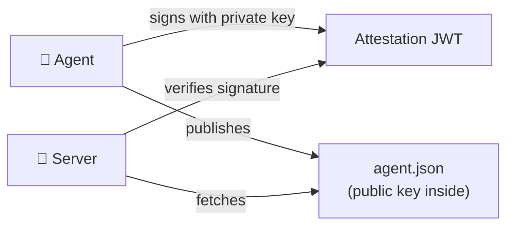

## The Two Parts

Every agent identity has two components:

| Component | What it is | Where it lives |
|-----------|-----------|---------------|
| **Identity document** | A JSON file with the agent's name, developer, and public key | Published at a URL you control |
| **Attestation JWT** | A signed token proving the agent owns the corresponding private key | Sent with every ATH request |



---

## Identity Document

Publish this at your `agent_id` URL (e.g., `https://your-agent.com/.well-known/agent.json`):

```json
{
  "ath_version": "0.1",
  "agent_id": "https://your-agent.com/.well-known/agent.json",
  "name": "My Agent",
  "developer": {
    "name": "Your Company",
    "id": "your-company",
    "contact": "security@yourcompany.com"
  },
  "capabilities": ["data-reading", "task-automation"],
  "public_key": {
    "kty": "EC",
    "crv": "P-256",
    "x": "...",
    "y": "..."
  }
}
```

The `public_key` is a JWK (JSON Web Key). Generate it with:

```bash
# Generate key pair
openssl ecparam -genkey -name prime256v1 -noout -out private.pem
# Export public key as JWK (use jose library or online converter)
```

Or let the SDK generate it for you (see the demo's `agent/server.ts`).

---

## Attestation JWT

Every time your agent calls register, authorize, or token, it includes a signed JWT:

```
Header:  { "alg": "ES256", "kid": "my-key-2024" }
Payload: {
  "iss": "https://your-agent.com",
  "sub": "https://your-agent.com/.well-known/agent.json",
  "aud": "https://service.example.com",   ← who you're talking to
  "iat": 1714500000,                       ← when you signed this
  "exp": 1714503600,                       ← when this expires
  "jti": "unique-random-id"               ← prevents replay
}
Signature: [signed with your private key]
```

**You don't build this yourself.** The SDK does it automatically every time you call `register()`, `authorize()`, or `exchangeToken()`.

---

## Verification Rules

When a server receives your attestation, it checks:

1. ✅ Signature matches the public key at `agent_id`
2. ✅ `aud` matches this server's URL
3. ✅ `exp` is in the future
4. ✅ `iat` is within 5 minutes of now (clock skew tolerance)
5. ✅ `jti` hasn't been seen before (prevents replays)

If any check fails → `INVALID_ATTESTATION` error.

---

## In Development: Skip Verification

The demo uses `skipAttestationVerification: true` so you can develop without publishing a real identity document. The SDK still signs attestations (so the format is correct), but the server doesn't verify the signature.

**Remove this in production.**
