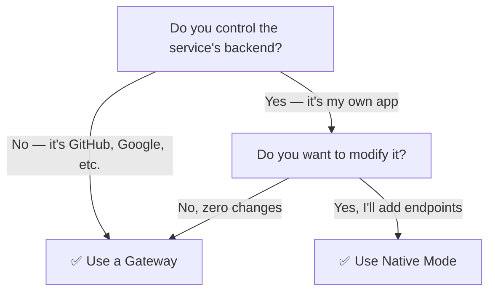

## Decision Flowchart

---

## Comparison

| | Gateway | Native |
|-|---------|--------|
| **Service changes required** | None | Add ATH endpoints |
| **How agent discovers** | `GET /.well-known/ath.json` | `GET /.well-known/ath-app.json` |
| **How agent calls API** | `proxy("github", "GET", "/user")` | `api("GET", "/products")` |
| **URL pattern** | `/ath/proxy/{provider}/{path}` | `{api_base}/{path}` |
| **Who holds upstream tokens** | Gateway | Service itself |
| **Multi-provider** | Yes (one gateway, many services) | One service per integration |
| **Best for** | Existing services, quick setup | New services, maximum control |

---

## When to Use Gateway

- You want agents to access **GitHub, Google, Slack, etc.** without those services knowing
- You want **centralized control** over which agents can access which services
- You're a **platform team** managing access for multiple agents

## When to Use Native

- You're building a **new service** designed for agent access
- You want **custom consent UX** (your own consent page, not the gateway's)
- You want to **own the full flow** — registration policy, token issuance, everything
- You're the demo shop

---

## Can I Use Both?

Yes! The demo shows both modes with the same shop:
- **Native:** Agent connects directly to `ath-shop.local:3000`
- **Gateway:** Agent connects to `gateway.ath.local:4001`, which proxies to the shop

The shop's API code is identical in both cases — the difference is where the ATH layer sits.
