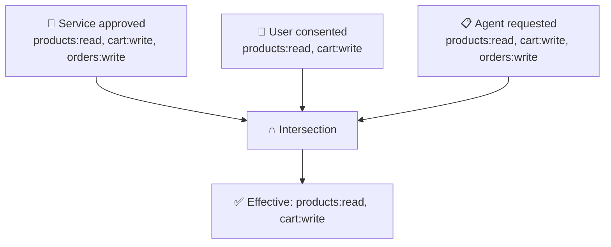

## The Rule

When an agent gets a token, its effective permissions are the **intersection** of three sets:

```
Effective = Agent-Approved ∩ User-Consented ∩ Requested
```



In this example, the agent asked for `orders:write` but the user only consented to `products:read` and `cart:write`. So the effective token **does not** include `orders:write`.

---

## Why Three Sets?

| Set | Who controls it | What it means |
|-----|:--------------:|---------------|
| **Agent-Approved** | Service operator | "I've reviewed this agent. It's allowed these capabilities." |
| **User-Consented** | End user | "I trust this agent with these specific permissions on my data." |
| **Requested** | Agent (per-request) | "For this task, I only need these scopes." |

This means:
- A malicious agent can't get scopes the service didn't approve
- A user can't be tricked into granting more than the service allows
- An agent can request **less** than its maximum (principle of least privilege)

---

## What Happens When the Intersection Is Empty?

Token issuance **fails**. The agent gets a `SCOPE_NOT_APPROVED` error.

Example: Agent is approved for `[products:read]` but requests `[orders:write]`. The intersection with the approved set is empty → no token issued.

---

## In the Token Response

The scope intersection is returned explicitly so you can see what happened:

```json
{
  "access_token": "ath_tk_...",
  "effective_scopes": ["products:read", "cart:write"],
  "scope_intersection": {
    "agent_approved": ["products:read", "cart:write", "orders:write"],
    "user_consented": ["products:read", "cart:write"],
    "effective": ["products:read", "cart:write"]
  }
}
```
