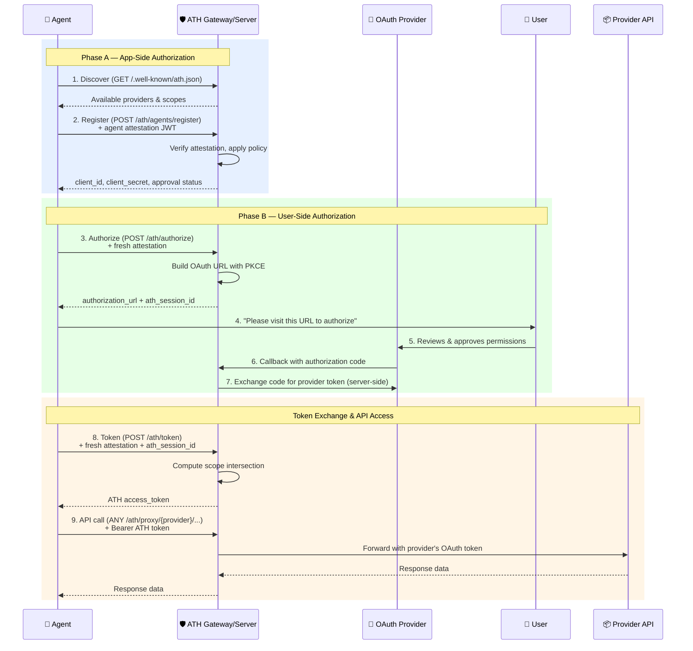
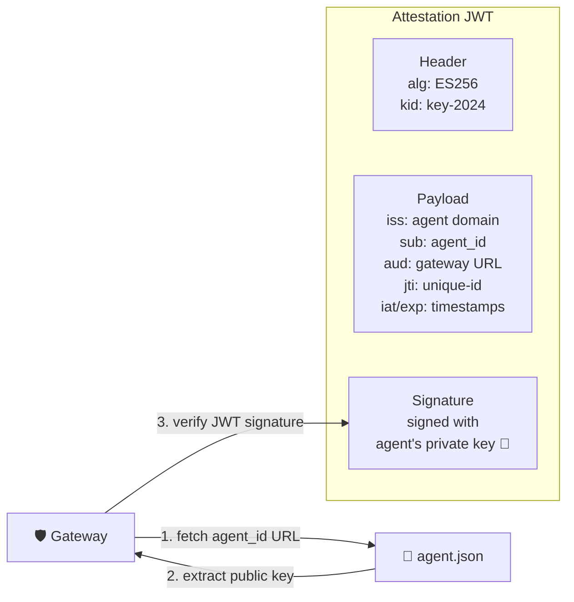
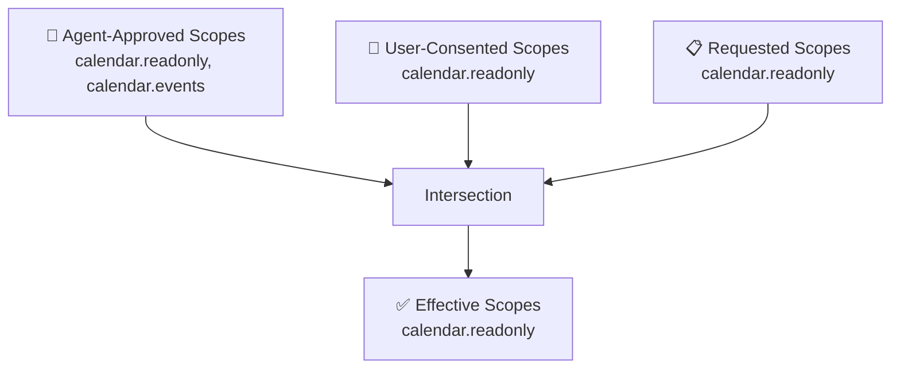
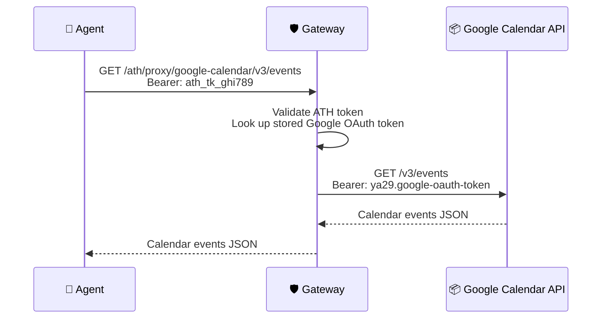
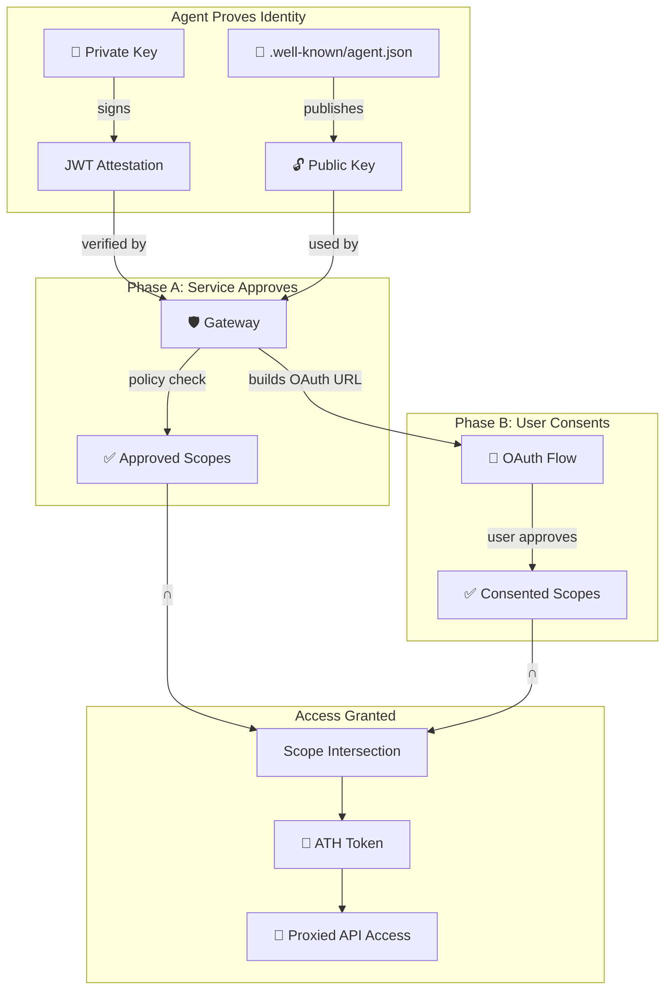

## The ATH Handshake at a Glance

The ATH protocol adds a **trust handshake** around standard OAuth. Think of it as a **two-phase gate**: the agent must pass through both Phase A (service approval) and Phase B (user consent) before getting an access token.



---

## Step 1: Discovery

Before anything else, the agent needs to know **what's available**. It fetches the gateway's discovery document:

```bash
GET https://gateway.example.com/.well-known/ath.json
```

```json
{
  "ath_version": "0.1",
  "gateway_id": "https://gateway.example.com",
  "agent_registration_endpoint": "https://gateway.example.com/ath/agents/register",
  "supported_providers": [
    {
      "provider_id": "github",
      "display_name": "GitHub",
      "available_scopes": ["read:user", "repo", "gist"],
      "auth_mode": "OAUTH2",
      "agent_approval_required": true
    },
    {
      "provider_id": "google-calendar",
      "display_name": "Google Calendar",
      "available_scopes": ["calendar.readonly", "calendar.events"],
      "auth_mode": "OAUTH2",
      "agent_approval_required": true
    }
  ]
}
```

<Info>
  For **native mode** (where the service implements ATH directly), the discovery URL is `/.well-known/ath-app.json` with a slightly different format — see [Deployment Models](/foundations/deployment-models).
</Info>

---

## Step 2: Registration (Phase A)

The agent registers with the gateway, presenting its **identity attestation** — a signed JWT that proves "I am this agent, and here's my cryptographic proof."

```bash
POST https://gateway.example.com/ath/agents/register
Content-Type: application/json

{
  "agent_id": "https://travel-agent.example.com/.well-known/agent.json",
  "agent_attestation": "eyJhbGciOiJFUzI1NiIs...",
  "developer": {
    "name": "TravelCorp",
    "id": "travelcorp-dev"
  },
  "requested_providers": [
    {
      "provider_id": "google-calendar",
      "scopes": ["calendar.readonly"]
    }
  ],
  "purpose": "Read user calendar to suggest travel dates"
}
```

The gateway:
1. **Verifies the attestation JWT** — checks signature against the agent's published public key
2. **Applies policy** — decides which providers/scopes to approve
3. Returns credentials:

```json
{
  "client_id": "ath_abc123",
  "client_secret": "ath_secret_xyz789",
  "agent_status": "approved",
  "approved_providers": [
    {
      "provider_id": "google-calendar",
      "approved_scopes": ["calendar.readonly"],
      "denied_scopes": []
    }
  ],
  "approval_expires": "2025-07-01T00:00:00Z"
}
```

### Agent Identity Document

The `agent_id` is a URL pointing to a JSON document that the gateway can fetch to get the agent's public key:

```json
// https://travel-agent.example.com/.well-known/agent.json
{
  "ath_version": "0.1",
  "agent_id": "https://travel-agent.example.com/.well-known/agent.json",
  "name": "TravelBot",
  "developer": {
    "name": "TravelCorp",
    "id": "travelcorp-dev",
    "contact": "security@travelcorp.com"
  },
  "capabilities": ["calendar-reading", "trip-planning"],
  "public_key": {
    "kty": "EC",
    "crv": "P-256",
    "x": "f83OJ3D2xF1Bg8vub9tLe1gHMzV76e8Tus9uPHvRVEU",
    "y": "x_FEzRu9m36HLN_tue659LNpXW6pCyStikYjKIWI5a0"
  }
}
```

### Agent Attestation JWT

The attestation proves the agent possesses the private key corresponding to the published public key:



---

## Step 3: Authorization (Phase B)

Now the agent starts the user consent flow:

```bash
POST https://gateway.example.com/ath/authorize
Content-Type: application/json

{
  "client_id": "ath_abc123",
  "agent_attestation": "eyJhbGciOiJFUzI1NiIs...",
  "provider_id": "google-calendar",
  "scopes": ["calendar.readonly"],
  "state": "random-csrf-token-abc"
}
```

The gateway builds an OAuth authorization URL with **PKCE** and returns it:

```json
{
  "authorization_url": "https://accounts.google.com/o/oauth2/auth?client_id=...&scope=calendar.readonly&code_challenge=...&code_challenge_method=S256&...",
  "ath_session_id": "ath_sess_def456"
}
```

The agent directs the user to `authorization_url`. The user completes the OAuth consent at Google (or whichever provider). The gateway handles the callback and stores the user's consent.

---

## Step 4: Token Exchange

After the user completes OAuth, the agent exchanges the session for an ATH access token:

```bash
POST https://gateway.example.com/ath/token
Content-Type: application/json

{
  "grant_type": "authorization_code",
  "client_id": "ath_abc123",
  "client_secret": "ath_secret_xyz789",
  "agent_attestation": "eyJhbGciOiJFUzI1NiIs...",
  "code": "oauth-auth-code",
  "ath_session_id": "ath_sess_def456"
}
```

<Warning>
  The `agent_attestation` for the token endpoint must have `aud` set to the **full token endpoint URL** (e.g. `https://gateway.example.com/ath/token`), not the gateway base URL.
</Warning>

### The Scope Intersection

This is ATH's core innovation. The effective permissions are the **intersection** of three sets:



**Formula: `Effective = Agent-Approved ∩ User-Consented ∩ Requested`**

The response includes the full intersection breakdown:

```json
{
  "access_token": "ath_tk_ghi789",
  "token_type": "Bearer",
  "expires_in": 3600,
  "effective_scopes": ["calendar.readonly"],
  "provider_id": "google-calendar",
  "agent_id": "https://travel-agent.example.com/.well-known/agent.json",
  "scope_intersection": {
    "agent_approved": ["calendar.readonly"],
    "user_consented": ["calendar.readonly"],
    "effective": ["calendar.readonly"]
  }
}
```

If the intersection is **empty** (no common scopes across all three sets), the token request is **rejected**. This ensures no party grants more than they intended.

---

## Step 5: API Access via Proxy

The agent uses the ATH token to call APIs through the gateway:

```bash
GET https://gateway.example.com/ath/proxy/google-calendar/v3/calendars/primary/events
Authorization: Bearer ath_tk_ghi789
X-ATH-Agent-ID: https://travel-agent.example.com/.well-known/agent.json
```

The gateway:
1. Validates the ATH token (not expired, not revoked, provider matches)
2. Checks the `X-ATH-Agent-ID` matches the token binding
3. **Swaps the ATH token** for the stored upstream OAuth token
4. Forwards the request to Google Calendar API
5. Returns the response to the agent



<Note>
  The **upstream OAuth token never reaches the agent**. The gateway holds it securely and only uses it when proxying requests. This is a critical security boundary.
</Note>

---

## Step 6: Revocation

When the agent no longer needs access, it revokes the token:

```bash
POST https://gateway.example.com/ath/revoke
Content-Type: application/json

{
  "client_id": "ath_abc123",
  "client_secret": "ath_secret_xyz789",
  "token": "ath_tk_ghi789"
}
```

---

## The Complete Trust Chain



<Card title="Next: Deployment Models" icon="arrow-right" href="/foundations/deployment-models">
  Gateway mode, native mode, and when to use each
</Card>
