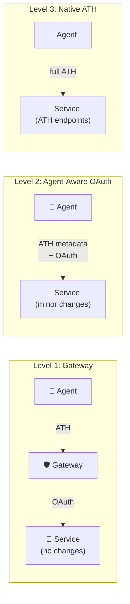
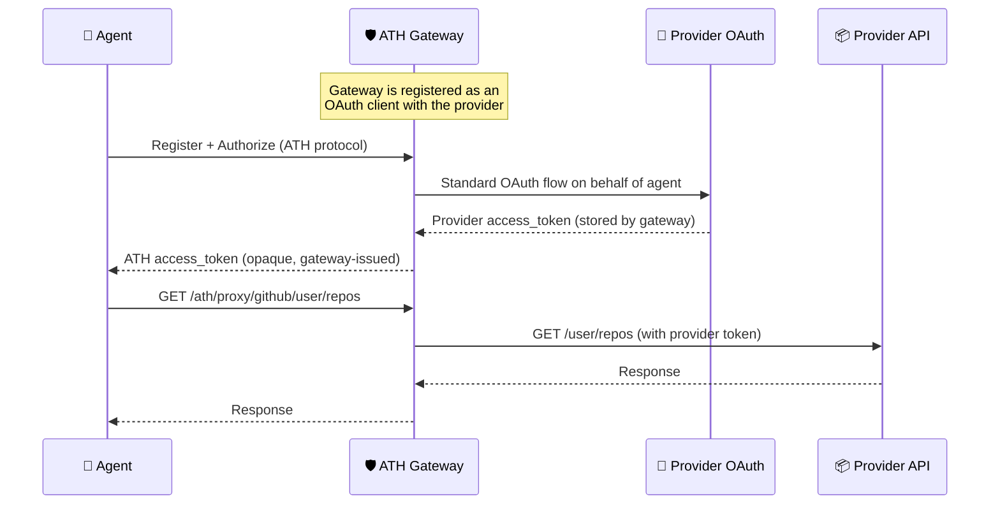
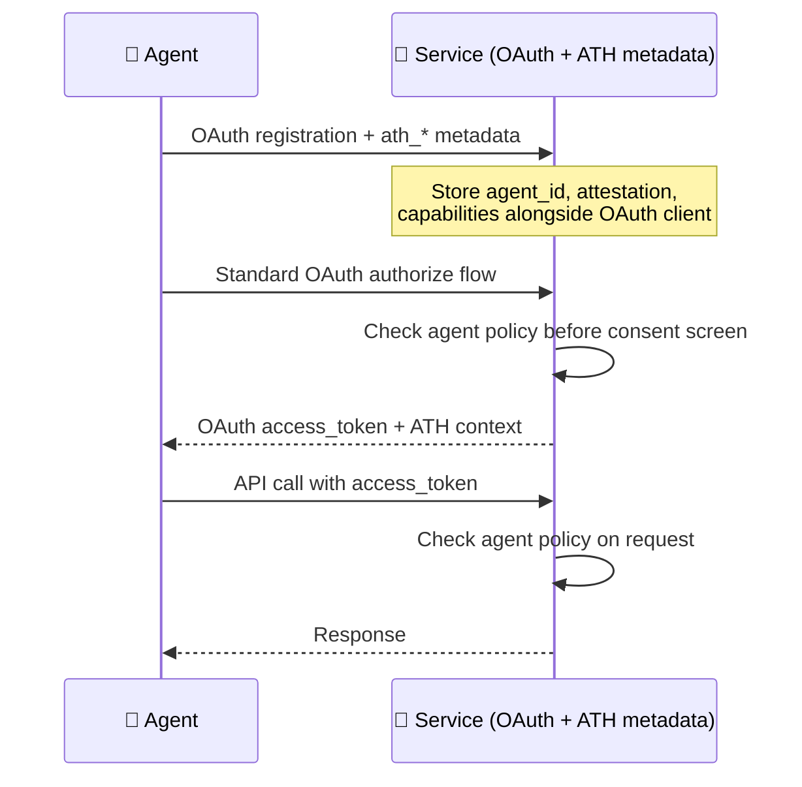
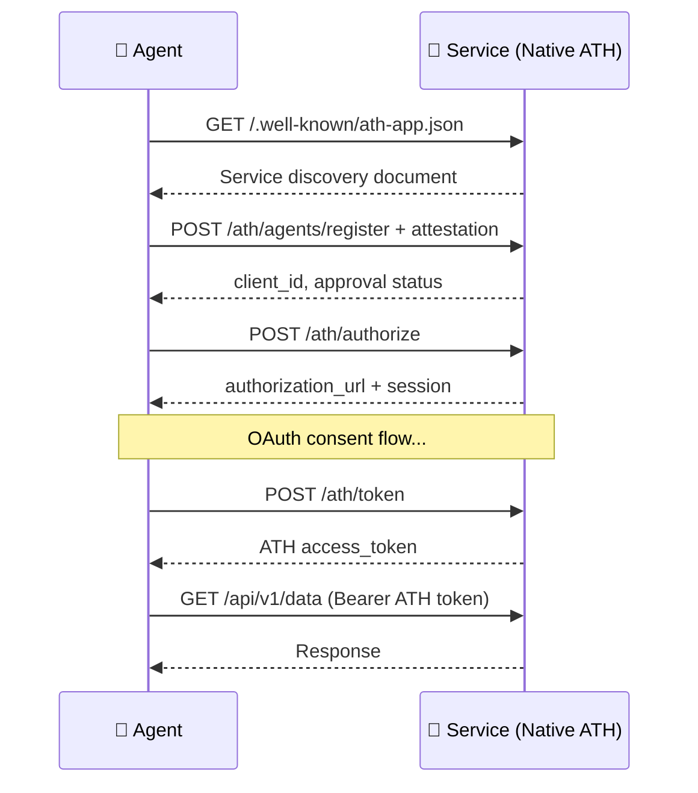
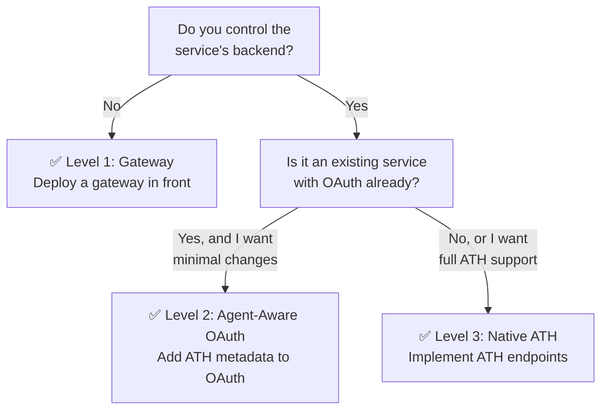

## Overview

ATH defines **three adoption levels**, each requiring progressively deeper integration. Choose the level that matches your situation:



| Level | Backend Changes | Agent Gets | Best For |
|:-----:|:---------------:|:----------:|----------|
| **1 — Gateway** | None | ATH token (proxied access) | Existing services with no API changes |
| **2 — Agent-Aware** | Minimal | OAuth token + ATH metadata | Services that want agent visibility |
| **3 — Native** | Full ATH endpoints | ATH token (direct access) | New services built for agents |

---

## Level 1: Gateway Mode

The gateway acts as a **trust broker** — agents speak ATH to the gateway, and the gateway speaks standard OAuth to upstream services. The upstream service requires **zero modifications**.



### Key Characteristics

- **Agent never touches the provider's OAuth token** — only the gateway holds it
- **Agent gets an opaque ATH token** — bound to agent + user + provider + scopes
- **Provider sees normal OAuth traffic** — it doesn't know an agent is involved
- **Gateway handles**: agent identity verification, registration policy, OAuth bridging, scope intersection, proxy

### When to Use

- You want to secure agent access to **existing services** (GitHub, Google, Slack, etc.)
- You can't or don't want to modify the upstream service
- You want **centralized control** over which agents can access which services

<Tip>
  This is the **fastest path** to securing agent access — deploy a gateway, configure your OAuth providers, and agents can start connecting immediately.
</Tip>

---

## Level 2: Agent-Aware OAuth

The service enhances its **existing OAuth system** to recognize agents. No new endpoints — just extra metadata during OAuth client registration and token inspection.



### What Changes in Your OAuth Server

1. **Registration**: Accept `ath_agent_id`, `ath_attestation`, `ath_capabilities` alongside standard OAuth `client_id` registration
2. **Authorization**: Check agent approval policy before showing the consent screen
3. **Token introspection**: Include `agent_id` and `effective_scopes` in token metadata
4. **API middleware**: Optionally enforce agent-specific rate limits or scope restrictions

### When to Use

- You own the service and want **agent visibility** without a full ATH rewrite
- Your OAuth infrastructure is mature and you want to extend it
- You want agents to get standard OAuth tokens (not proxied)

---

## Level 3: Native ATH

The service implements the **full ATH endpoint suite** directly. This gives the richest integration — agents connect directly to the service with the complete trust handshake.



### Native Discovery Document

```json
// GET https://service.example.com/.well-known/ath-app.json
{
  "ath_version": "0.1",
  "app_id": "com.example.calendar",
  "name": "Example Calendar Service",
  "auth": {
    "type": "oauth2",
    "authorization_endpoint": "https://service.example.com/oauth/authorize",
    "token_endpoint": "https://service.example.com/oauth/token",
    "scopes_supported": ["read", "write", "admin"],
    "agent_attestation_required": true
  },
  "api_base": "https://service.example.com/api/v1"
}
```

### Key Differences from Gateway

| Aspect | Gateway | Native |
|--------|---------|--------|
| **Discovery URL** | `/.well-known/ath.json` | `/.well-known/ath-app.json` |
| **API access** | Via proxy: `/ath/proxy/{provider}/...` | Direct: `{api_base}/...` |
| **OAuth** | Gateway is the OAuth client | Service is the OAuth provider |
| **Token type** | Gateway-issued opaque token | Service-issued ATH token |
| **Provider token** | Held by gateway | Service manages its own tokens |

### When to Use

- Building a **new service** designed for agent access from the start
- Need the **richest consent UX** — custom per-agent consent screens
- Want **direct agent-to-service** communication without a gateway intermediary

---

## Decision Flowchart



---

## What's Next?

Based on your deployment model, jump to the relevant guide:

<CardGroup cols={3}>
  <Card title="Gateway Guide" icon="server" href="/gateway/what-gateway-does">
    Set up an ATH gateway to proxy existing OAuth services
  </Card>
  <Card title="Server Guide" icon="code" href="/server/architecture-overview">
    Build an ATH server from scratch or add ATH to existing OAuth
  </Card>
  <Card title="Client Guide" icon="terminal" href="/client/concepts">
    Build agents that connect via TypeScript SDK, Python SDK, or athx CLI
  </Card>
</CardGroup>
