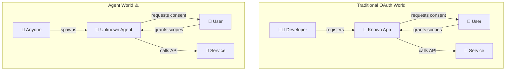
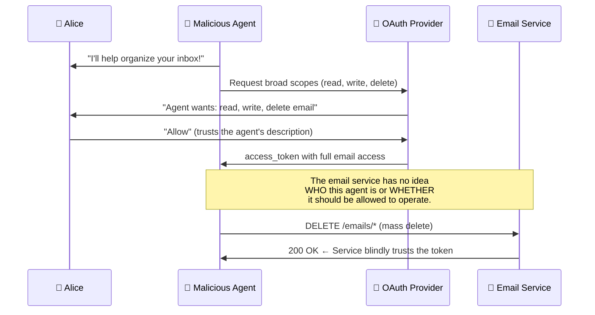
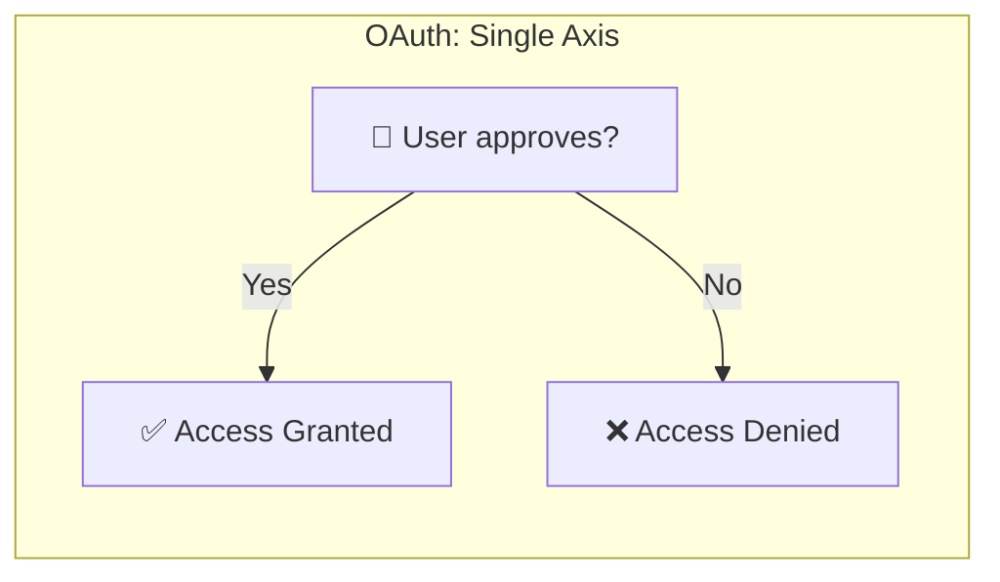
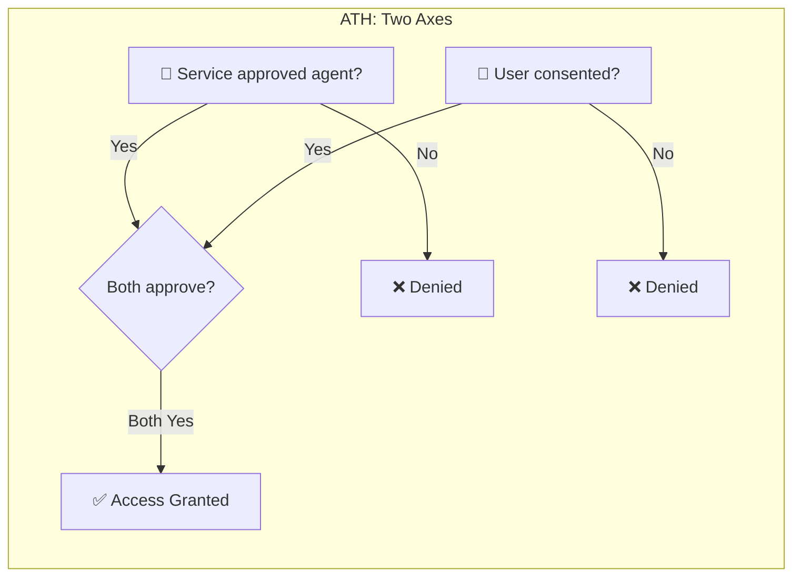
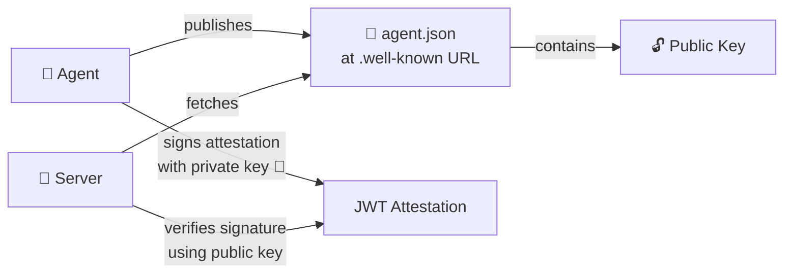
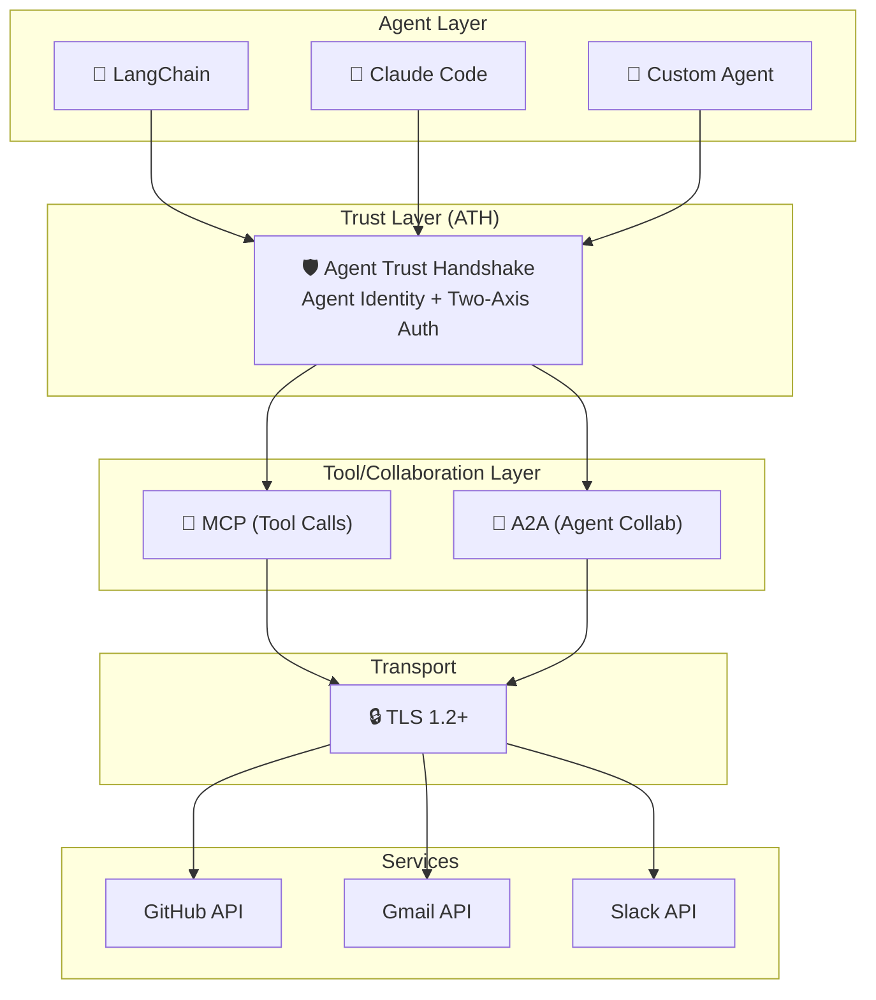

## OAuth Was Built for Apps, Not Agents

OAuth 2.0 was designed for a world where a **human developer** registers an app, a **human user** reviews permissions, and the app is a known, auditable piece of software.

AI agents break these assumptions:

### The Missing Question

OAuth answers one critical question:

> ✅ **"Did the user consent to grant these permissions?"**

But it does **not** answer:

> ❌ **"Did the service approve this specific agent to operate here?"**

### Why This Matters: An Attack Scenario

The email service **cannot distinguish** between:
- A legitimate, well-known email assistant
- A rogue agent that obtained user consent through social engineering

**The service never got to approve or deny this agent.**

---

## What's Missing: Two-Axis Authorization

In the traditional OAuth model, authorization is **one-dimensional** — only the user decides:

What we need for agents is **two-dimensional** — both the user AND the service must approve:

| Scenario | Service approves? | User consents? | Result |
|----------|:-:|:-:|--------|
| Legitimate agent, user agrees | ✅ | ✅ | **Access granted** |
| Good agent, user declines | ✅ | ❌ | No access |
| Unknown agent, user tricked | ❌ | ✅ | **No access** ← ATH prevents this |
| Unknown agent, user declines | ❌ | ❌ | No access |

The key insight: **Row 3 is impossible with OAuth alone**, but ATH blocks it.

---

## The Agent Identity Problem

Beyond authorization, there's an **identity** gap. When an app registers with an OAuth provider, it gets a `client_id`. But there's no standard way to verify:

- **Who** built this agent?
- **What** is this agent supposed to do?
- Is this the **same** agent that was approved last week, or a different one using the same name?

ATH solves this with **cryptographic agent identity** — each agent has a verifiable identity document and proves it owns that identity with a signed JWT (called an **attestation**).

---

## Where ATH Fits in the Stack

ATH doesn't replace existing protocols — it adds a **trust layer** between the agent ecosystem and the service ecosystem:

| Protocol | What it does | ATH's relationship |
|----------|-------------|-------------------|
| **OAuth 2.0** | User consent & delegation | ATH builds on top of OAuth |
| **MCP** | Tool calling interface for agents | ATH secures MCP tool calls |
| **A2A** | Agent-to-agent collaboration | ATH authenticates agents in A2A |
| **TLS** | Encrypted transport | ATH requires TLS 1.2+ |

<Card title="Next: ATH Two-Axis Trust" icon="arrow-right" href="/foundations/ath-two-axis-trust">
  How ATH's handshake protocol works step by step
</Card>
