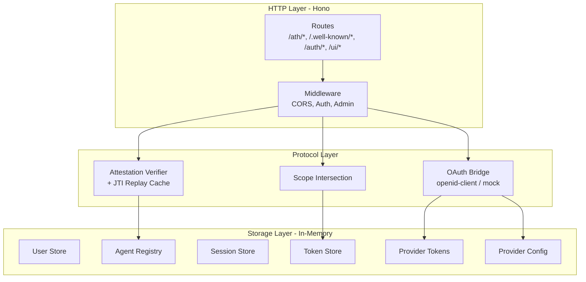
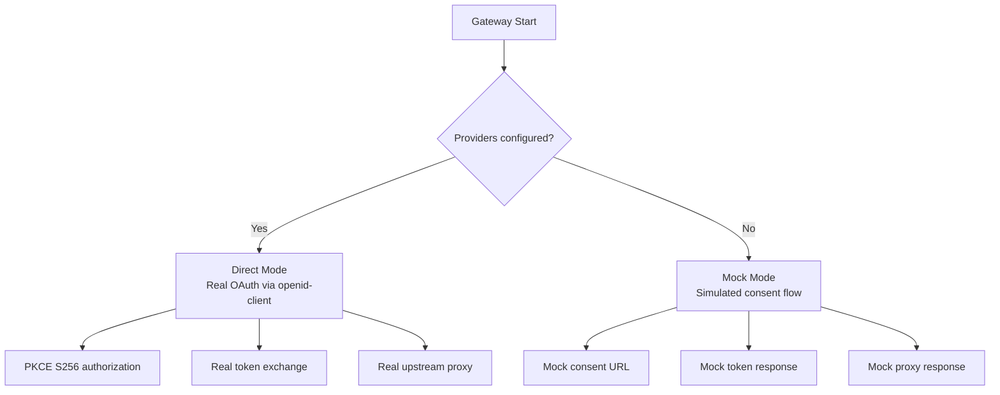

## Component Architecture

## OAuth Modes

| Feature | Direct Mode | Mock Mode |
|---------|------------|-----------|
| **OAuth URLs** | Real provider endpoints | `/ui/mock-consent` |
| **PKCE** | Real S256 | Simulated |
| **Provider tokens** | Real upstream tokens | Placeholder |
| **Proxy** | Forwards to real APIs | Mock data |
| **Use case** | Production | Development |

## Storage Details

All stores are **in-memory** in the reference implementation. For production, replace with persistent backends:

| Store | What to Replace With |
|-------|---------------------|
| Agent Registry | PostgreSQL / Redis |
| Session Store | Redis with TTL |
| Token Store | PostgreSQL with expiry index |
| Provider Token Store | Encrypted database |
| User Store | PostgreSQL with bcrypt/scrypt |

<Card title="Next: Production Deployment" icon="arrow-right" href="/gateway/production">
  Considerations for deploying the gateway in production
</Card>
