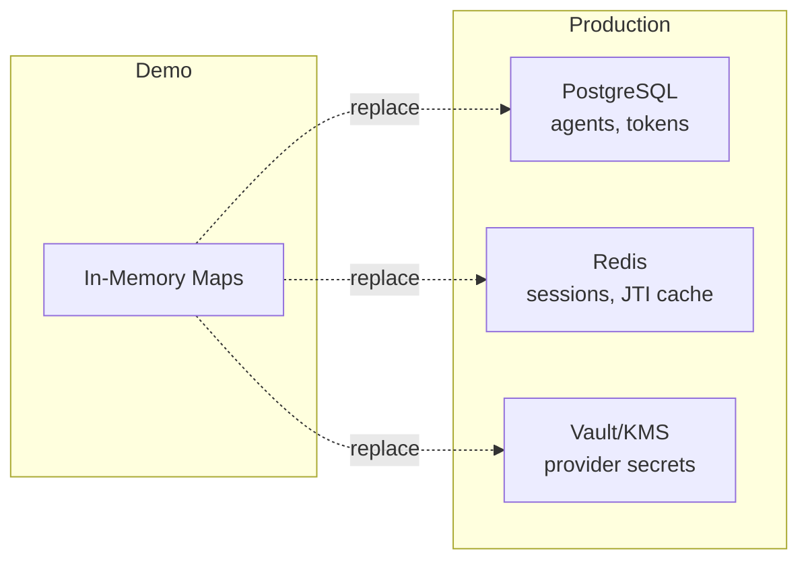

## Production Checklist

The reference gateway is a **demo implementation**. Before deploying to production:

### 1. Enable Attestation Signature Verification

The demo skips cryptographic verification. In production, remove `skipSignatureVerification: true`.

### 2. Replace In-Memory Stores

All data is lost on restart. Use persistent storage:

### 3. Secure Secrets

- Use a secrets manager for provider OAuth client secrets
- Use strong, persistent `ATH_JWT_SECRET`
- Rotate secrets periodically

### 4. TLS

ATH requires **TLS 1.2+**. Deploy behind nginx, Caddy, or a load balancer with TLS termination.

### 5. Rate Limiting

Protect endpoints: registration per IP/agent_id, authorization per client_id, proxy per token.

### 6. Audit Logging

Log all ATH operations for security monitoring.

### 7. UI Authentication

Add `requireAdmin` middleware to UI provider management POST endpoints.

### 8. Multi-Instance

For horizontal scaling, ensure stores are shared across instances.
