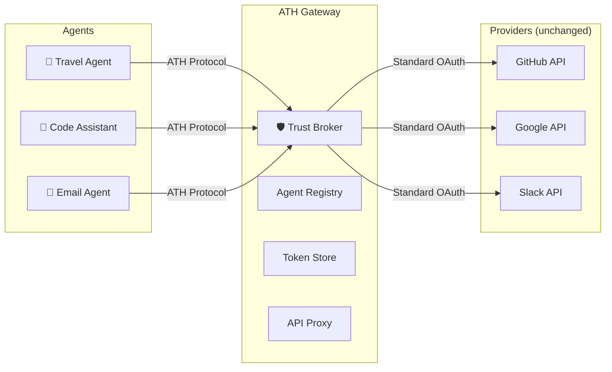
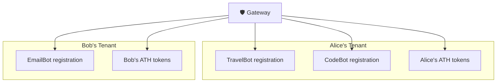

## The Gateway's Role

An ATH gateway sits between agents and existing OAuth-protected services. It handles the **entire trust handshake** so that upstream services require **zero modifications**.

## What the Gateway Handles

| Responsibility | What it does |
|---------------|-------------|
| **Discovery** | Publishes `/.well-known/ath.json` with available providers and scopes |
| **Agent Registration** | Verifies agent attestations, applies approval policy, issues `client_id`/`client_secret` |
| **OAuth Bridge** | Initiates OAuth with upstream providers using PKCE, handles callbacks, stores provider tokens |
| **Token Issuance** | Computes scope intersection, issues bound ATH tokens |
| **API Proxy** | Validates ATH tokens, swaps for provider tokens, forwards requests |
| **Revocation** | Invalidates ATH tokens |
| **User Management** | Gateway users (tenants) who own agent registrations |

## Multi-Tenant Architecture

The reference gateway is **multi-tenant** — each gateway user has their own isolated set of agent registrations, sessions, and tokens:

Agents registered under Alice's account **cannot** access Bob's data or tokens.

## Security Properties

1. **Provider tokens never reach agents** — the gateway is the only entity that holds upstream OAuth tokens
2. **Attestation verification** — agents must prove their identity cryptographically on every sensitive request
3. **Scope intersection** — agents can never exceed the minimum of what the service approved, what the user consented, and what the agent requested
4. **Session binding** — OAuth sessions are single-use, short-lived (10 min), and browser-bound
5. **JTI replay protection** — agent attestations cannot be replayed

<Card title="Next: Setup" icon="arrow-right" href="/gateway/setup">
  Install and configure the reference gateway
</Card>
