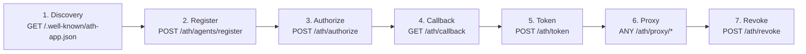

## Protocol Flow

The endpoints are called in this order:



## Endpoint Map

| Method | Path | Purpose |
|--------|------|---------|
| `GET` | `/.well-known/ath-app.json` | Native service discovery |
| `GET` | `/.well-known/ath.json` | Gateway discovery |
| `POST` | `/ath/agents/register` | Agent registration |
| `POST` | `/ath/authorize` | Start user authorization |
| `GET` | `/ath/callback` | OAuth callback |
| `POST` | `/ath/token` | Token exchange |
| `ANY` | `/ath/proxy/{provider_id}/{path}` | API proxy |
| `POST` | `/ath/revoke` | Token revocation |

---

## POST /ath/agents/register

**Request:**
```json
{
  "agent_id": "https://agent.example/.well-known/agent.json",
  "agent_attestation": "<JWT>",
  "developer": { "name": "...", "id": "..." },
  "requested_providers": [{ "provider_id": "...", "scopes": ["..."] }],
  "purpose": "...",
  "redirect_uris": ["..."]
}
```

**Response (201):**
```json
{
  "client_id": "ath_...",
  "client_secret": "ath_secret_...",
  "agent_status": "approved",
  "approved_providers": [{ "provider_id": "...", "approved_scopes": [...], "denied_scopes": [...] }],
  "approval_expires": "2025-..."
}
```

---

## POST /ath/authorize

**Request:**
```json
{
  "client_id": "ath_...",
  "agent_attestation": "<JWT>",
  "provider_id": "...",
  "scopes": ["..."],
  "state": "<random>",
  "user_redirect_uri": "...",
  "resource": "..."
}
```

**Response (200):**
```json
{
  "authorization_url": "https://...",
  "ath_session_id": "ath_sess_..."
}
```

---

## POST /ath/token

**Request:**
```json
{
  "grant_type": "authorization_code",
  "client_id": "ath_...",
  "client_secret": "ath_secret_...",
  "agent_attestation": "<JWT with aud=token endpoint URL>",
  "code": "...",
  "ath_session_id": "ath_sess_..."
}
```

**Response (200):**
```json
{
  "access_token": "ath_tk_...",
  "token_type": "Bearer",
  "expires_in": 3600,
  "effective_scopes": ["..."],
  "provider_id": "...",
  "agent_id": "...",
  "scope_intersection": {
    "agent_approved": ["..."],
    "user_consented": ["..."],
    "effective": ["..."]
  }
}
```

---

## ANY /ath/proxy/{provider_id}/{path}

**Headers:**
```
Authorization: Bearer ath_tk_...
X-ATH-Agent-ID: https://agent.example/.well-known/agent.json  (optional)
```

**Response:** Upstream API response (forwarded).

---

## POST /ath/revoke

**Request:**
```json
{
  "token": "ath_tk_...",
  "client_id": "ath_...",
  "client_secret": "ath_secret_..."
}
```

**Response:** Always `200 OK`.
