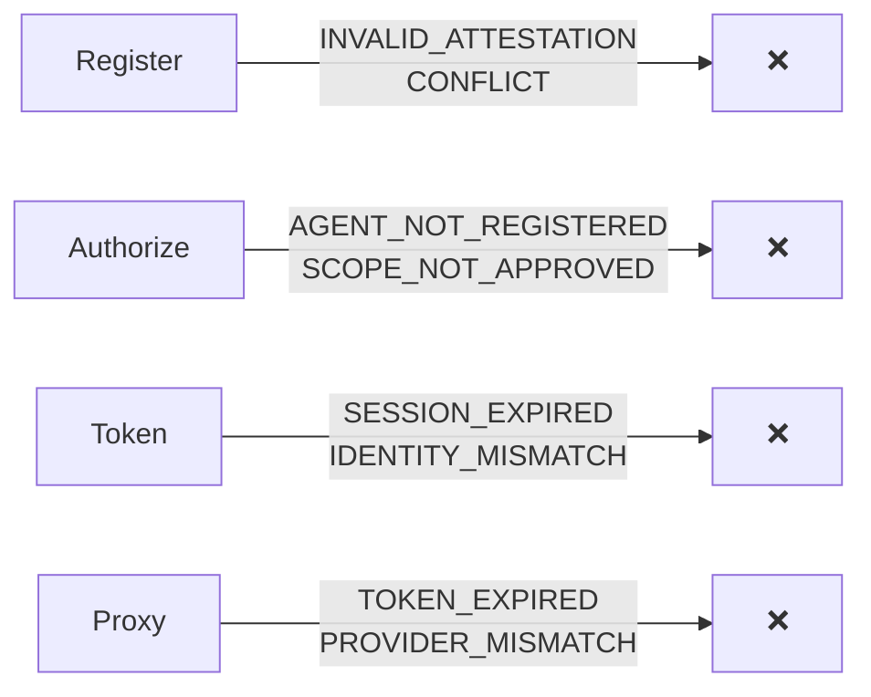

## Where Errors Happen



Most errors are self-explanatory from their code. The table below maps each to its cause and fix.

## Error Response Format

```json
{
  "code": "ERROR_CODE",
  "message": "Human-readable description"
}
```

---

## Error Code Reference

| Code | HTTP | What went wrong | How to fix it |
|------|:----:|----------------|---------------|
| `INVALID_ATTESTATION` | 401 | JWT is malformed, expired, wrong `aud`, or replayed `jti` | Generate a fresh attestation. Check `aud` matches the endpoint URL. |
| `AGENT_NOT_REGISTERED` | 403 | Agent hasn't registered yet | Call `/ath/agents/register` first |
| `AGENT_UNAPPROVED` | 403 | Registration is `pending` or `denied` | Wait for approval or request with different scopes |
| `PROVIDER_NOT_APPROVED` | 403 | Agent isn't approved for this provider | Register with this provider |
| `SCOPE_NOT_APPROVED` | 403 | Requested scopes exceed what's approved | Request only scopes you were approved for |
| `SESSION_NOT_FOUND` | 400 | Unknown `ath_session_id` | Use the session from your most recent `authorize` call |
| `SESSION_EXPIRED` | 400 | Session is older than 10 minutes | Call `authorize` again — sessions are short-lived |
| `STATE_MISMATCH` | 400 | OAuth state doesn't match | Don't reuse state values |
| `TOKEN_INVALID` | 401 | Token not recognized | Get a new token |
| `TOKEN_EXPIRED` | 401 | Token past its `expires_in` | Re-authorize and get a new token |
| `TOKEN_REVOKED` | 401 | Token was revoked | Re-authorize and get a new token |
| `AGENT_IDENTITY_MISMATCH` | 403 | Attestation `sub` ≠ registered agent | Check your `agentId` matches what you registered with |
| `PROVIDER_MISMATCH` | 403 | Token was issued for a different provider | Use the token only for the provider it was issued for |
| `USER_DENIED` | 403 | User clicked "Deny" on consent page | User declined — respect their decision |
| `OAUTH_ERROR` | 502 | Upstream OAuth provider returned an error | Check provider configuration |
| `INTERNAL_ERROR` | 500 | Server bug | Report to service operator |

---

## Common Mistakes

<Accordion title="INVALID_ATTESTATION on /ath/token">
The attestation for the token endpoint must have `aud` set to the **full token endpoint URL** (e.g., `https://example.com/ath/token`), not the base URL. The SDK handles this automatically — if you're getting this error with the SDK, check that your `url` config is correct.
</Accordion>

<Accordion title="SESSION_EXPIRED after user approved">
ATH sessions expire after 10 minutes. If the user takes too long to approve (or you wait too long after they approve), the session expires. Call `authorize` again to get a fresh session.
</Accordion>

<Accordion title="PROVIDER_MISMATCH on proxy">
Each ATH token is bound to one provider. If you got a token for `github` and try to use it for `slack`, you'll get this error. Get a separate token for each provider.
</Accordion>
