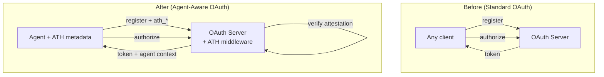
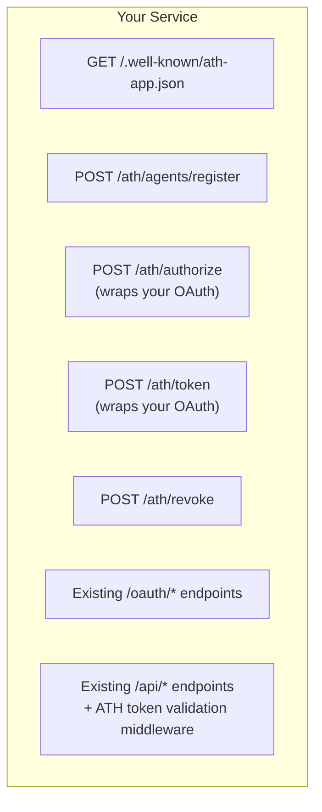

## Starting Point

You already have an OAuth 2.0 authorization server with:
- A registration system for clients
- An `/oauth/authorize` consent screen
- A `/oauth/token` endpoint
- A resource server (API)

Here's how to progressively add ATH support.

## Level 2: Agent-Aware OAuth (Minimal Changes)



### Step 1: Extend Client Registration

Add ATH fields to your OAuth client registration:

```typescript
// Your existing OAuth client registration handler
app.post("/oauth/register", async (req, res) => {
  const { client_name, redirect_uris, /* existing fields */ } = req.body;

  // NEW: Accept ATH metadata
  const {
    ath_agent_id,       // Agent identity URL
    ath_attestation,    // Signed JWT
    ath_capabilities,   // What the agent can do
  } = req.body;

  // If ATH fields are present, verify the attestation
  if (ath_agent_id && ath_attestation) {
    const { verifyAttestation } = require("@ath-protocol/server");
    const result = await verifyAttestation(ath_attestation, {
      audience: "https://your-service.com",
    });
    if (!result.valid) {
      return res.status(401).json({ error: "Invalid agent attestation" });
    }
  }

  // Register the client as normal, storing ATH metadata alongside
  const client = await createOAuthClient({
    client_name,
    redirect_uris,
    // Store ATH context
    ath_agent_id: ath_agent_id || null,
    ath_capabilities: ath_capabilities || null,
    is_agent: !!ath_agent_id,
  });

  return res.json(client);
});
```

### Step 2: Agent-Aware Authorization

Before showing the consent screen, check agent policy:

```typescript
app.get("/oauth/authorize", async (req, res) => {
  const { client_id, scope } = req.query;
  const client = await findOAuthClient(client_id);

  if (client.is_agent) {
    // Check if this agent is allowed to request these scopes
    const allowed = await checkAgentPolicy(client.ath_agent_id, scope.split(" "));
    if (!allowed) {
      return res.status(403).json({ error: "Agent not approved for these scopes" });
    }

    // Show enhanced consent screen with agent identity info
    return res.render("agent-consent", {
      agent_name: client.client_name,
      agent_id: client.ath_agent_id,
      requested_scopes: scope.split(" "),
    });
  }

  // Standard consent screen for non-agent clients
  return res.render("consent", { client, scope });
});
```

### Step 3: Enriched Token Response

Include agent context in token introspection:

```typescript
app.post("/oauth/introspect", async (req, res) => {
  const token = await validateAccessToken(req.body.token);
  const client = await findOAuthClient(token.client_id);

  return res.json({
    active: true,
    scope: token.scope,
    client_id: token.client_id,
    // ATH-enriched fields
    ath_agent_id: client.ath_agent_id || undefined,
    ath_is_agent: client.is_agent,
  });
});
```

---

## Level 3: Full Native ATH

For full native support, you add the complete ATH endpoint suite alongside your existing OAuth:



### Publish a Discovery Document

```typescript
import { createServiceDiscoveryDocument } from "@ath-protocol/server";

app.get("/.well-known/ath-app.json", (req, res) => {
  res.json(createServiceDiscoveryDocument({
    ath_version: "0.1",
    app_id: "com.yourcompany.yourservice",
    name: "Your Service",
    authorization_endpoint: "https://your-service.com/oauth/authorize",
    token_endpoint: "https://your-service.com/oauth/token",
    scopes_supported: ["read", "write", "admin"],
    agent_attestation_required: true,
    api_base: "https://your-service.com/api/v1",
  }));
});
```

### Add Token Validation Middleware

For native mode, agents call your API directly (no proxy). Add ATH token validation to your existing API routes:

```typescript
import { validateToken } from "@ath-protocol/server";

async function athTokenMiddleware(req, res, next) {
  const token = req.headers.authorization?.replace("Bearer ", "");
  if (!token) return res.status(401).json({ error: "Missing token" });

  const result = await validateToken(tokenStore, token, {
    requiredScopes: getRequiredScopes(req.method, req.path),
  });

  if (!result.valid) {
    return res.status(401).json({ code: result.code, message: result.message });
  }

  // Attach agent context to request for downstream use
  req.athAgent = {
    agentId: result.token.agent_id,
    scopes: result.token.effective_scopes,
  };

  next();
}

// Apply to your API routes
app.use("/api/v1/*", athTokenMiddleware);
```

### Migration Checklist

<Steps>
  <Step title="Publish discovery document">
    Add `GET /.well-known/ath-app.json` returning your service config.
  </Step>
  <Step title="Add agent registration endpoint">
    Implement `POST /ath/agents/register` with attestation verification.
  </Step>
  <Step title="Wrap your OAuth authorize">
    Add `POST /ath/authorize` that validates the agent, then delegates to your existing OAuth flow.
  </Step>
  <Step title="Add token exchange">
    Implement `POST /ath/token` with scope intersection logic.
  </Step>
  <Step title="Add token validation middleware">
    Validate ATH tokens on your existing API routes.
  </Step>
  <Step title="Add revocation">
    Implement `POST /ath/revoke` following RFC 7009.
  </Step>
  <Step title="Test end-to-end">
    Use the athx CLI or SDKs to test the complete flow.
  </Step>
</Steps>
