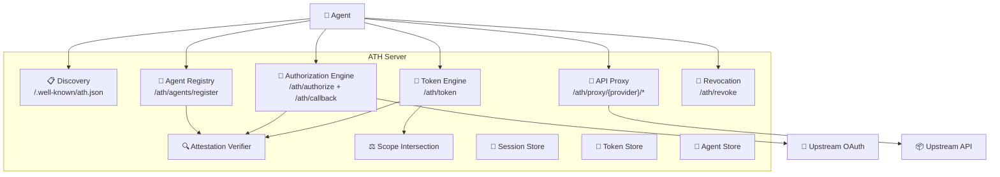
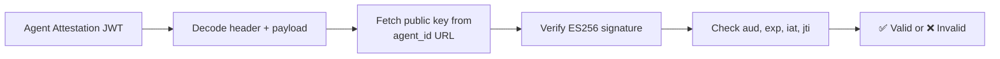

## What Does an ATH Server Do?

An ATH server sits between **agents** and **upstream APIs**. It verifies agent identity, manages registrations, orchestrates OAuth flows, computes scope intersections, and proxies API requests.



---

## Required Endpoints

| Method | Path | Purpose |
|--------|------|---------|
| `GET` | `/.well-known/ath.json` | Discovery — tells agents what's available |
| `POST` | `/ath/agents/register` | Registration — Phase A (app-side approval) |
| `GET` | `/ath/agents/{clientId}` | Lookup — agent queries its own registration |
| `POST` | `/ath/authorize` | Authorization — starts Phase B (user OAuth) |
| `GET` | `/ath/callback` | OAuth callback — handles provider redirect |
| `POST` | `/ath/token` | Token exchange — issues ATH access token |
| `ANY` | `/ath/proxy/{provider_id}/{path}` | API proxy — forwards to upstream with provider token |
| `POST` | `/ath/revoke` | Revocation — invalidates an ATH token |

---

## Required Components

### 1. Attestation Verifier

Validates agent identity by checking ES256 JWT attestations against published public keys.



### 2. Agent Registry

Stores registered agents with their approved scopes, credentials, and status.

```typescript
interface RegisteredAgent {
  client_id: string;
  client_secret_hash: string;
  agent_id: string;
  agent_status: "approved" | "pending" | "denied";
  approved_providers: ProviderApproval[];
  redirect_uris?: string[];
  registered_at: string;
}
```

### 3. Session Store

Tracks in-progress OAuth authorization sessions (short-lived, single-use).

```typescript
interface AuthorizationSession {
  session_id: string;           // returned to agent as ath_session_id
  client_id: string;
  provider_id: string;
  requested_scopes: string[];
  oauth_state: string;          // correlates with OAuth callback
  code_verifier: string;        // PKCE
  status: "pending" | "completed";
  expires_at: number;           // 10-minute TTL
  user_consented_scopes?: string[];
  oauth_connection_id?: string;
}
```

### 4. Token Store

Maps opaque ATH tokens to their bindings (agent, user, provider, scopes).

```typescript
interface BoundToken {
  token: string;                // ath_tk_...
  client_id: string;
  agent_id: string;
  provider_id: string;
  effective_scopes: string[];
  oauth_connection_id: string;  // links to stored provider token
  expires_at: number;
  revoked: boolean;
}
```

### 5. Scope Intersection Engine

Computes `Effective = Agent-Approved ∩ User-Consented ∩ Requested`.

### 6. Provider Token Store

Stores upstream OAuth tokens obtained during the callback, keyed by `oauth_connection_id`.

---

## Using `@ath-protocol/server`

The TypeScript SDK provides a **`@ath-protocol/server`** package with ready-made implementations of all these components. You wire them into your HTTP framework of choice:

```typescript
import {
  createATHHandlers,
  createProxyHandler,
  InMemoryAgentRegistry,
  InMemorySessionStore,
  InMemoryTokenStore,
  InMemoryProviderTokenStore,
  InMemoryJtiCache,
} from "@ath-protocol/server";

const handlers = createATHHandlers({
  registry: new InMemoryAgentRegistry(),
  sessionStore: new InMemorySessionStore(),
  tokenStore: new InMemoryTokenStore(),
  providerTokenStore: new InMemoryProviderTokenStore(),
  config: {
    audience: "https://gateway.example.com",
    callbackUrl: "https://gateway.example.com/ath/callback",
    availableScopes: ["read:user", "repo"],
    appId: "my-gateway",
    oauth: {
      authorizeEndpoint: "https://github.com/login/oauth/authorize",
      tokenEndpoint: "https://github.com/login/oauth/access_token",
      clientId: "github-app-client-id",
      clientSecret: "github-app-client-secret",
    },
  },
});
```

The following pages walk through each endpoint in detail, with both **conceptual explanation** and **code using `@ath-protocol/server`**.

<CardGroup cols={2}>
  <Card title="Identity & Attestation" icon="fingerprint" href="/server/identity-attestation">
    How to verify agent identity
  </Card>
  <Card title="Registration" icon="user-plus" href="/server/registration">
    Implementing Phase A
  </Card>
  <Card title="Authorization" icon="lock-open" href="/server/authorization">
    Implementing Phase B
  </Card>
  <Card title="Token Exchange" icon="ticket" href="/server/token-exchange">
    Issuing ATH tokens
  </Card>
</CardGroup>
