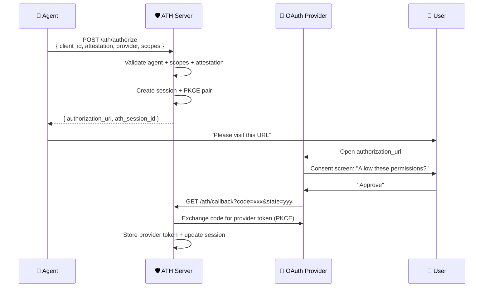
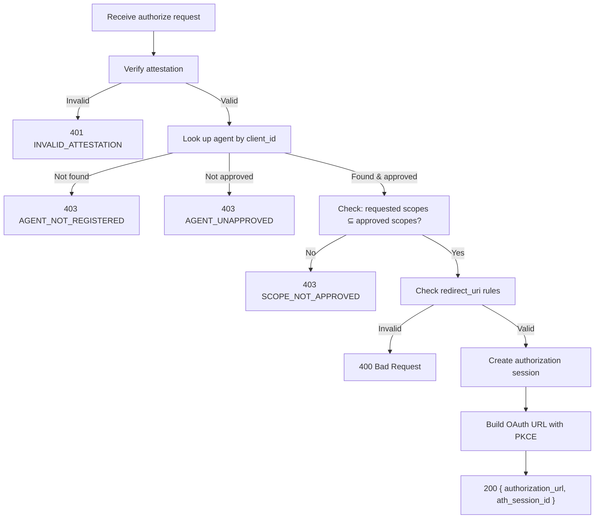
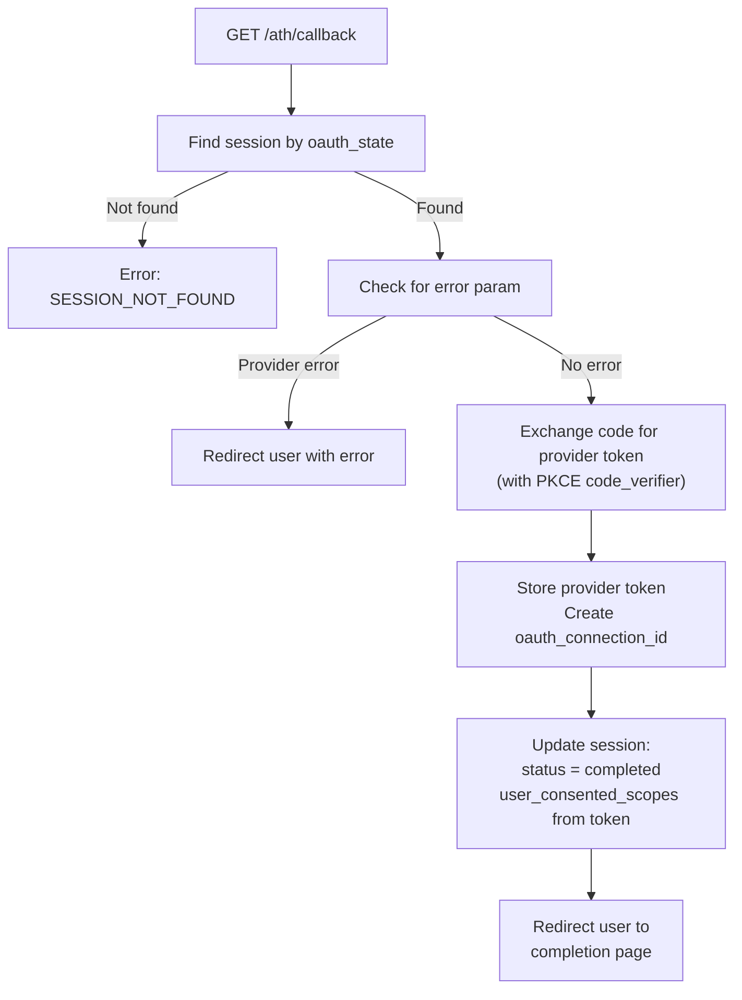

## Purpose

Authorization is **Phase B** — the user consents to the agent acting on their behalf. The server creates an OAuth authorization URL with PKCE and tracks the session.



## Authorize Request

```bash
POST /ath/authorize
Content-Type: application/json

{
  "client_id": "ath_abc123",
  "agent_attestation": "eyJhbGciOiJFUzI1NiIs...",
  "provider_id": "github",
  "scopes": ["read:user", "repo"],
  "state": "c3ab8ff13720e8ad9047dd39466b3c89",
  "user_redirect_uri": "https://my-agent.com/done",
  "resource": "https://api.github.com"
}
```

| Field | Required | Description |
|-------|:--------:|-------------|
| `client_id` | ✅ | From registration |
| `agent_attestation` | ✅ | Fresh JWT (`aud` = server base URL) |
| `provider_id` | ✅ | Which provider to authorize |
| `scopes` | ✅ | Requested scopes (must be ⊆ agent's approved scopes) |
| `state` | ✅ | CSRF protection token (≥128 bits entropy) |
| `user_redirect_uri` | Optional | Where to send user after consent (must match `redirect_uris` from registration) |
| `resource` | Optional | RFC 8707 resource indicator |

## Authorize Response

```json
{
  "authorization_url": "https://github.com/login/oauth/authorize?client_id=...&scope=read:user+repo&code_challenge=...&code_challenge_method=S256&state=...",
  "ath_session_id": "ath_sess_def456"
}
```

## Server-Side Logic



### Redirect URI Rules

- If the agent registered with `redirect_uris`: the `user_redirect_uri` MUST be in that list
- If the agent registered **without** `redirect_uris`: `user_redirect_uri` MUST NOT be provided
- The OAuth callback is always handled by the **server** (at `/ath/callback`)

### Session Creation

The server creates an authorization session with a **10-minute TTL** and **single-use** constraint:

```typescript
const session = {
  session_id: generateId("ath_sess_"),
  client_id: request.client_id,
  provider_id: request.provider_id,
  requested_scopes: request.scopes,
  oauth_state: generateRandomState(), // internal, not the agent's state
  code_verifier: generatePKCEVerifier(),
  user_redirect_uri: request.user_redirect_uri,
  resource: request.resource,
  status: "pending",
  expires_at: Date.now() + 10 * 60 * 1000, // 10 minutes
};
```

### Building the OAuth URL

The server constructs the upstream OAuth authorization URL with **PKCE S256**:

```
https://github.com/login/oauth/authorize?
  client_id=gateway-github-app-id&
  redirect_uri=https://gateway.example.com/ath/callback&
  scope=read:user+repo&
  state={session.oauth_state}&
  code_challenge={SHA256(session.code_verifier)}&
  code_challenge_method=S256
```

---

## OAuth Callback

When the user completes the OAuth consent, the provider redirects to the server's callback:

```bash
GET /ath/callback?code=AUTH_CODE&state=OAUTH_STATE
```

### Callback Logic



<Note>
  The provider token exchange happens **server-side** using `application/x-www-form-urlencoded` (per RFC 6749). The provider's access token is **never** exposed to the agent.
</Note>

## Code Example

```typescript
import { Hono } from "hono";

const app = new Hono();

// Authorization endpoint
app.post("/ath/authorize", async (c) => {
  const body = await c.req.json();
  const result = await handlers.authorize({
    method: "POST",
    url: c.req.url,
    headers: Object.fromEntries(c.req.raw.headers),
    body,
  });
  return c.json(result.body, result.status as any);
});

// OAuth callback (browser redirect from provider)
app.get("/ath/callback", async (c) => {
  const query = c.req.query();
  const result = await handlers.callback({
    method: "GET",
    url: c.req.url,
    headers: Object.fromEntries(c.req.raw.headers),
    body: query,
  });

  // Callback returns a redirect
  if (result.status === 302 && result.headers?.location) {
    return c.redirect(result.headers.location);
  }
  return c.json(result.body, result.status as any);
});
```

<Card title="Next: Token Exchange" icon="arrow-right" href="/server/token-exchange">
  Computing scope intersection and issuing ATH tokens
</Card>
