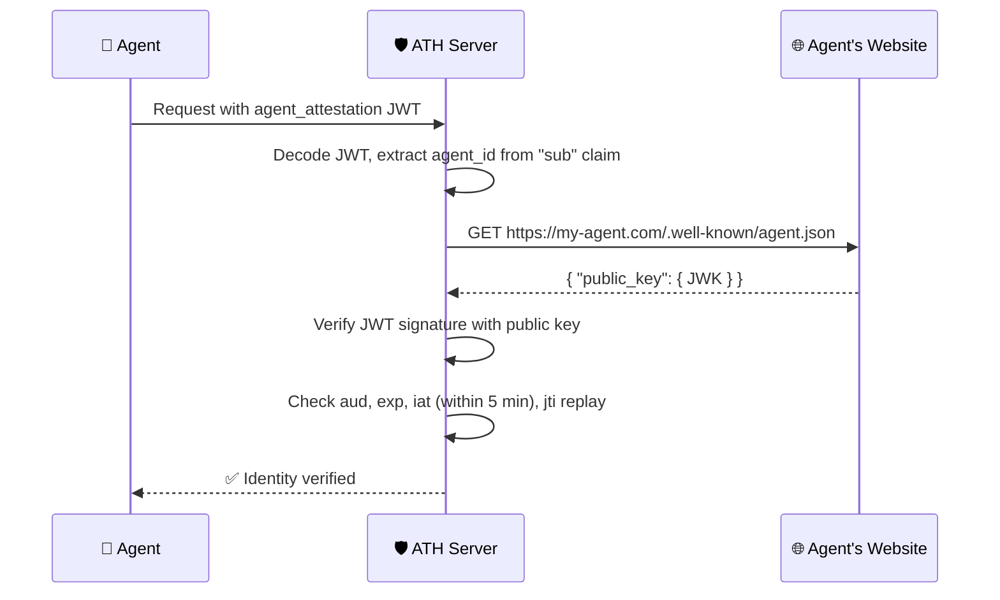

## Agent Identity Model

Every agent in ATH has a **verifiable identity** consisting of:

1. **`agent_id`** — an HTTPS URL pointing to an identity document (e.g. `https://my-agent.com/.well-known/agent.json`)
2. **Identity document** — a JSON file at that URL containing the agent's public key
3. **Attestation** — a signed JWT proving the agent controls the private key



## Identity Document Format

The agent publishes this document at its `agent_id` URL:

```json
{
  "ath_version": "0.1",
  "agent_id": "https://travel-agent.example.com/.well-known/agent.json",
  "name": "TravelBot",
  "developer": {
    "name": "TravelCorp",
    "id": "travelcorp-dev",
    "contact": "security@travelcorp.com"
  },
  "capabilities": ["calendar-reading", "trip-planning"],
  "public_key": {
    "kty": "EC",
    "crv": "P-256",
    "x": "f83OJ3D2xF1Bg8vub9tLe1gHMzV76e8Tus9uPHvRVEU",
    "y": "x_FEzRu9m36HLN_tue659LNpXW6pCyStikYjKIWI5a0"
  }
}
```

## Attestation JWT Structure

Each API call that requires identity proof includes an `agent_attestation` — a fresh JWT signed with the agent's private key:

```json
// Header
{
  "alg": "ES256",
  "kid": "key-2024"
}

// Payload
{
  "iss": "https://travel-agent.example.com",
  "sub": "https://travel-agent.example.com/.well-known/agent.json",
  "aud": "https://gateway.example.com",
  "iat": 1714500000,
  "exp": 1714503600,
  "jti": "550e8400-e29b-41d4-a716-446655440000",
  "capabilities": []
}
```

<Warning>
  The `aud` claim changes depending on which endpoint is being called:
  - **Register / Authorize**: `aud` = gateway or service **base URL**
  - **Token exchange**: `aud` = full **token endpoint URL** (e.g. `https://gateway.example.com/ath/token`)
</Warning>

## Verification Rules

When verifying an attestation, the server MUST check:

| Check | Rule | Error if failed |
|-------|------|-----------------|
| **Algorithm** | Must be `ES256` | `INVALID_ATTESTATION` |
| **Signature** | Verify against public key from `agent_id` document | `INVALID_ATTESTATION` |
| **Audience** | `aud` must match the expected endpoint URL | `INVALID_ATTESTATION` |
| **Expiration** | `exp` must be in the future | `INVALID_ATTESTATION` |
| **Issued At** | `iat` must be within **5 minutes** of server time | `INVALID_ATTESTATION` |
| **JTI Replay** | `jti` must not have been seen before (until `exp`) | `INVALID_ATTESTATION` |
| **Subject** | `sub` must match the `agent_id` from registration | `AGENT_IDENTITY_MISMATCH` |

### Public Key Caching

To avoid fetching the identity document on every request:
- **Cache TTL**: Maximum **5 minutes**
- **Re-fetch**: If signature verification fails (not due to `exp`/`aud`), re-fetch the document **at most once per `agent_id` per minute**

## Implementation with `@ath-protocol/server`

```typescript
import {
  verifyAttestation,
  InMemoryJtiCache,
} from "@ath-protocol/server";

const jtiCache = new InMemoryJtiCache();

async function verifyAgentAttestation(token: string, expectedAudience: string) {
  const result = await verifyAttestation(token, {
    audience: expectedAudience,
    jtiCache: jtiCache,
    // Optional: provide a custom key resolver
    // resolvePublicKey: async (agentId) => { ... }
  });

  if (!result.valid) {
    throw new Error(`Attestation verification failed: ${result.error}`);
  }

  return result.agentId; // verified agent_id
}
```

### Custom Public Key Resolution

By default, `verifyAttestation` fetches the `agent_id` URL and extracts the `public_key` JWK. You can override this:

```typescript
const result = await verifyAttestation(token, {
  audience: "https://gateway.example.com",
  resolvePublicKey: async (agentId: string) => {
    // Look up in your own registry, or fetch from a custom URL
    const doc = await fetch(agentId).then(r => r.json());
    const { importJWK } = await import("jose");
    return importJWK(doc.public_key, "ES256");
  },
});
```

### Skipping Verification in Development

For local development and testing, you can skip cryptographic verification:

```typescript
const result = await verifyAttestation(token, {
  audience: "https://localhost:3000",
  skipSignatureVerification: true, // ⚠️ NEVER in production
});
```

<Card title="Next: Registration" icon="arrow-right" href="/server/registration">
  Implementing the agent registration endpoint
</Card>
