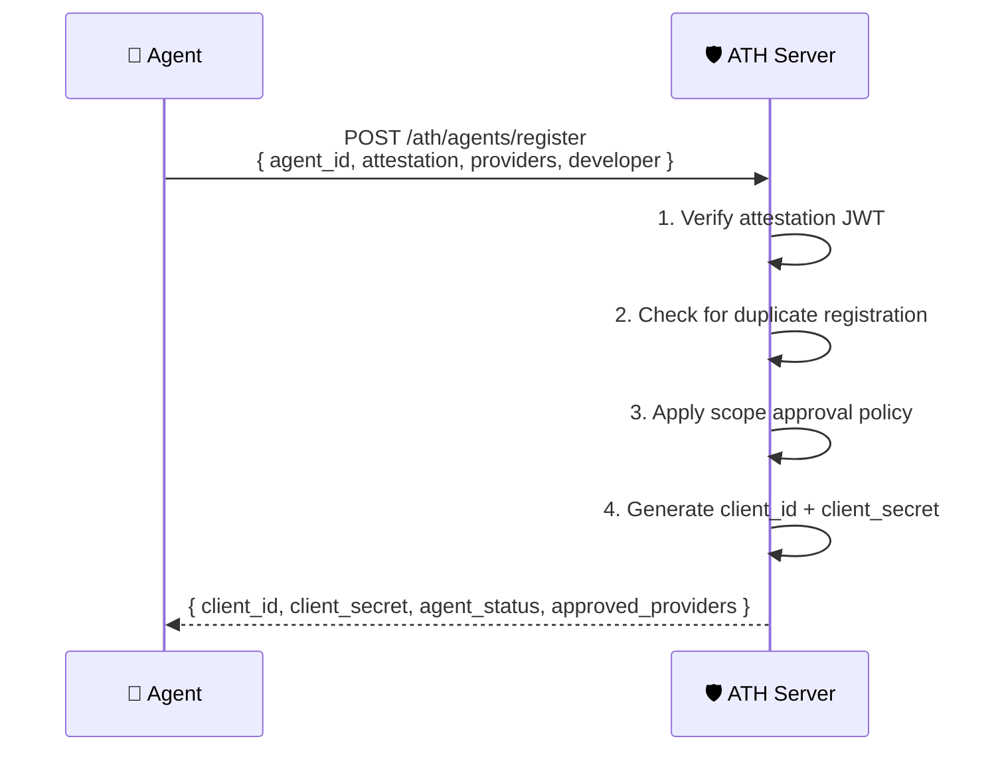
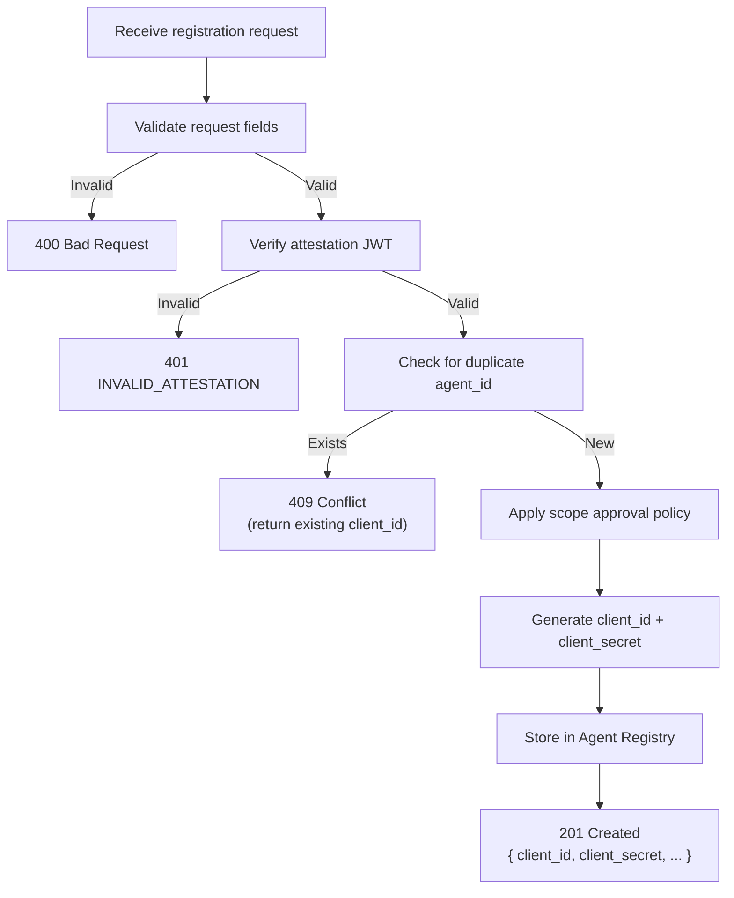

## Purpose

Registration is **Phase A** of the ATH handshake — the server decides whether to **approve** this agent for the requested providers and scopes.



## Request Format

```bash
POST /ath/agents/register
Content-Type: application/json

{
  "agent_id": "https://travel-agent.example.com/.well-known/agent.json",
  "agent_attestation": "eyJhbGciOiJFUzI1NiIs...",
  "developer": {
    "name": "TravelCorp",
    "id": "travelcorp-dev"
  },
  "requested_providers": [
    {
      "provider_id": "google-calendar",
      "scopes": ["calendar.readonly", "calendar.events"]
    }
  ],
  "purpose": "Read user calendar to suggest travel dates",
  "redirect_uris": ["https://travel-agent.example.com/callback"]
}
```

| Field | Required | Description |
|-------|:--------:|-------------|
| `agent_id` | ✅ | Agent's identity URL |
| `agent_attestation` | ✅ | Fresh ES256 JWT (`aud` = server base URL) |
| `developer` | Optional | Developer name and ID |
| `requested_providers` | ✅ | Array of `{ provider_id, scopes }` |
| `purpose` | Optional | Human-readable description of why access is needed |
| `redirect_uris` | Optional | Allowed redirect URIs for OAuth callbacks |

## Response Format

```json
{
  "client_id": "ath_abc123def456",
  "client_secret": "ath_secret_xyz789...",
  "agent_status": "approved",
  "approved_providers": [
    {
      "provider_id": "google-calendar",
      "approved_scopes": ["calendar.readonly"],
      "denied_scopes": ["calendar.events"],
      "denial_reason": "Write access requires manual review"
    }
  ],
  "approval_expires": "2025-07-01T00:00:00Z"
}
```

### Agent Status Values

| Status | Meaning |
|--------|---------|
| `approved` | Agent can proceed to authorization immediately |
| `pending` | Registration received; requires manual review |
| `denied` | Agent is not allowed to use this service |

## Implementation Logic



## Code Example

Using `@ath-protocol/server` with Hono:

```typescript
import { Hono } from "hono";
import {
  createATHHandlers,
  InMemoryAgentRegistry,
  InMemorySessionStore,
  InMemoryTokenStore,
} from "@ath-protocol/server";

const registry = new InMemoryAgentRegistry();

const handlers = createATHHandlers({
  registry,
  sessionStore: new InMemorySessionStore(),
  tokenStore: new InMemoryTokenStore(),
  config: {
    audience: "https://gateway.example.com",
    callbackUrl: "https://gateway.example.com/ath/callback",
    availableScopes: ["calendar.readonly", "calendar.events"],
    appId: "my-gateway",
    oauth: { /* ... */ },
  },
});

const app = new Hono();

app.post("/ath/agents/register", async (c) => {
  const body = await c.req.json();
  const result = await handlers.register({
    method: "POST",
    url: c.req.url,
    headers: Object.fromEntries(c.req.raw.headers),
    body,
  });
  return c.json(result.body, result.status as any);
});
```

### Custom Approval Policy

The default `InMemoryAgentRegistry` approves all registrations. For production, implement a custom policy:

```typescript
import { AgentRegistry, RegisteredAgent } from "@ath-protocol/server";

class CustomAgentRegistry implements AgentRegistry {
  private agents = new Map<string, RegisteredAgent>();

  async register(agent: RegisteredAgent): Promise<void> {
    // Apply your policy here
    const approvedProviders = agent.approved_providers.map(p => ({
      ...p,
      // Only approve scopes that are in your allow-list
      approved_scopes: p.approved_scopes.filter(s =>
        this.isAllowedScope(agent.agent_id, p.provider_id, s)
      ),
    }));

    this.agents.set(agent.client_id, {
      ...agent,
      approved_providers: approvedProviders,
      agent_status: approvedProviders.some(p => p.approved_scopes.length > 0)
        ? "approved"
        : "denied",
    });
  }

  private isAllowedScope(agentId: string, providerId: string, scope: string): boolean {
    // Your business logic: database lookup, allow-list, etc.
    return true;
  }

  async findByClientId(clientId: string): Promise<RegisteredAgent | undefined> {
    return this.agents.get(clientId);
  }

  async findByAgentId(agentId: string): Promise<RegisteredAgent | undefined> {
    return [...this.agents.values()].find(a => a.agent_id === agentId);
  }
}
```

## Error Responses

| Code | HTTP | When |
|------|:----:|------|
| `INVALID_ATTESTATION` | 401 | Attestation JWT is invalid, expired, or replayed |
| Validation error | 400 | Missing required fields or malformed request |
| Conflict | 409 | Agent with this `agent_id` is already registered |

<Card title="Next: Authorization" icon="arrow-right" href="/server/authorization">
  Building the OAuth authorization flow
</Card>
