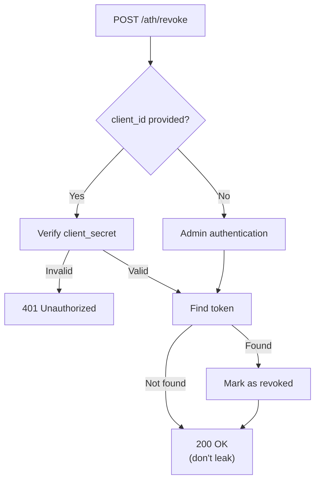

## Purpose

The revocation endpoint allows agents (or administrators) to **invalidate** ATH access tokens. This follows **RFC 7009** semantics.

## Request Format

```bash
POST /ath/revoke
Content-Type: application/json

{
  "client_id": "ath_abc123",
  "client_secret": "ath_secret_xyz789",
  "token": "ath_tk_ghi789"
}
```

| Field | Required | Description |
|-------|:--------:|-------------|
| `token` | ✅ | The ATH token to revoke |
| `client_id` | Optional | Agent's client ID (required if `client_secret` provided) |
| `client_secret` | Optional | Agent's client secret |

## Response

**Always returns `200 OK`** — even if the token is unknown or already revoked. This follows RFC 7009's security principle of not leaking whether a token exists.

```json
{
  "message": "Token revoked"
}
```

## Implementation

```typescript
app.post("/ath/revoke", async (c) => {
  const body = await c.req.json();
  const result = await handlers.revoke({
    method: "POST",
    url: c.req.url,
    headers: Object.fromEntries(c.req.raw.headers),
    body,
  });
  return c.json(result.body, result.status as any);
});
```

## Validation Logic

When `client_id` is provided:
1. Verify `client_secret` matches the registered agent
2. Verify the token belongs to this agent (same `client_id`)
3. Mark the token as revoked

When `client_id` is not provided:
- The server may implement admin-level revocation via other authentication methods



<Card title="Next: Full Example" icon="arrow-right" href="/server/full-example">
  A complete working ATH server with Hono
</Card>
