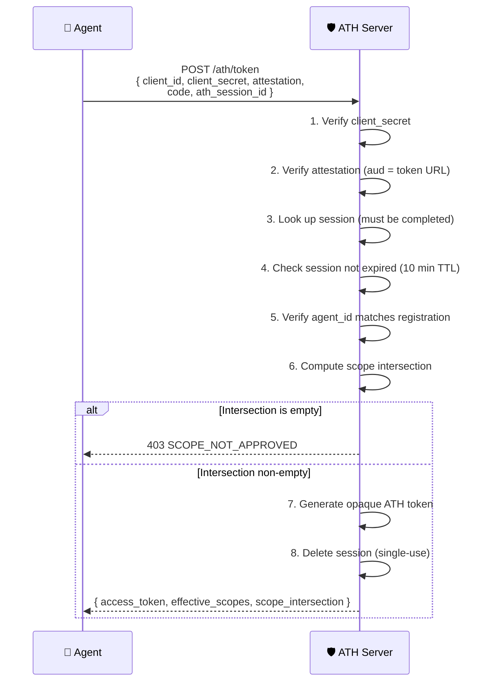
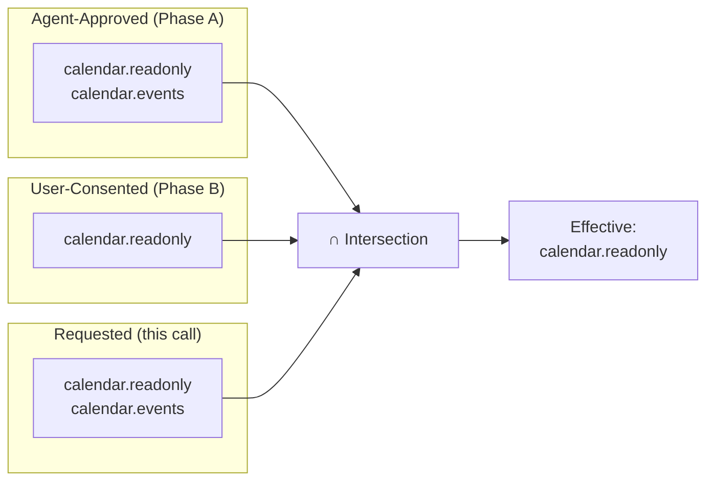
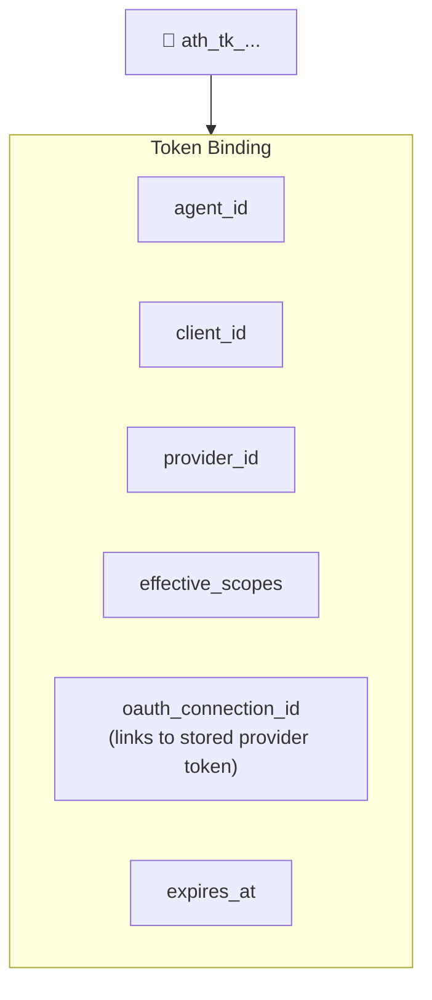

## Purpose

The token endpoint is where the **two authorization axes merge**. The server computes the **scope intersection** and issues an ATH access token if the intersection is non-empty.



## Request Format

```bash
POST /ath/token
Content-Type: application/json

{
  "grant_type": "authorization_code",
  "client_id": "ath_abc123",
  "client_secret": "ath_secret_xyz789",
  "agent_attestation": "eyJhbGciOiJFUzI1NiIs...",
  "code": "oauth-authorization-code",
  "ath_session_id": "ath_sess_def456"
}
```

<Warning>
  The `agent_attestation` JWT **MUST** have `aud` set to the full **token endpoint URL** (e.g., `https://gateway.example.com/ath/token`), not the base URL. This is a common source of `INVALID_ATTESTATION` errors.
</Warning>

## Response Format

```json
{
  "access_token": "ath_tk_secure_random_token_string",
  "token_type": "Bearer",
  "expires_in": 3600,
  "effective_scopes": ["calendar.readonly"],
  "provider_id": "google-calendar",
  "agent_id": "https://travel-agent.example.com/.well-known/agent.json",
  "scope_intersection": {
    "agent_approved": ["calendar.readonly", "calendar.events"],
    "user_consented": ["calendar.readonly"],
    "effective": ["calendar.readonly"]
  }
}
```

## The Scope Intersection in Detail

The core of the token endpoint is the **triple intersection**:



### Why Three Sets?

| Set | Who decides | Purpose |
|-----|:----------:|---------|
| **Agent-Approved** | Service operator (Phase A) | "This agent is allowed these scopes" |
| **User-Consented** | End user (Phase B) | "I allow this agent these scopes" |
| **Requested** | Agent (this request) | "I need these scopes right now" |

The **agent can never get more** than what both the service and user independently agreed to. And it can request **less** than the maximum, following the principle of least privilege.

### Implementation

```typescript
import { intersectScopes } from "@ath-protocol/server";

const result = intersectScopes(
  ["calendar.readonly", "calendar.events"],  // agent-approved
  ["calendar.readonly"],                      // user-consented
  ["calendar.readonly", "calendar.events"],   // requested
);

// result = {
//   agent_approved: ["calendar.readonly", "calendar.events"],
//   user_consented: ["calendar.readonly"],
//   requested: ["calendar.readonly", "calendar.events"],
//   effective: ["calendar.readonly"],
//   denied: ["calendar.events"],
// }
```

## Token Binding

ATH access tokens are **opaque strings** (not JWTs) bound to:



This means:
- A token **cannot be used** for a different provider than it was issued for
- A token **cannot be used** by a different agent
- A token **cannot exceed** its effective scopes
- The **upstream provider token** is only retrieved via the `oauth_connection_id` — it never leaves the server

## Error Responses

| Code | HTTP | When |
|------|:----:|------|
| `INVALID_ATTESTATION` | 401 | Bad attestation or wrong `aud` |
| `AGENT_NOT_REGISTERED` | 403 | `client_id` not found |
| `AGENT_IDENTITY_MISMATCH` | 403 | Attestation `sub` doesn't match registered `agent_id` |
| `SESSION_NOT_FOUND` | 400 | Unknown `ath_session_id` |
| `SESSION_EXPIRED` | 400 | Session older than 10 minutes |
| `SCOPE_NOT_APPROVED` | 403 | Empty scope intersection |

<Card title="Next: Proxy" icon="arrow-right" href="/server/proxy">
  Forwarding API requests to upstream providers
</Card>
