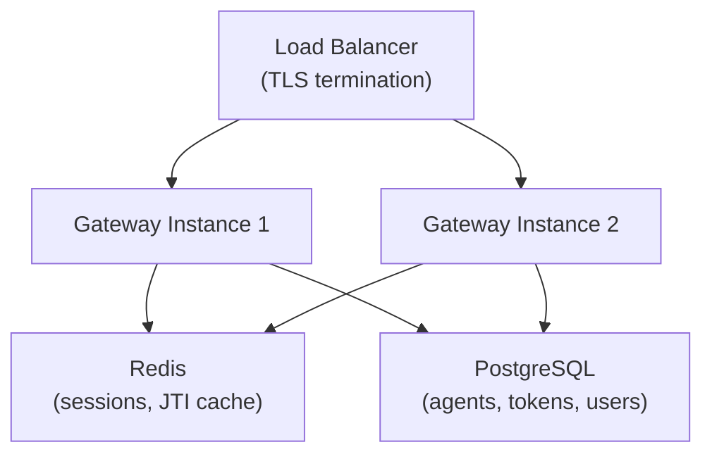

The reference gateway is a **demo**. Before production, address these items:

## Must Do

| Item | Why | How |
|------|-----|-----|
| **Enable attestation verification** | Demo skips crypto verification | Remove `skipSignatureVerification: true` |
| **Persistent storage** | In-memory = data lost on restart | Replace `InMemory*` stores with PostgreSQL/Redis |
| **TLS** | ATH requires HTTPS | Put behind nginx/Caddy with valid certs |
| **Strong JWT secret** | Demo uses random-at-boot | Set `ATH_JWT_SECRET` to a persistent, strong secret |
| **Disable signup** | Demo allows open registration | Set `ATH_SIGNUP_ENABLED=false`, manage users manually |

## Should Do

| Item | Why |
|------|-----|
| **Rate limiting** | Prevent brute-force on registration/token endpoints |
| **Audit logging** | Track which agents accessed what, when |
| **Provider secret encryption** | Don't store OAuth secrets in plaintext JSON |
| **Token expiry tuning** | Adjust `ATH_TOKEN_EXPIRY` based on your security needs |
| **Health checks** | Add `/health` to your monitoring |

## Architecture for Scale

The key change for horizontal scaling: all instances must share session and token state via an external store.
