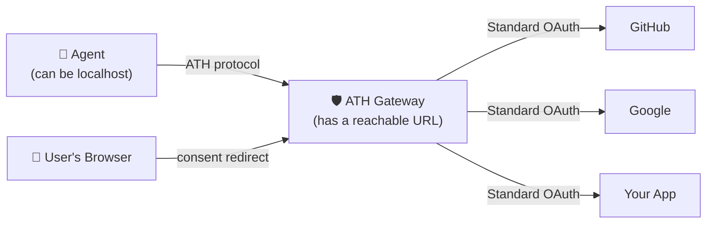
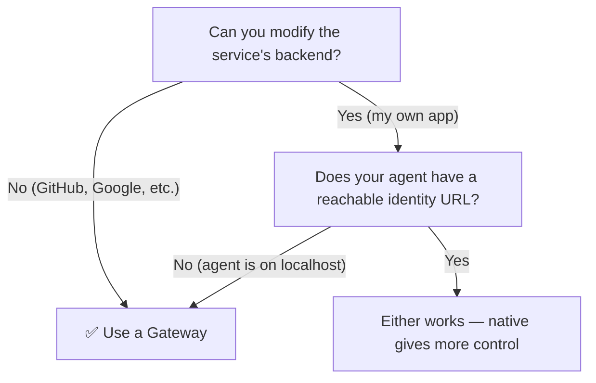
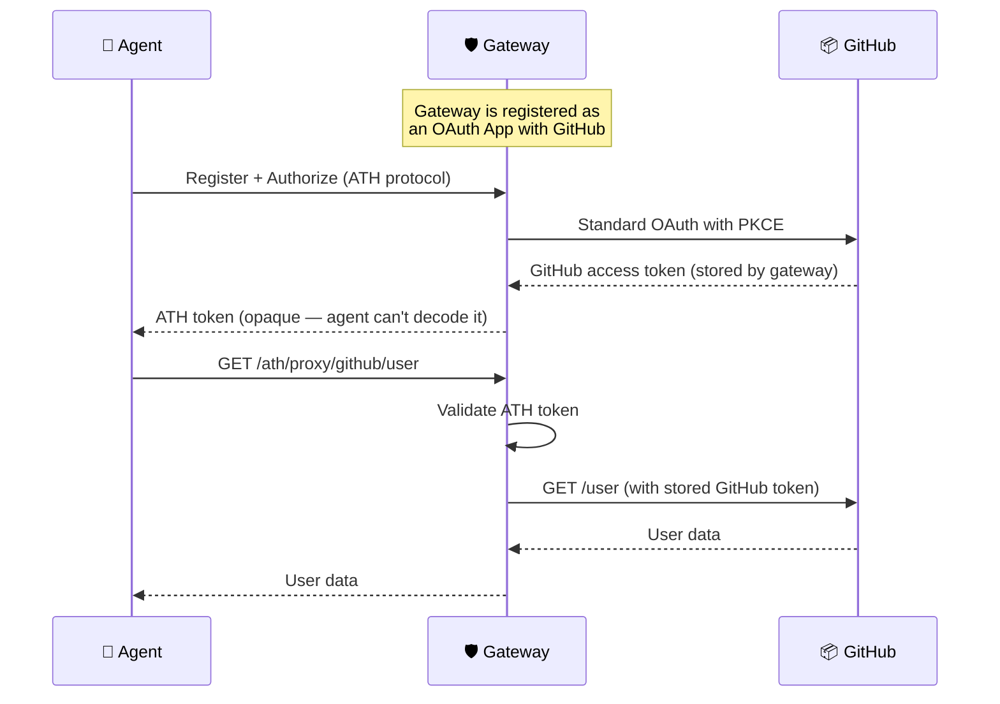

## What We're Building

A gateway that sits between agents and existing services. Agents talk ATH to the gateway; the gateway talks standard OAuth to the upstream services. **The upstream services don't need any changes.**



---

## Before You Start

### What you need

| Requirement | Why you need it | Details |
|-------------|----------------|---------|
| **A reachable URL for the gateway** | After the user approves on (e.g.) GitHub's consent screen, GitHub redirects the user's browser to `https://your-gateway.com/ath/callback`. GitHub must be able to reach this URL. | For local dev: `http://localhost:4001` works if you register it as the callback URL with the provider. For production: a public URL. |
| **OAuth credentials for each provider** | The gateway acts as an OAuth client with each provider (GitHub, Google, etc.). You register an "app" with the provider and get a client ID + secret. | See [Add Providers](/setup-gateway/add-providers) for per-provider setup. |

### What you don't need

- ❌ Changes to the upstream service — that's the whole point of a gateway
- ❌ A public URL for the **agent** — the agent talks to the gateway, not to the provider directly
- ❌ Deep OAuth knowledge — you just fill in 6 fields per provider

### When to use a gateway (vs native mode)



<Accordion title="Why does the agent not need a public URL in gateway mode?">
In native mode, the server fetches the agent's identity document from the `agent_id` URL to verify the agent's public key. This requires the URL to be reachable from the server.

In gateway mode with `skipAttestationVerification: true` (development), the gateway doesn't fetch the identity document at all. In production, you'd configure the gateway to trust specific agents through its registry — the gateway still verifies agent attestation JWTs, but you can configure key resolution without requiring the agent to host a public URL.

**Bottom line:** If you're building an agent on your laptop and can't expose a public URL, gateway mode is the easiest path.
</Accordion>

---

## Step 1: Run the Gateway

### Option A: From source

```bash
git clone https://github.com/ath-protocol/gateway.git
cd gateway
git submodule update --init --recursive
npm install
ATH_SIGNUP_ENABLED=true npm run dev
```

### Option B: Docker

```bash
docker run -p 4001:3000 \
  -e ATH_SIGNUP_ENABLED=true \
  -e ATH_GATEWAY_HOST=http://localhost:4001 \
  ghcr.io/ath-protocol/gateway:latest
```

The gateway is now running at `http://localhost:4001`.

---

## Step 2: Create a Gateway User

The gateway is multi-tenant — each user has their own isolated agent registrations. Create an admin user:

```bash
curl -X POST http://localhost:4001/auth/signup \
  -H "Content-Type: application/json" \
  -d '{"username":"admin","password":"your-secure-password"}'
```

Save the `token` from the response — you'll need it for admin operations.

---

## Step 3: Add a Provider

Create `providers.json` in the gateway directory with your OAuth provider's details:

```json
{
  "github": {
    "display_name": "GitHub",
    "available_scopes": ["read:user", "repo"],
    "authorize_endpoint": "https://github.com/login/oauth/authorize",
    "token_endpoint": "https://github.com/login/oauth/access_token",
    "api_base_url": "https://api.github.com",
    "client_id": "YOUR_GITHUB_CLIENT_ID",
    "client_secret": "YOUR_GITHUB_CLIENT_SECRET"
  }
}
```

<Accordion title="Where do these 6 fields come from?">

| Field | Where to find it |
|-------|-----------------|
| `display_name` | Whatever you want to call it |
| `available_scopes` | The provider's documentation (e.g., [GitHub scopes](https://docs.github.com/en/apps/oauth-apps/building-oauth-apps/scopes-for-oauth-apps)) |
| `authorize_endpoint` | Provider's OAuth docs — the URL users are sent to for consent |
| `token_endpoint` | Provider's OAuth docs — where codes are exchanged for tokens |
| `api_base_url` | The root URL of the provider's API |
| `client_id` / `client_secret` | Created when you register an OAuth app with the provider |
</Accordion>

<Accordion title="How do I register an OAuth app with GitHub?">
1. Go to GitHub → **Settings → Developer settings → OAuth Apps → New OAuth App**
2. Set **Application name** to anything (e.g., "ATH Gateway")
3. Set **Homepage URL** to your gateway URL (e.g., `http://localhost:4001`)
4. Set **Authorization callback URL** to `http://localhost:4001/ath/callback`
   
   ⚠️ **This is critical.** After the user approves on GitHub, GitHub redirects the user's browser to this URL. It must exactly match what you configure here.

5. Click **Register application**
6. Copy the **Client ID** and generate a **Client Secret**
</Accordion>

Restart the gateway to load the new provider.

---

## Step 4: Test the Full Flow

```bash
# Discover available providers
athx discover --gateway http://localhost:4001

# Register an agent
athx register --gateway http://localhost:4001 \
  --provider github --scopes "read:user,repo"

# Start authorization
athx authorize --gateway http://localhost:4001 \
  --provider github --scopes "read:user"
# → Open the authorization_url in your browser
# → Log in to GitHub, click "Authorize"

# Exchange for token (after user approves)
athx token --gateway http://localhost:4001 \
  --code CODE_FROM_CALLBACK --session SESSION_ID

# Call GitHub API through the gateway
athx proxy github GET /user --gateway http://localhost:4001
```

The agent called GitHub's API — but it **never saw the GitHub OAuth token**. The gateway held it securely and used it to proxy the request.

---

## How It Works



**Key security property:** The upstream provider token (GitHub's OAuth token) **never leaves the gateway**. The agent only holds an opaque ATH token that the gateway issued.

---

## Try It With the Demo

The [ATH Demo](https://github.com/ath-protocol/demo) includes a pre-configured gateway setup. To see gateway mode in action with a real e-commerce app:

```bash
git clone https://github.com/ath-protocol/demo.git
cd demo/demo/gateway
docker compose up --build
# In another terminal:
docker compose up athx-demo
```

---

## Next Steps

- [Add more providers](/setup-gateway/add-providers) — GitHub, Google, Slack, and custom OAuth providers
- [Production deployment](/setup-gateway/production) — what to change before going live
