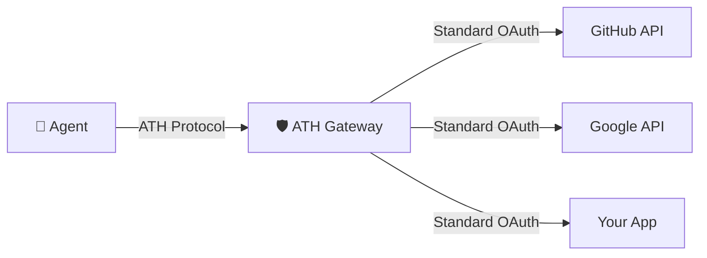
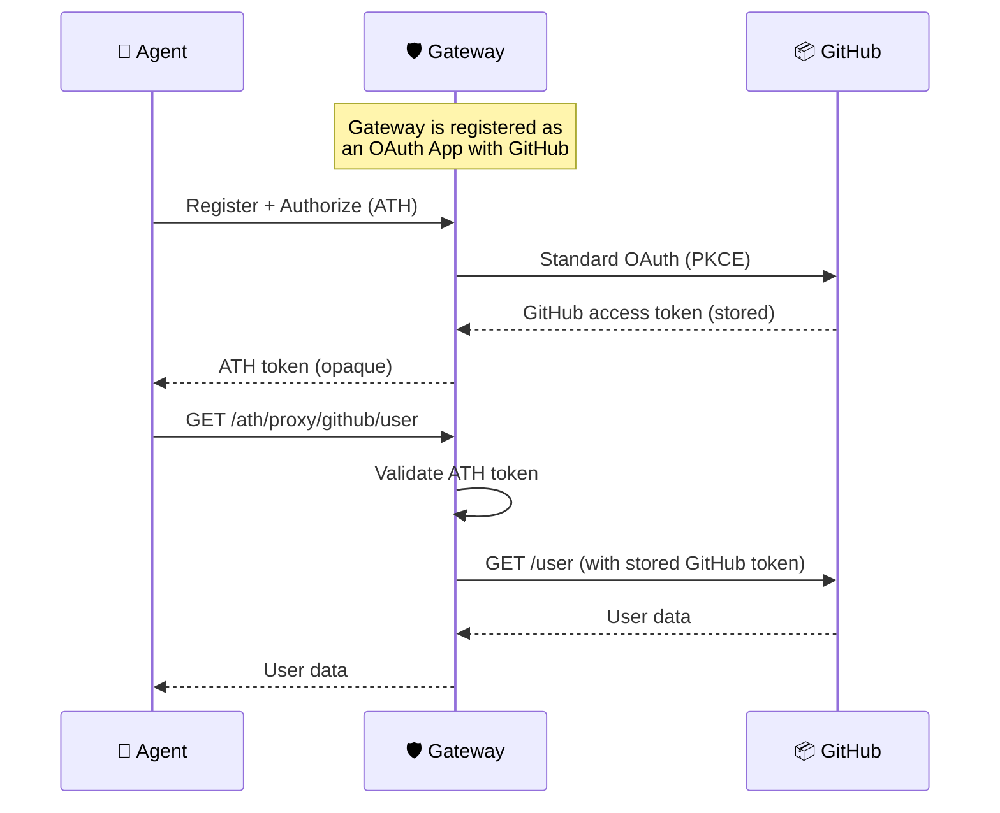

A gateway lets you protect **existing services** (GitHub, Google, Slack, your internal APIs) with ATH — without modifying those services at all. The agent talks ATH to the gateway, the gateway talks standard OAuth to the service.



---

## See It Working First

The demo includes a working gateway setup:

```bash
git clone https://github.com/ath-protocol/demo.git
cd demo/demo/gateway
docker compose up --build
```

This starts:
- **ATH Shop** at `https://ath-shop.local:3000`
- **ATH Gateway** at `http://gateway.ath.local:4001`
- The gateway is configured to proxy access to the shop

Then run the agent demo:
```bash
docker compose up athx-demo
```

You'll see the agent discover, register, authorize, and call the shop — all through the gateway.

---

## Set Up Your Own Gateway

### Option 1: Use the Reference Gateway

```bash
git clone https://github.com/ath-protocol/gateway.git
cd gateway
git submodule update --init --recursive
npm install
```

### Option 2: Docker

```bash
docker run -p 4001:3000 \
  -e ATH_SIGNUP_ENABLED=true \
  -e ATH_GATEWAY_HOST=http://localhost:4001 \
  ghcr.io/ath-protocol/gateway:latest
```

---

## Configure a Provider

Create `providers.json` in the gateway directory:

```json
{
  "github": {
    "display_name": "GitHub",
    "available_scopes": ["read:user", "repo"],
    "authorize_endpoint": "https://github.com/login/oauth/authorize",
    "token_endpoint": "https://github.com/login/oauth/access_token",
    "api_base_url": "https://api.github.com",
    "client_id": "YOUR_GITHUB_CLIENT_ID",
    "client_secret": "YOUR_GITHUB_CLIENT_SECRET"
  }
}
```

<Accordion title="How do I get GitHub OAuth credentials?">
1. Go to GitHub → Settings → Developer settings → OAuth Apps → New
2. Set **Authorization callback URL** to `http://localhost:4001/ath/callback`
3. Copy the Client ID and generate a Client Secret
</Accordion>

Start the gateway:
```bash
ATH_SIGNUP_ENABLED=true npm run dev
```

---

## Test With athx

```bash
# Create a gateway user
curl -X POST http://localhost:4001/auth/signup \
  -H "Content-Type: application/json" \
  -d '{"username":"admin","password":"admin123"}'

# Save the token
TOKEN="<token from response>"

# Discover what's available
athx discover --gateway http://localhost:4001

# Register an agent
athx register --gateway http://localhost:4001 \
  --provider github --scopes "read:user,repo"

# Start authorization  
athx authorize --gateway http://localhost:4001 \
  --provider github --scopes "read:user"
# → Open the URL in your browser, approve on GitHub

# Exchange for token
athx token --gateway http://localhost:4001 \
  --code <from callback> --session <session_id>

# Call GitHub API through the gateway
athx proxy github GET /user --gateway http://localhost:4001
```

The agent called GitHub's API — but never saw the GitHub OAuth token. The gateway handled that securely.

---

## How It Works



The agent **never** touches the GitHub token. It only holds an ATH token that the gateway issued.

<Card title="Add more providers →" icon="plus" href="/setup-gateway/add-providers">
  Configure GitHub, Google, Slack, and custom OAuth providers
</Card>
