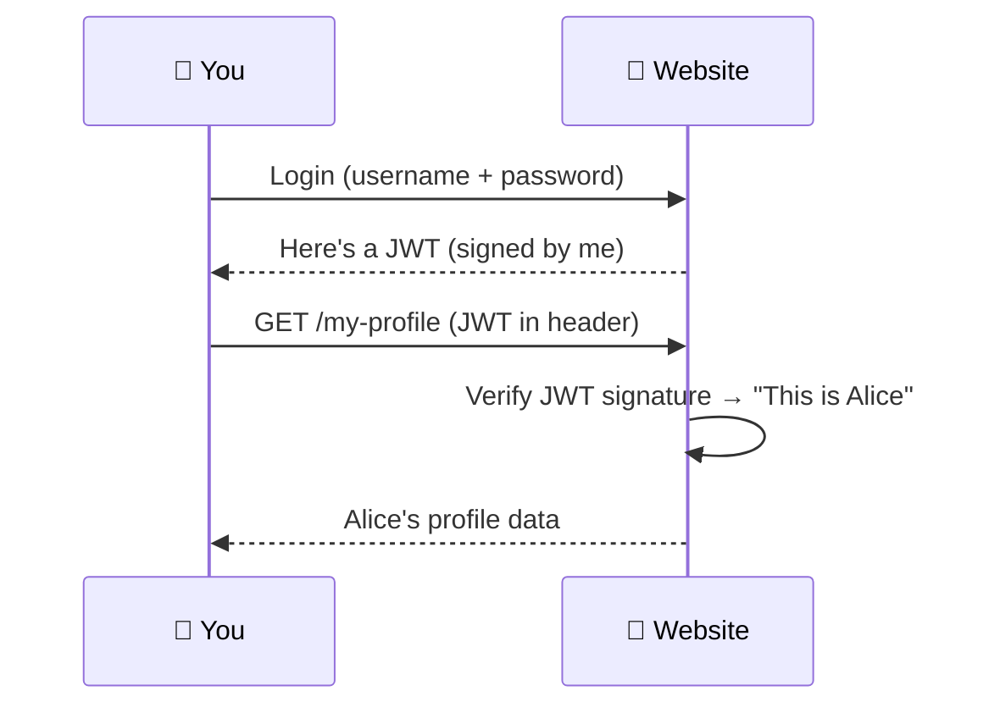
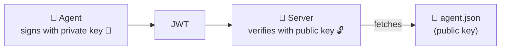
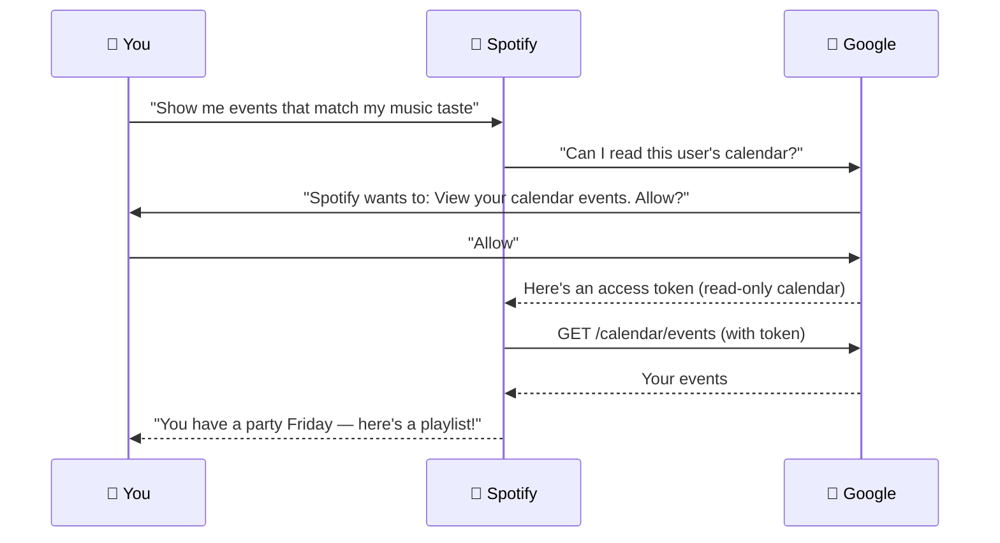
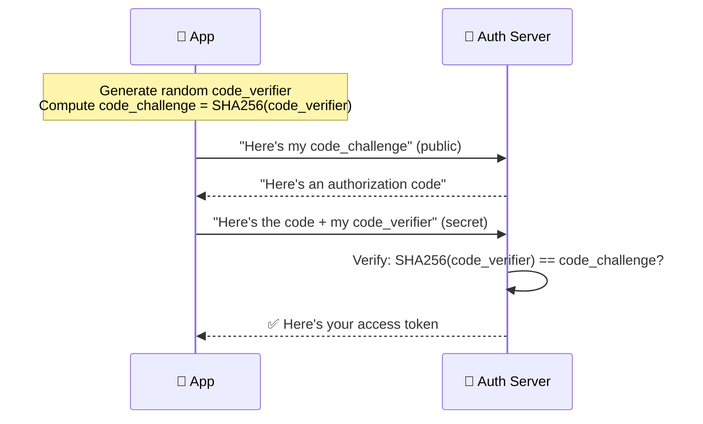
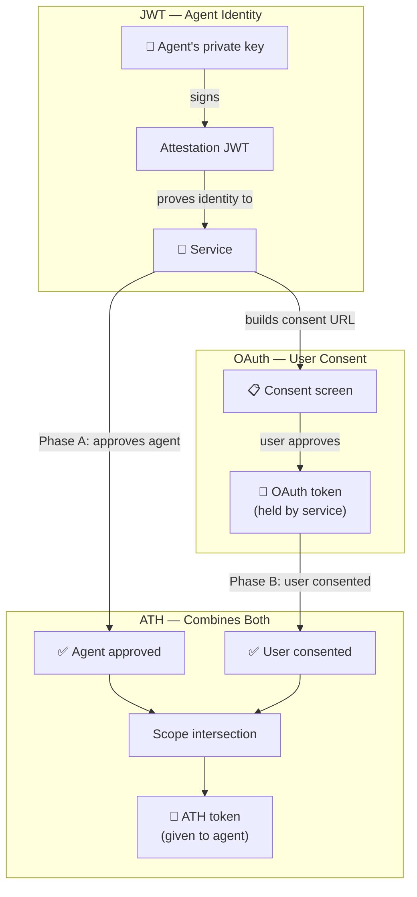

ATH builds on two widely-used technologies: **JWT** (for identity) and **OAuth** (for user consent). You don't need to be a security expert — this page explains both with familiar examples.

---

## JWT: A Tamper-Proof ID Card

### What it is

A **JSON Web Token (JWT)** is a small signed string that carries claims — facts about someone. Think of it as a **digital ID card** that can't be forged.

```
eyJhbGciOiJFUzI1NiJ9.eyJzdWIiOiJhZ2VudC0xMjMifQ.MEUCIQDx...
└──── Header ────────┘ └────── Payload ──────────────┘ └ Signature ┘
```

### Real-world example you already use

When you log in to a website, the server often gives you a JWT. Your browser sends it on every request to prove "I'm logged in as Alice."



The website **signed** the JWT with its secret key. If anyone changes the content (e.g., changes "Alice" to "Admin"), the signature won't match and the server rejects it.

### How ATH uses JWT

In ATH, agents carry a JWT called an **attestation** that says "I am TravelBot, and I can prove it." The server verifies the signature against the agent's published public key.

```json
{
  "iss": "https://travelbot.example.com",
  "sub": "https://travelbot.example.com/.well-known/agent.json",
  "aud": "https://your-service.com",
  "exp": 1714503600,
  "jti": "unique-random-id"
}
```

| Field | Plain English |
|-------|-------------|
| `iss` | "I was made by travelbot.example.com" |
| `sub` | "My identity document is at this URL" |
| `aud` | "I'm talking to your-service.com" |
| `exp` | "This proof expires at this time" |
| `jti` | "This specific proof has never been used before" |

<Accordion title="Symmetric vs Asymmetric — why ATH uses ES256">
Some JWTs use a **shared secret** (symmetric) — both the creator and verifier know the same password. This is fine when it's the same server on both sides (like your website login).

ATH uses **ES256** (asymmetric) — the agent has a **private key** (secret) and publishes a **public key** (open). The server verifies the JWT using the public key without ever knowing the private key. This means:

- The agent can prove its identity to **any** server
- No shared secrets need to be exchanged in advance
- The server just fetches the public key from a URL


</Accordion>

---

## OAuth: "Allow This App to Access My Data"

### What it is

**OAuth 2.0** is the protocol that shows you those "Sign in with Google" or "Allow this app to access your calendar?" screens. It lets a user **grant limited access** to their data without sharing their password.

### Real-world example: connecting Spotify to your calendar



Key points:
- **You never gave Spotify your Google password**
- Spotify got **read-only calendar access**, not full Google account access
- You can **revoke** Spotify's access any time in Google settings
- Google issued a **scoped token** — Spotify can't read your email with it

### The four roles in OAuth

| Role | In the Spotify example | In ATH |
|------|----------------------|--------|
| **Resource Owner** | You (it's your calendar) | The user whose data the agent wants |
| **Client** | Spotify (wants access) | The AI agent |
| **Authorization Server** | Google's login page | Your app's OAuth or the gateway's OAuth |
| **Resource Server** | Google Calendar API | Your app's API |

### PKCE: Preventing Token Theft

Modern OAuth uses **PKCE** (pronounced "pixie") — an extra step that prevents someone from stealing the authorization code during the redirect.



Even if an attacker steals the authorization code, they can't exchange it without the `code_verifier` (which never left the app).

**ATH requires PKCE on all OAuth flows.** The SDK handles it automatically — you don't write any PKCE code yourself.

### Scopes: Limiting permissions

**Scopes** define exactly what an app can do:

| Scope | What it means |
|-------|-------------|
| `calendar.readonly` | Read calendar events (can't modify) |
| `products:read` | Browse the product catalog |
| `cart:write` | Add/remove items from cart |
| `orders:write` | Place orders |
| `repo` | Full access to code repositories |

Users see the scopes on the consent screen and decide whether to approve.

---

## Why OAuth Alone Isn't Enough for AI Agents

OAuth answers: **"Did the user consent?"**

But it doesn't answer: **"Did the service approve this agent?"**

| Scenario | User consents? | Service approved? | OAuth result | ATH result |
|----------|:-:|:-:|:---:|:---:|
| Known agent, user approves | ✅ | ✅ | ✅ Access | ✅ Access |
| Unknown agent tricks user | ✅ | ❌ | ✅ Access ⚠️ | ❌ Blocked |
| Known agent, user declines | ❌ | ✅ | ❌ No access | ❌ No access |

**Row 2 is the problem.** With OAuth alone, a rogue agent that convinces a user to click "Allow" gets full access. The service never got to say "I don't trust this agent."

ATH adds that missing gate. The service must approve the agent **before** the user even sees a consent screen.

---

## How ATH Combines Them



- **JWT** proves the agent is who it claims to be
- **OAuth** gets the user's consent
- **ATH** ties both together: the agent only gets a token if the service approved it AND the user consented, and only for the **intersection** of what both allowed

<Card title="Next: Run the Demo →" icon="play" href="/start-here/run-the-demo">
  See all of this in action with a real e-commerce app
</Card>
