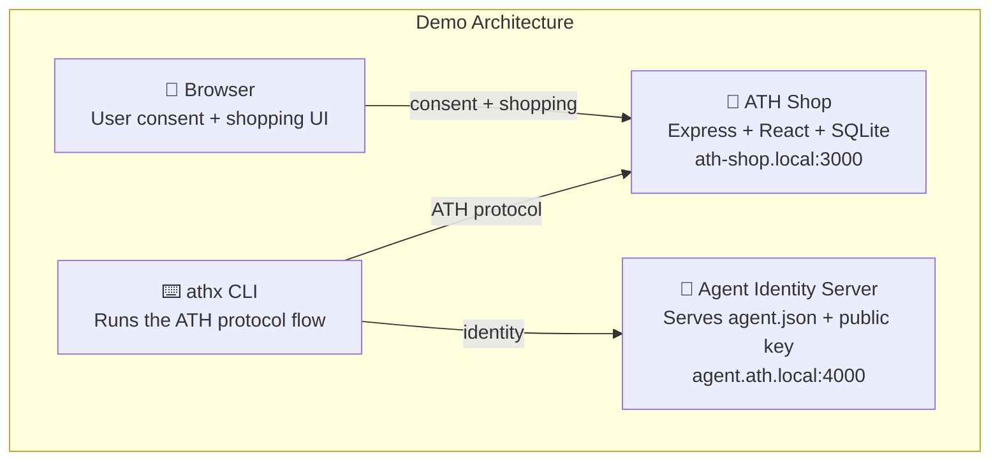

## What You'll See

The demo is a **real e-commerce shop** (ATH Shop) where:
- Humans can browse products, add to cart, and check out normally
- An AI agent can do the same — **but only after the user approves in their browser**



By the end of this page, you'll have watched an AI agent:
1. Discover the shop's ATH endpoints
2. Register itself with the shop
3. Ask the user for permission (user sees a consent page in the browser)
4. Get a scoped access token
5. Browse products, add to cart, and place an order
6. Revoke its own access when done

---

## Prerequisites

- **Docker** and **Docker Compose** installed
- A terminal

That's it. No Node.js, no Python, no keys to generate.

---

## Step 1: Clone and Start

```bash
git clone https://github.com/ath-protocol/demo.git
cd demo
```

Add these entries to your `/etc/hosts` file:

```bash
# On Mac/Linux:
echo "127.0.0.1 ath-shop.local agent.ath.local gateway.ath.local" | sudo tee -a /etc/hosts
```

Start the demo in **native mode** (agent connects directly to the shop):

```bash
cd demo/native
docker compose up --build
```

Wait for the output:
```
ATH Shop HTTPS server running on https://ath-shop.local:3000
Agent identity server: https://agent.ath.local:4000
```

---

## Step 2: Run the Full ATH Flow

In a separate terminal:

```bash
cd demo/native
docker compose up athx-demo
```

This runs the complete ATH protocol flow. Watch the output — you'll see each step labeled:

```
━━━ STEP 1: Service Discovery ━━━
━━━ STEP 2: Agent Registration (Phase A) ━━━
━━━ STEP 3: Request Authorization (Phase B) ━━━
━━━ STEP 4: User Consent in Browser (Interactive) ━━━
━━━ STEP 5: Token Exchange ━━━
━━━ STEP 6: Access E-Commerce API via ATH Token ━━━
━━━ STEP 7: Revoke Token ━━━
```

The demo opens a browser, logs in as a test user, navigates to the consent page, and clicks "Authorize" — simulating what a real user would do.

---

## Step 3: Try Gateway Mode

Want to see the same flow through a gateway (no changes to the shop)?

```bash
cd demo/gateway
docker compose up --build
# In another terminal:
docker compose up athx-demo
```

In gateway mode, the agent talks to the gateway at `gateway.ath.local:4001`, and the gateway talks to the shop. The shop doesn't even know an agent is involved.

---

## Step 4: Explore Manually

Open https://ath-shop.local:3000 in your browser (accept the self-signed cert). You'll see a real e-commerce UI where you can:
- Create an account
- Browse products
- Add items to cart
- Check out

This is the same app the agent interacts with — just through ATH-protected endpoints instead of the web UI.

---

## What's Next?

Now that you've seen it running, let's understand **what actually happened** in those 7 steps:

<Card title="What Just Happened? →" icon="magnifying-glass" href="/start-here/what-just-happened">
  A line-by-line walkthrough of the demo output
</Card>
