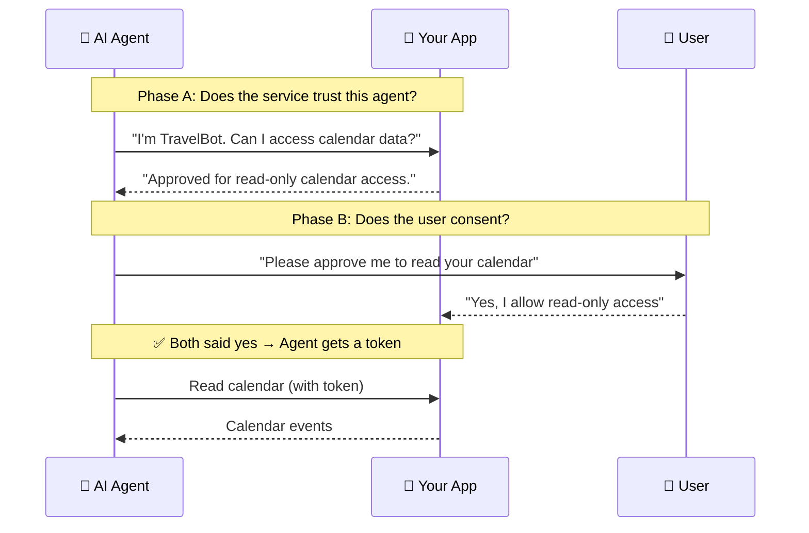

**ATH (Agent Trust Handshake)** is a protocol that lets AI agents access your users' data on external services — but **only after both the service AND the user say yes**. It's OAuth for the agent era.

That's it. Two gates, both must pass. The agent gets the **intersection** of what was approved — never more.

---

## Who Are You?

Pick the path that matches your situation:

<CardGroup cols={3}>
  <Card title="I have an app" icon="server" href="/add-ath-to-your-app/tutorial">
    **"I want AI agents to access my API securely."**
    
    You'll add ATH endpoints to your existing backend. Takes ~100 lines of code.
  </Card>
  <Card title="I manage infrastructure" icon="shield-halved" href="/setup-gateway/tutorial">
    **"I want to put a trust layer in front of existing services like GitHub or Google."**
    
    You'll deploy a gateway. Zero changes to upstream services.
  </Card>
  <Card title="I'm building an agent" icon="robot" href="/build-an-agent/tutorial">
    **"My agent needs to call APIs that are protected by ATH."**
    
    You'll use our SDK (TypeScript/Python) or CLI tool.
  </Card>
</CardGroup>

---

## But First: See It Running

Before diving into any path, **run the demo** to see the entire protocol in action. It takes 5 minutes and you'll understand everything much faster.

<Card title="Run the Demo →" icon="play" href="/start-here/run-the-demo">
  A real e-commerce app where an AI agent browses products, adds to cart, and places orders — all with user consent.
</Card>
