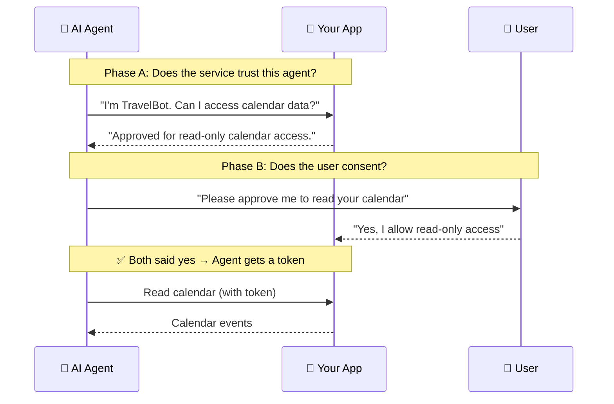

**ATH (Agent Trust Handshake)** is a protocol that lets AI agents access your users' data on external services — but **only after both the service AND the user say yes**. It's OAuth for the agent era.

That's it. Two gates, both must pass. The agent gets the **intersection** of what was approved — never more.

---

## Who Are You?

Pick the path that matches your situation. Each is a self-contained tutorial.

<Steps>
  <Step title="I have an app and want agents to access my API securely">
    You'll add ATH endpoints to your existing backend. Takes ~100 lines of code.
    
    [Go to: Add ATH to Your App →](/add-ath-to-your-app/tutorial)
  </Step>
  <Step title="I want to put a trust layer in front of existing services (GitHub, Google, etc.)">
    You'll deploy a gateway. Zero changes to upstream services.
    
    [Go to: Set Up a Gateway →](/setup-gateway/tutorial)
  </Step>
  <Step title="I'm building an agent that needs to call ATH-protected APIs">
    You'll use our SDK (TypeScript/Python) or CLI tool.
    
    [Go to: Build an Agent →](/build-an-agent/tutorial)
  </Step>
</Steps>

---

## But First

Before diving into any path, we recommend two things:

1. **[Learn the basics of JWT & OAuth](/start-here/jwt-and-oauth-basics)** — if you're not already familiar, this 10-minute read explains the two technologies ATH builds on, with real-world examples.

2. **[Run the demo](/start-here/run-the-demo)** — 5 minutes to see the entire protocol working in a real e-commerce app. You'll understand everything much faster.
