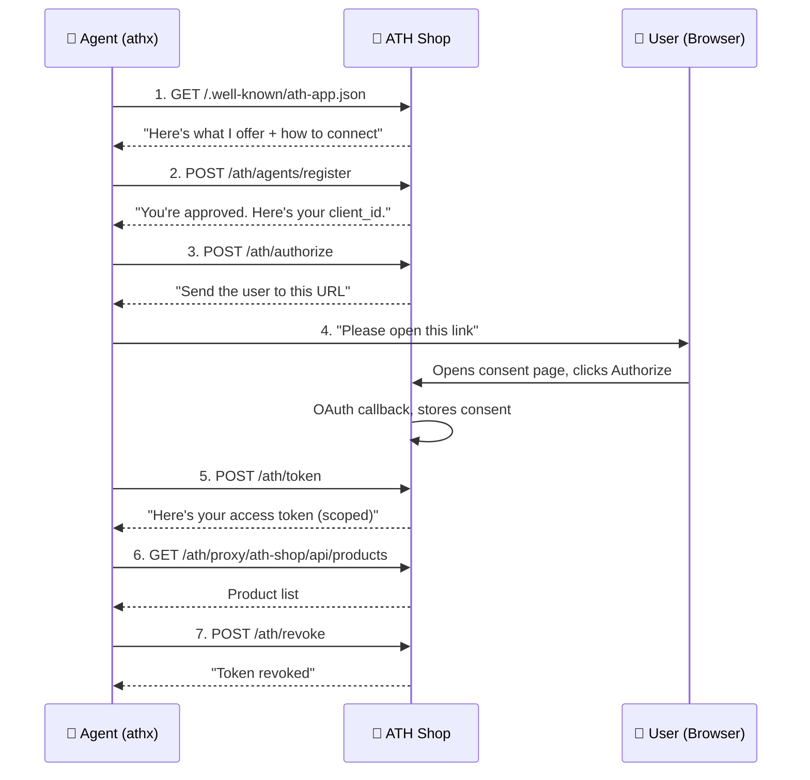

Let's trace what the demo did. Each step maps to a real HTTP call. By the end of this page, you'll understand the entire ATH protocol.

## The Full Flow



---

## Step 1: Discovery — "What can I connect to?"

```bash
GET https://ath-shop.local:3000/.well-known/ath-app.json
```

The agent fetches a public JSON document that says: "Here's my name, here are the permissions I support, here's how to authenticate."

```json
{
  "ath_version": "0.1",
  "app_id": "com.ath-shop.ecommerce",
  "name": "ATH Shop E-Commerce API",
  "auth": {
    "type": "oauth2",
    "authorization_endpoint": "https://ath-shop.local:3000/oauth/authorize/redirect",
    "token_endpoint": "https://ath-shop.local:3000/oauth/token",
    "scopes_supported": ["products:read", "cart:read", "cart:write", "orders:read", "orders:write"]
  },
  "api_base": "https://ath-shop.local:3000/api"
}
```

<Accordion title="Why does this exist?">
Without discovery, every agent would need to be manually configured with your app's URLs and capabilities. The `.well-known` document makes your app **automatically discoverable** by any ATH-compatible agent.
</Accordion>

---

## Step 2: Registration — "Can I use your service?"

```bash
POST https://ath-shop.local:3000/ath/agents/register
```

```json
{
  "agent_id": "https://agent.ath.local:4000/.well-known/agent.json",
  "agent_attestation": "eyJhbGciOiJFUzI1NiIs...",
  "requested_providers": [
    { "provider_id": "ath-shop", "scopes": ["products:read", "cart:write", "orders:write"] }
  ],
  "purpose": "AI Shopping Agent"
}
```

The shop checks: "Do I trust this agent? What scopes am I willing to grant?"

**Response:**
```json
{
  "client_id": "ath_abc123",
  "client_secret": "ath_secret_xyz",
  "agent_status": "approved",
  "approved_providers": [
    { "provider_id": "ath-shop", "approved_scopes": ["products:read", "cart:write", "orders:write"] }
  ]
}
```

<Accordion title="What's that agent_attestation thing?">
It's a signed JWT that proves the agent is who it claims to be. The agent has a private key; its public key is published at `agent_id` URL. The shop can verify the signature.

Think of it like an ID card — the agent shows its ID, and the shop can verify it's not forged. You don't need to understand the cryptography to implement this — the SDK handles signing automatically.
</Accordion>

---

## Step 3: Authorization — "Let me ask the user"

```bash
POST https://ath-shop.local:3000/ath/authorize
```

```json
{
  "client_id": "ath_abc123",
  "agent_attestation": "eyJhbGciOiJFUzI1NiIs...",
  "provider_id": "ath-shop",
  "scopes": ["products:read", "cart:write", "orders:write"],
  "state": "random-csrf-token"
}
```

**Response:**
```json
{
  "authorization_url": "https://ath-shop.local:3000/oauth/authorize?client_id=...&scope=...&code_challenge=...",
  "ath_session_id": "ath_sess_def456"
}
```

The agent gets a URL to send the user to. This is a standard OAuth consent page.

---

## Step 4: User Consent — "The user decides"

The user opens `authorization_url` in their browser and sees:

> **ATH Shop Demo Agent** wants to access your account:
> - ✅ View products
> - ✅ Manage shopping cart
> - ✅ Place orders
>
> [Authorize] [Deny]

If the user clicks **Authorize**, the shop processes the OAuth callback internally. The user **never** gives their password to the agent.

<Accordion title="What happens technically?">
The URL contains a PKCE code challenge. When the user approves, the shop's OAuth server issues an authorization code, exchanges it for an internal token, and stores the user's consented scopes on the ATH session. All of this is handled server-side — the agent doesn't see any of it.
</Accordion>

---

## Step 5: Token Exchange — "Here's your scoped access"

```bash
POST https://ath-shop.local:3000/ath/token
```

```json
{
  "grant_type": "authorization_code",
  "client_id": "ath_abc123",
  "client_secret": "ath_secret_xyz",
  "agent_attestation": "eyJhbGciOiJFUzI1NiIs...",
  "code": "exchange",
  "ath_session_id": "ath_sess_def456"
}
```

**Response:**
```json
{
  "access_token": "ath_tk_secure_token",
  "expires_in": 3600,
  "effective_scopes": ["products:read", "cart:write", "orders:write"],
  "scope_intersection": {
    "agent_approved": ["products:read", "cart:write", "orders:write"],
    "user_consented": ["products:read", "cart:write", "orders:write"],
    "effective": ["products:read", "cart:write", "orders:write"]
  }
}
```

The **scope intersection** is the key innovation: the agent gets only the scopes that **all three parties** agreed on:
- What the shop approved for this agent (**Phase A**)
- What the user consented (**Phase B**)
- What the agent actually requested (**this call**)

If any of these three doesn't include a scope, the agent doesn't get it.

---

## Step 6: Use the API — "Now I can shop"

```bash
GET https://ath-shop.local:3000/ath/proxy/ath-shop/api/products
Authorization: Bearer ath_tk_secure_token
```

The agent calls the shop's API through the ATH proxy. The proxy:
1. Validates the token (not expired, not revoked)
2. Checks the request is within the granted scopes
3. Forwards to the real API

The agent can now browse products, add to cart, and place orders — just like a user would through the web UI.

---

## Step 7: Revoke — "I'm done"

```bash
POST https://ath-shop.local:3000/ath/revoke
{ "client_id": "ath_abc123", "client_secret": "ath_secret_xyz", "token": "ath_tk_secure_token" }
```

The agent cleans up after itself. The token is now invalid.

---

## The Key Insight

The entire protocol exists to answer **two questions**:

| Question | Who answers | When |
|----------|:----------:|------|
| "Should this agent be allowed here at all?" | 🏢 Your app (the service) | Step 2 (registration) |
| "Does this specific user want this agent acting for them?" | 👤 The user | Step 4 (consent) |

OAuth alone only answers the second question. ATH adds the first.

---

## What Do You Want to Build?

<CardGroup cols={3}>
  <Card title="Add ATH to my app" icon="server" href="/add-ath-to-your-app/tutorial">
    I want to protect my API so agents can access it securely
  </Card>
  <Card title="Set up a gateway" icon="shield-halved" href="/setup-gateway/tutorial">
    I want to put ATH in front of existing services
  </Card>
  <Card title="Build an agent" icon="robot" href="/build-an-agent/tutorial">
    I want my agent to call ATH-protected APIs
  </Card>
</CardGroup>
