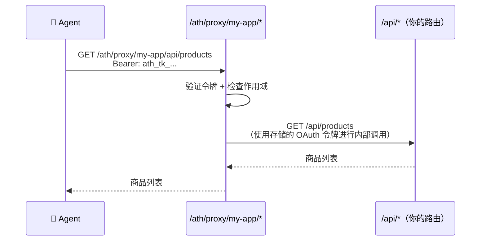

## 改动前：典型的 Express 应用

你可能有这样的代码：

```typescript
// app.ts
import express from "express";
import productRoutes from "./routes/products";
import cartRoutes from "./routes/cart";
import orderRoutes from "./routes/orders";

const app = express();
app.use(express.json());

app.use("/api/products", productRoutes);
app.use("/api/cart", cartRoutes);
app.use("/api/orders", orderRoutes);

app.listen(3000);
```

用户通过 Web 前端或移动应用访问你的 API，使用你现有的会话/JWT 系统进行认证。

---

## 改动后：相同的应用 + ATH（差异对比）

以下是你要添加的内容——**你现有的路由完全不需要改动：**

```diff
  // app.ts
  import express from "express";
  import productRoutes from "./routes/products";
  import cartRoutes from "./routes/cart";
  import orderRoutes from "./routes/orders";
+ import athRoutes from "./routes/ath";

  const app = express();
  app.use(express.json());

+ const BASE_URL = process.env.BASE_URL || "http://localhost:3000";  // 你的服务器 URL

+ // ATH 发现——告诉 Agent 有什么可用
+ app.get("/.well-known/ath-app.json", (req, res) => {
+   res.json({
+     ath_version: "0.1",
+     app_id: "com.my-company.my-app",
+     name: "My App",
+     auth: {
+       type: "oauth2",
+       authorization_endpoint: `${BASE_URL}/oauth/authorize`,
+       token_endpoint: `${BASE_URL}/oauth/token`,
+       scopes_supported: ["products:read", "cart:write", "orders:write"],
+       agent_attestation_required: true,
+     },
+     api_base: `${BASE_URL}/api`,
+   });
+ });

  app.use("/api/products", productRoutes);
  app.use("/api/cart", cartRoutes);
  app.use("/api/orders", orderRoutes);
+ app.use("/ath", athRoutes);  // ATH 协议端点

  app.listen(3000);
```

以及一个新文件——`routes/ath.ts`——就是[教程](/zh/add-ath-to-your-app/tutorial)中约 70 行的那个文件。

---

## 映射你的作用域

最重要的决定：**你暴露哪些作用域？** 将它们映射到你的 API 实际功能：

| 你的 API 路由 | HTTP 方法 | 建议的作用域 |
|--------------|:---------:|------------|
| `/api/products` | GET | `products:read` |
| `/api/cart` | GET | `cart:read` |
| `/api/cart/add` | POST | `cart:write` |
| `/api/orders` | GET | `orders:read` |
| `/api/orders` | POST | `orders:write` |

将这些放入你的 `availableScopes` 数组和发现文档中：

```typescript
availableScopes: ["products:read", "cart:read", "cart:write", "orders:read", "orders:write"],
```

---

## 代理转发层如何连接到你的 API

ATH 代理转发层不会替代你的 API——它位于 API **前面**，转发经过认证的请求：



你现有的 `/api/*` 上的认证中间件仍然为浏览器用户正常工作。代理转发层单独处理 Agent 的认证。

---

## 集成后的文件结构

```
my-app/
├── routes/
│   ├── products.ts    ← 未改动
│   ├── cart.ts        ← 未改动
│   ├── orders.ts      ← 未改动
│   └── ath.ts         ← 新增（50-70 行）
├── app.ts             ← +15 行（发现 + 挂载）
└── package.json       ← +2 个依赖
```

**总改动量：约 85 行代码，2 个新依赖。**
