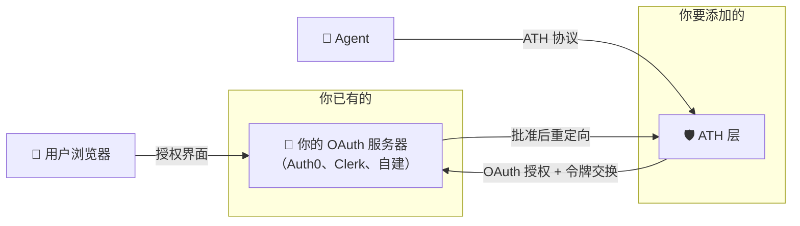
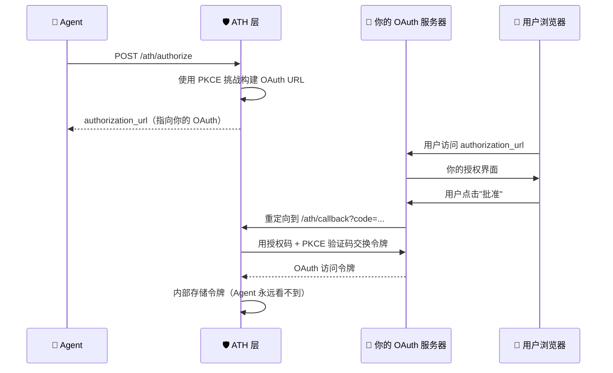

## 你已有 OAuth。现在怎么办？

如果你使用 Auth0、Clerk、Firebase Auth 或自己的 OAuth 服务器，就不需要再建一个。你只需**将 ATH 的配置指向你现有的端点**。



---

## 唯一的配置改动

在你的 `createATHHandlers` 配置中，`oauth` 部分告诉 ATH 将用户引导到哪里进行授权：

```typescript
const handlers = createATHHandlers({
  // ... 其他配置 ...
  config: {
    // ...
    oauth: {
      authorize_endpoint: "https://your-auth-provider.com/authorize",
      token_endpoint: "https://your-auth-provider.com/oauth/token",
      client_id: "your-ath-client-id",      // 在 OAuth 提供商处注册
      client_secret: "your-ath-client-secret",
    },
  },
});
```

### ATH 如何使用你的 OAuth



简而言之：
1. ATH 构建一个重定向 URL 到**你的 OAuth 授权端点**（包含 PKCE）
2. 你的 OAuth 服务器向用户展示授权界面
3. 用户同意后，你的 OAuth 服务器重定向到 `/ath/callback` 并附带授权码
4. ATH 在**你的令牌端点**交换授权码（服务器端，使用 PKCE 验证码）
5. ATH 内部存储获得的令牌——Agent 永远看不到它

---

## 各提供商的设置

<Tabs>
  <Tab title="Auth0">
    1. 在 Auth0 控制台中创建一个"常规 Web 应用"
    2. 将**允许的回调 URL** 设为 `https://your-app.com/ath/callback`
    3. 记下 Client ID 和 Client Secret
    4. 在你的 ATH 配置中使用：

    ```typescript
    oauth: {
      authorize_endpoint: "https://YOUR_DOMAIN.auth0.com/authorize",
      token_endpoint: "https://YOUR_DOMAIN.auth0.com/oauth/token",
      client_id: "YOUR_AUTH0_CLIENT_ID",
      client_secret: "YOUR_AUTH0_CLIENT_SECRET",
    }
    ```
  </Tab>
  <Tab title="Clerk">
    1. 在 Clerk 控制台中，前往 **JWT 模板**或使用 OAuth 端点
    2. 将重定向 URL 设为 `https://your-app.com/ath/callback`
    3. 配置：

    ```typescript
    oauth: {
      authorize_endpoint: "https://YOUR_CLERK_DOMAIN/oauth/authorize",
      token_endpoint: "https://YOUR_CLERK_DOMAIN/oauth/token",
      client_id: "YOUR_CLERK_CLIENT_ID",
      client_secret: "YOUR_CLERK_CLIENT_SECRET",
    }
    ```
  </Tab>
  <Tab title="自定义 OAuth">
    如果你自己构建了 OAuth 服务器（就像演示中那样）：

    ```typescript
    oauth: {
      authorize_endpoint: "https://your-app.com/oauth/authorize",
      token_endpoint: "https://your-app.com/oauth/token",
      client_id: "ath-internal-client",
      client_secret: "ath-internal-secret",
    }
    ```
    
    确保你的 OAuth 服务器：
    - 支持 **Authorization Code** 授权方式和 **PKCE (S256)**
    - 允许的重定向 URI 中包含 `https://your-app.com/ath/callback`
  </Tab>
</Tabs>

---

## 对你的 OAuth 服务器的要求

ATH 需要你的 OAuth 服务器支持：

| 功能 | 是否必需？ | 为什么 |
|------|:--------:|--------|
| Authorization Code 授权方式 | ✅ | 核心流程 |
| PKCE (S256) | ✅ | 安全性——防止授权码被截获 |
| 自定义作用域 | 推荐 | 让用户在授权界面看到有意义的权限 |
| 令牌端点返回 JSON | ✅ | ATH 需要解析响应 |

大多数现代 OAuth 提供商（Auth0、Clerk、Keycloak 等）开箱即支持以上全部功能。

---

## 如果我的 OAuth 不支持 PKCE 怎么办？

较旧的 OAuth 服务器可能不支持 PKCE。这种情况下有两个选择：

1. **升级你的 OAuth 服务器** ——大多数服务器都有 PKCE 支持开关
2. **改用 ATH 网关** ——在你的服务前面放一个网关，网关用自己的 OAuth 客户端处理 PKCE。参见[设置网关](/zh/setup-gateway/tutorial)。
