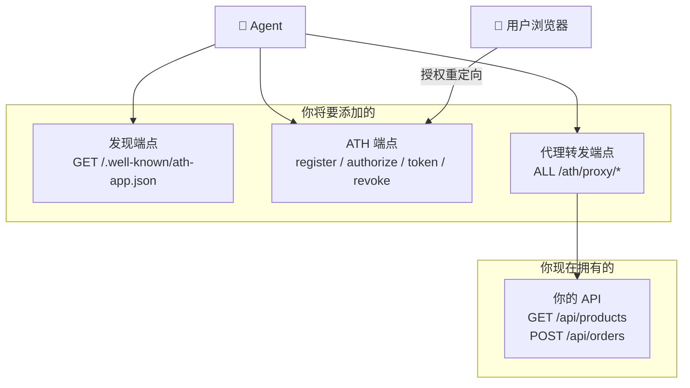
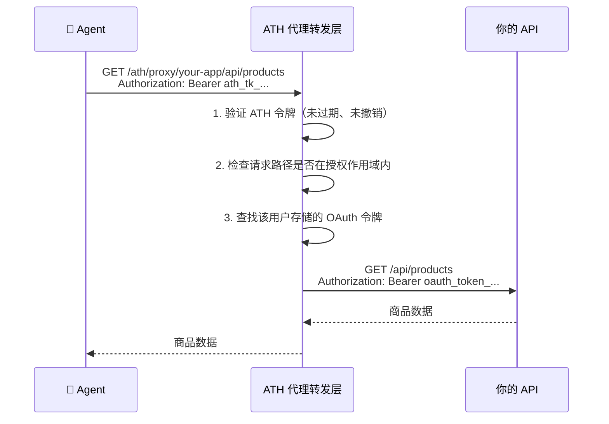
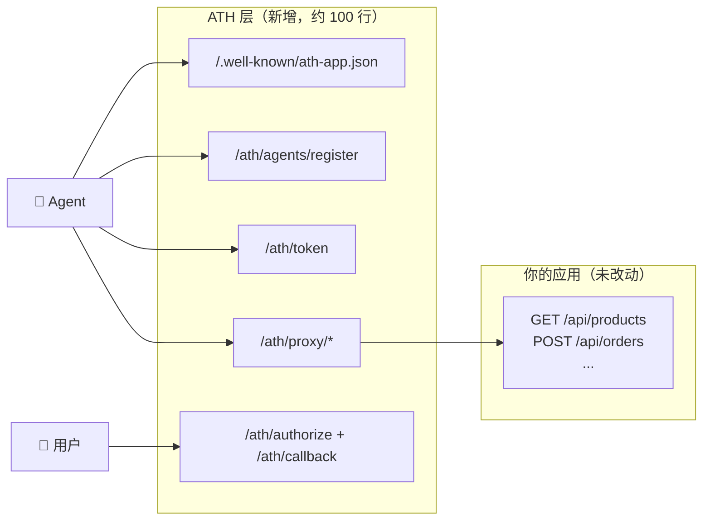

## 我们要构建什么

你有一个带 API 的后端。你希望 AI Agent 能调用该 API——但只有在服务批准且用户同意之后。完成本教程后，你的应用将支持完整的 ATH 协议。



---

## 开始之前

### 你需要什么

| 需求 | 为什么需要 | 没有的话？ |
|------|-----------|----------|
| **一个有 API 的后端** | Agent 要访问的目标 | 本教程使用 Express，但任何 HTTP 框架都可以 |
| **一个 OAuth 服务器** | Agent 需要用户授权，这通过 OAuth 完成。用户在浏览器中看到授权界面并点击"批准" | 使用你现有的（Auth0、Clerk 等）或演示内置的 OAuth 服务器 |
| **一个用户浏览器可达的回调 URL** | 用户点击"批准"后，浏览器会重定向到这个 URL。它不需要是公网地址——只需要用户打开浏览器的地方能访问到即可 | 开发环境中，如果服务器在 localhost，`http://localhost:3000/ath/callback` 就没问题，只要用户的浏览器在同一台机器上 |

<Accordion title="为什么 ATH 需要 OAuth？">
ATH 不是替代 OAuth——而是在其之上添加一层。各部分的作用：

- **ATH** 处理："服务是否信任这个 Agent？"（注册）和"权限的交集是什么？"（作用域交集）
- **OAuth** 处理："用户是否同意？"（浏览器中的授权界面）

当 Agent 调用你的 `/ath/authorize` 端点时，你的服务器会构建一个 OAuth 授权 URL 并返回。Agent 告诉用户"请打开这个 URL"。用户的浏览器跳转到你的 OAuth 服务器，用户看到授权界面，批准后，浏览器重定向到 `/ath/callback`。

这就是为什么你需要一个用户浏览器可达的回调 URL。
</Accordion>

<Accordion title="如果我没有公网 URL 怎么办？">
**本地开发**时，localhost 回调 URL 完全没问题——用户的浏览器和你的服务器在同一台机器上。

**生产环境**中，如果你的应用在防火墙后面，有两个选择：
1. 通过反向代理或隧道暴露 `/ath/callback` 路由
2. 改用**[网关模式](/zh/setup-gateway/tutorial)**——网关有公网 URL，替你处理回调
</Accordion>

### 你不需要什么

- ❌ 深入的安全知识——SDK 处理 JWT 签名、PKCE 和令牌管理
- ❌ 一个用于测试的 Agent——我们将使用 `athx` CLI 工具来模拟
- ❌ 开发期间的公网 URL——localhost 即可

---

## 步骤 1：安装 SDK

```bash
npm install @ath-protocol/server @ath-protocol/types jose
```

`@ath-protocol/server` 提供了所有 ATH 端点的现成处理程序。你是把它们接入到你的路由——而非从头实现协议。

---

## 步骤 2：添加发现端点

这是一个简单的 JSON 文件，告诉 Agent："这是我的身份、我提供的权限，以及如何连接。"

```typescript
// 在你的主应用文件中（如 app.ts）
const BASE_URL = process.env.BASE_URL || "http://localhost:3000";

app.get("/.well-known/ath-app.json", (req, res) => {
  res.json({
    ath_version: "0.1",
    app_id: "com.your-company.your-app",
    name: "Your App Name",
    auth: {
      type: "oauth2",
      authorization_endpoint: `${BASE_URL}/oauth/authorize`,
      token_endpoint: `${BASE_URL}/oauth/token`,
      scopes_supported: [
        "products:read",    // Agent 可请求的权限
        "cart:write",
        "orders:write",
      ],
      agent_attestation_required: true,
    },
    api_base: `${BASE_URL}/api`,
  });
});
```

<Accordion title="什么是作用域，如何选择？">
**作用域**定义 Agent 可以请求的具体权限。将它们映射到你的 API 实际功能：

| 你的 API 路由 | 方法 | 建议的作用域 |
|--------------|:----:|------------|
| `/api/products` | GET | `products:read` |
| `/api/cart/add` | POST | `cart:write` |
| `/api/orders` | POST | `orders:write` |
| `/api/orders` | GET | `orders:read` |

使用 `resource:action` 格式（如 `products:read`、`cart:write`）。用户会在授权界面看到这些，所以要让它们易于理解。
</Accordion>

---

## 步骤 3：创建 ATH 路由文件

创建 `routes/ath.ts`。这个文件将 SDK 的处理程序接入你的 Express 路由：

```typescript
import { Router } from "express";
import {
  createATHHandlers,
  createProxyHandler,
  InMemoryAgentRegistry,
  InMemoryTokenStore,
  InMemorySessionStore,
  InMemoryProviderTokenStore,
} from "@ath-protocol/server";

const BASE_URL = process.env.BASE_URL || "http://localhost:3000";

// 这些存储保存 Agent 注册信息、会话和令牌。
// ⚠️ 内存存储 = 重启后丢失。生产环境请使用数据库。
const registry = new InMemoryAgentRegistry();
const tokenStore = new InMemoryTokenStore();
const sessionStore = new InMemorySessionStore();
const providerTokenStore = new InMemoryProviderTokenStore();

const handlers = createATHHandlers({
  registry,
  tokenStore,
  sessionStore,
  providerTokenStore,
  config: {
    // audience：这个服务器是谁？Agent 在身份证明中会包含此值。
    audience: BASE_URL,

    // callbackUrl：用户批准后浏览器跳转的地址。
    // 必须从用户的浏览器可以访问到。
    callbackUrl: `${BASE_URL}/ath/callback`,

    // 你的应用向 Agent 提供的权限。
    availableScopes: ["products:read", "cart:write", "orders:write"],

    // 你的应用的唯一标识符。
    appId: "com.your-company.your-app",

    // ⚠️ 仅限开发环境：跳过 Agent 身份的密码学验证。
    // 生产环境中请移除此行。
    skipAttestationVerification: true,

    // 你的 OAuth 服务器的端点。用户会被引导到这里
    // 看到授权界面（"允许此 Agent...？"）。
    oauth: {
      authorize_endpoint: `${BASE_URL}/oauth/authorize`,
      token_endpoint: `${BASE_URL}/oauth/token`,
      client_id: "your-oauth-client-id",
      client_secret: "your-oauth-client-secret",
    },
  },
});

// 代理转发层将经过认证的 Agent 请求转发到你的真实 API。
const proxy = createProxyHandler({
  tokenStore,
  providerTokenStore,
  upstreams: { "your-app": BASE_URL },
});

const router = Router();

// 辅助函数：将 Express 请求转换为 ATH 处理程序格式
function toATH(req) {
  return {
    method: req.method,
    url: `${BASE_URL}/ath${req.originalUrl.replace(/^\/ath/, "")}`,
    headers: req.headers,
    body: req.body,
    query: req.query,
  };
}

// --- ATH 协议端点 ---

// 阶段 A：Agent 注册并请求批准
router.post("/agents/register", async (req, res) => {
  const result = await handlers.register(toATH(req));
  res.status(result.status).json(result.body);
});

// 阶段 B：启动用户授权流程
router.post("/authorize", async (req, res) => {
  const result = await handlers.authorize(toATH(req));
  res.status(result.status).json(result.body);
});

// OAuth 回调：用户批准后浏览器会跳转到这里
router.get("/callback", async (req, res) => {
  const result = await handlers.callback(toATH(req));
  if (result.status === 302) return res.redirect(result.headers.Location);
  res.status(result.status).json(result.body);
});

// 令牌交换：Agent 获取访问令牌
router.post("/token", async (req, res) => {
  const result = await handlers.token(toATH(req));
  res.status(result.status).json(result.body);
});

// 撤销：Agent 放弃访问权限
router.post("/revoke", async (req, res) => {
  const result = await handlers.revoke(toATH(req));
  res.status(result.status).json(result.body);
});

// 代理转发：Agent 通过 ATH 调用你的 API
router.all("/proxy/your-app/*", async (req, res) => {
  const result = await proxy({
    method: req.method,
    path: req.path,
    headers: req.headers,
    query: req.query,
    body: req.body,
  });
  res.status(result.status).json(result.body);
});

export default router;
```

<Accordion title="每个配置字段的作用是什么？">

| 字段 | 用途 |
|------|------|
| `audience` | 你的服务器 URL。Agent 在身份证明（JWT `aud` 声明）中包含此值，确保证明只能用于你的服务器，无法在其他地方重放。 |
| `callbackUrl` | 用户在授权界面点击"批准"后浏览器跳转的地址。必须从用户浏览器可达。 |
| `availableScopes` | 你的应用提供的完整权限列表。Agent 可以请求其子集。 |
| `appId` | 你的应用的唯一标识符（如反向域名格式 `com.acme.api`）。 |
| `skipAttestationVerification` | 跳过密码学身份验证。**仅限开发环境**——生产环境中请移除。 |
| `oauth.authorize_endpoint` | 你的 OAuth 服务器的授权 URL。用户浏览器会被引导到这里查看授权界面。 |
| `oauth.token_endpoint` | 你的 OAuth 服务器的令牌 URL。ATH 在此处将授权码交换为令牌（服务器端，Agent 看不到）。 |
| `oauth.client_id` / `client_secret` | ATH 作为 OAuth 客户端与你的 OAuth 服务器交互的凭据。 |
</Accordion>

---

## 步骤 4：挂载路由

```typescript
import athRoutes from "./routes/ath";

app.use("/ath", athRoutes);
```

---

## 步骤 5：连接你的 OAuth 服务器

ATH 需要 OAuth 服务器来向用户展示授权界面。你的选择：

| 情况 | 怎么做 |
|------|--------|
| 我使用 **Auth0、Clerk、Firebase Auth** 等 | 将 `oauth.authorize_endpoint` 和 `oauth.token_endpoint` 指向你的提供商。参见[现有 OAuth 指南](/zh/add-ath-to-your-app/existing-oauth)。 |
| 我有**自定义 OAuth 服务器** | 同上——将配置指向你的端点 |
| 我还没有 OAuth | 以演示的内置 OAuth 服务器为起点，或改用网关 |

### 将 ATH 注册为 OAuth 客户端

ATH 配置中的 `oauth.client_id` 和 `oauth.client_secret` 是 **ATH 作为 OAuth 客户端与你的 OAuth 服务器交互的凭据**。你需要在 OAuth 提供商处注册：

1. **在你的 OAuth 服务器**（Auth0、Clerk 或自建）中，创建一个新的"应用"或"客户端"
2. 将**允许的重定向 URI** 设置为 `${YOUR_BASE_URL}/ath/callback`（如 `http://localhost:3000/ath/callback`）
3. 将**客户端 ID** 和**客户端密钥**复制到你的 ATH 配置中

这与注册任何 OAuth 客户端的流程相同——你只是将 ATH 注册为 OAuth 服务器的又一个客户端。

<Accordion title="为什么 ATH 需要成为 OAuth 客户端？">
当 Agent 调用 `/ath/authorize` 时，ATH 需要将用户重定向到你的 OAuth 服务器的授权界面。为此，它充当 OAuth 客户端——向授权 URL 发送带有 `client_id`、`redirect_uri` 和 `scope` 的请求。

用户批准后，你的 OAuth 服务器将用户浏览器重定向到 `/ath/callback` 并附带授权码。ATH 随后在**服务器端**使用 `client_secret` 将该授权码交换为 OAuth 令牌。该令牌存储在内部——Agent 永远看不到它。

因此 ATH 配置中的 `client_id`/`client_secret` 是用于你的 OAuth 服务器的，而非用于 Agent。Agent 在 ATH 注册期间会获得自己独立的 `client_id`/`client_secret`。
</Accordion>

### 代理转发层如何连接到你的 API

代理转发端点（`/ath/proxy/your-app/*`）位于你现有 API 的前面。当 Agent 发起请求时：



代理转发层在转发到你的 API 之前**将 ATH 令牌替换为存储的 OAuth 令牌**。你现有的 API 认证中间件看到的是一个有效的 OAuth 令牌，正常工作——它不知道有 Agent 参与。

这意味着：
- 你的 API 路由**完全不需要改动**
- 你现有的认证中间件**继续正常工作**
- Agent **永远看不到**用户的 OAuth 令牌

---

## 步骤 6：测试

启动你的应用，然后使用 `athx` CLI 模拟 Agent：

```bash
npm install -g athx

# 1. Agent 能发现你的应用吗？
athx discover --mode native --service $YOUR_APP_URL

# 2. Agent 能注册吗？
athx register --mode native --service $YOUR_APP_URL \
  --agent-id https://test-agent.example/.well-known/agent.json \
  --provider your-app --scopes "products:read,cart:write"

# 3. Agent 能启动授权流程吗？
athx authorize --mode native --service $YOUR_APP_URL \
  --agent-id https://test-agent.example/.well-known/agent.json \
  --provider your-app --scopes "products:read"
# → 你会得到一个 authorization_url。在浏览器中打开它。
```

将 `$YOUR_APP_URL` 替换为你的服务器实际 URL（如 `http://localhost:3000`）。

<Accordion title="如果 athx register 报 INVALID_ATTESTATION 错误怎么办？">
在开发环境中设置了 `skipAttestationVerification: true` 时，这不应该发生。如果发生了：

- 确保你的服务器正在运行且可在指定 URL 访问
- 检查 `--service` 中的 URL 是否与 ATH 配置中的 `audience` 一致
- 查看服务器日志获取错误详情
</Accordion>

---

## 你刚刚构建了什么



你现有的 API 路由没有改变。你在它们前面添加了一个**信任层**，确保：
- Agent 已注册并获得批准（**阶段 A**）
- 用户在浏览器中已授权（**阶段 B**）
- Agent 只获得批准作用域的**交集**

---

## 下一步

- [将 ATH 添加到现有 Express 应用](/zh/add-ath-to-your-app/existing-express-app) ——查看准确的前后对比
- [连接到你现有的 OAuth](/zh/add-ath-to-your-app/existing-oauth) ——Auth0、Clerk 或自定义 OAuth 配置
- [运行完整演示](/zh/start-here/run-the-demo) ——在真实电商应用中看到端到端运行
