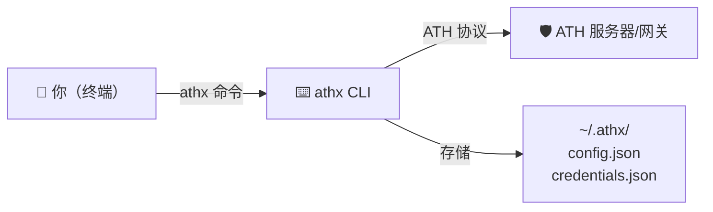

## 安装

```bash
npm install -g athx
```

## athx 在架构中的位置



athx 是 ATH 协议的命令行客户端。它处理密钥管理、认证签名、凭据存储和所有 HTTP 通信。每个命令对应 ATH 流程的一个步骤。

## 配置

```bash
athx config init                              # 创建 ~/.athx/
athx config set-gateway prod https://gw.example.com  # 保存命名网关
athx config set agent-id https://your-agent.com/.well-known/agent.json
athx config set key-path ./private-key.pem    # 可选的持久密钥
```

---

## 完整流程（网关模式）

```bash
athx discover -g prod
athx register -g prod --provider github --scopes "read:user,repo"
athx authorize -g prod --provider github --scopes "read:user"
# → 用户访问 URL 并批准
athx token -g prod --code <code> --session <session_id>
athx proxy -g prod github GET /user
athx proxy -g prod github GET /user/repos
athx revoke -g prod --provider github
```

## 完整流程（原生模式）

```bash
athx discover --mode native --service https://service.example.com
athx register --mode native --service https://service.example.com --provider default --scopes "read,write"
athx authorize --mode native --service https://service.example.com --provider default --scopes "read"
athx token --mode native --service https://service.example.com --code <code> --session <session_id>
athx proxy --mode native --service https://service.example.com default GET /data
```

---

## 命令参考

| 命令 | 功能 |
|------|------|
| `discover` | 获取发现文档 |
| `register` | 注册 Agent（阶段 A） |
| `authorize` | 获取授权 URL（阶段 B） |
| `token` | 用 code+session 交换令牌 |
| `proxy <provider> <method> <path>` | 使用令牌调用 API |
| `revoke` | 撤销当前令牌 |
| `status` | 显示已保存的凭据/令牌 |
| `config init/show/set/set-gateway` | 管理配置 |

## 常用标志

| 标志 | 说明 |
|------|------|
| `-g, --gateway <url or name>` | 网关 URL 或保存的名称 |
| `-m, --mode <gateway\|native>` | 部署模式（默认：gateway） |
| `-s, --service <url>` | 服务 URL（原生模式） |
| `--agent-id <uri>` | 覆盖 Agent 身份 |
| `--key <path>` | ES256 PEM 密钥路径 |
| `--format <text\|json>` | 输出格式 |
| `--provider <id>` | 目标提供商 |
| `--scopes <list>` | 逗号分隔的作用域 |
| `--body <json>` | POST/PUT 的 JSON 请求体 |

---

## 脚本化

使用 `--format json` 获取机器可读输出：

```bash
# 获取仓库列表并用 jq 处理
athx proxy -g prod github GET /user/repos --format json | jq '.[].full_name'

# 在循环中使用
for repo in $(athx proxy -g prod github GET /user/repos --format json | jq -r '.[].full_name'); do
  echo "Issues in $repo:"
  athx proxy -g prod github GET "/repos/$repo/issues?state=open" --format json | jq length
done
```

---

## 凭据存储位置

| 文件 | 内容 |
|------|------|
| `~/.athx/config.json` | 网关名称、Agent ID、密钥路径 |
| `~/.athx/credentials.json` | 每个网关的 `client_id`/`secret` 和令牌 |

凭据跨运行持久化。使用 `athx status -g <gateway>` 查看存储的内容。
