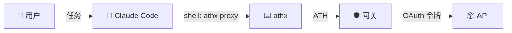

## 工作原理

Claude Code 可以运行 shell 命令。athx CLI 处理 ATH 协议。两者结合，Claude 可以安全地访问用户授权的 API。



---

## 设置（一次性）

在 Claude Code 会话之前，预先授权访问：

```bash
# 配置 athx
athx config init
athx config set-gateway prod https://your-gateway.com
athx config set agent-id https://claude-agent.example/.well-known/agent.json
athx config set key-path ./keys/claude-agent.pem

# 注册并获取用户授权
athx register -g prod --provider github --scopes "read:user,repo"
athx authorize -g prod --provider github --scopes "read:user,repo"
# → 用户访问 URL，批准
athx token -g prod --code <code> --session <session_id>
```

现在 `~/.athx/credentials.json` 中有了有效令牌。Claude Code 可以使用它。

---

## Claude Code 使用方式

授权完成后，Claude Code 可以在任何 shell 命令中调用 `athx proxy`：

```bash
# Claude 在推理过程中运行这些命令：
athx proxy -g prod github GET /user --format json
athx proxy -g prod github GET /repos/owner/repo/issues --format json
athx proxy -g prod github POST /repos/owner/repo/issues --body '{"title":"Bug fix","body":"..."}'
```

### 示例提示

> "查看 ath-protocol/demo 的开放 issues 并总结 bug。"

Claude 执行：
```bash
athx proxy -g prod github GET /repos/ath-protocol/demo/issues?state=open&labels=bug --format json
```

获取 JSON，进行推理，然后给你一个总结。

---

## 安全模型

| 特性 | 工作方式 |
|------|---------|
| **限定范围** | Claude 只能访问用户批准的作用域 |
| **时间限制** | 令牌会过期（默认 1 小时） |
| **可撤销** | `athx revoke -g prod --provider github` |
| **无原始令牌** | Claude 永远看不到 GitHub/Google 的 OAuth 令牌 |
| **可审计** | 所有请求都经过网关 |

---

## 检查令牌状态

```bash
athx status -g prod
```

如果令牌已过期，Claude（或包装脚本）需要重新授权——这需要用户交互。
