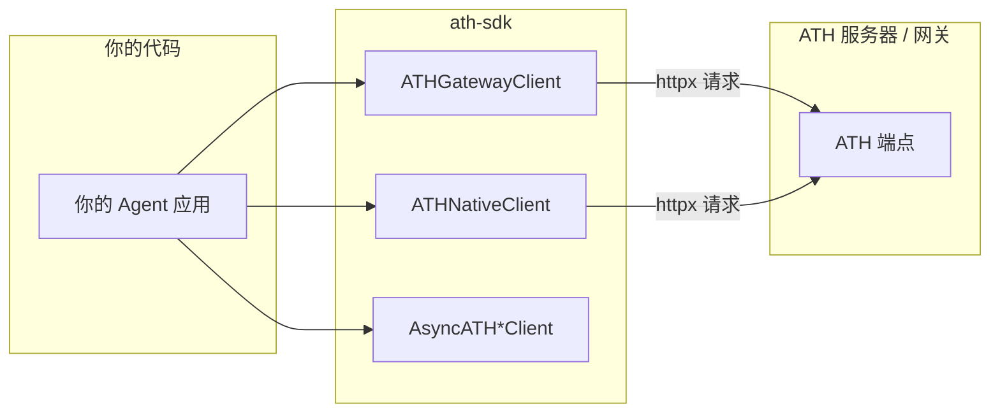

## 安装

```bash
pip install ath-sdk
```

## SDK 在架构中的位置



SDK 处理认证签名、PKCE、状态管理和 HTTP 请求。你只需调用 `discover()`、`register()`、`proxy()` 等高级方法。

## 快速参考

```python
from ath import ATHGatewayClient, ATHNativeClient, AsyncATHGatewayClient, ATHError
```

| 类 | 模式 |
|---|------|
| `ATHGatewayClient` | 同步，网关 |
| `ATHNativeClient` | 同步，原生 |
| `AsyncATHGatewayClient` | 异步，网关 |
| `AsyncATHNativeClient` | 异步，原生 |

---

## 创建客户端

```python
from cryptography.hazmat.primitives.asymmetric import ec
from cryptography.hazmat.primitives import serialization

key = ec.generate_private_key(ec.SECP256R1())
pem = key.private_bytes(
    serialization.Encoding.PEM,
    serialization.PrivateFormat.PKCS8,
    serialization.NoEncryption(),
).decode()

# 使用上下文管理器（自动关闭 HTTP 连接）
with ATHGatewayClient(
    url="http://gateway.example.com",
    agent_id="https://your-agent.com/.well-known/agent.json",
    private_key=pem,
    key_id="my-key-2024",  # 可选
    timeout=60.0,           # 可选
) as client:
    ...
```

---

## API 方法

### `discover()`

```python
# 网关
doc = client.discover()
for p in doc.supported_providers:
    print(p.provider_id, p.available_scopes)

# 原生
doc = client.discover()  # 同时设置内部 api_base
print(doc.app_id, doc.auth.scopes_supported)
```

### `register(...)`

```python
reg = client.register(
    developer={"name": "Acme", "id": "acme"},
    providers=[{"provider_id": "github", "scopes": ["read:user", "repo"]}],
    purpose="Code review assistant",
)
print(reg.client_id, reg.agent_status)
```

### `authorize(provider, scopes, ...)`

```python
auth = client.authorize("github", ["read:user"])
print("Send user to:", auth.authorization_url)
print("Session:", auth.ath_session_id)
```

### `exchange_token(code, session_id)`

```python
token = client.exchange_token("auth-code", "ath_sess_...")
print(token.access_token, token.effective_scopes)
```

### `proxy()` / `api()`

```python
# 网关
user = client.proxy("github", "GET", "/user")
repos = client.proxy("github", "POST", "/user/repos", {"name": "new-repo"})

# 原生
products = client.api("GET", "/products")
order = client.api("POST", "/orders", {"shippingAddress": "..."})
```

### `revoke()`

```python
client.revoke()
```

---

## 凭据持久化

跨会话保存和恢复凭据：

```python
# 注册后——保存
client.save_credentials("creds.json")

# 之后的会话——恢复
client.load_credentials("creds.json")

# 或手动设置
client.set_credentials(client_id="ath_abc", client_secret="ath_secret_xyz")
client.set_token("ath_tk_...")
```

---

## 异步客户端

```python
import asyncio
from ath import AsyncATHGatewayClient

async def main():
    async with AsyncATHGatewayClient(url=..., agent_id=..., private_key=pem) as client:
        await client.discover()
        await client.register(...)
        auth = await client.authorize("github", ["read:user"])
        token = await client.exchange_token(code, auth.ath_session_id)
        data = await client.proxy("github", "GET", "/user")
        await client.revoke()

asyncio.run(main())
```

---

## 错误处理

```python
from ath import ATHError

try:
    data = client.proxy("github", "GET", "/user")
except ATHError as e:
    print(f"[{e.code}] {e.message}")
    if e.code == "TOKEN_EXPIRED":
        # 重新授权
        pass
    elif e.code == "NOT_REGISTERED":
        # 先注册
        pass
```
