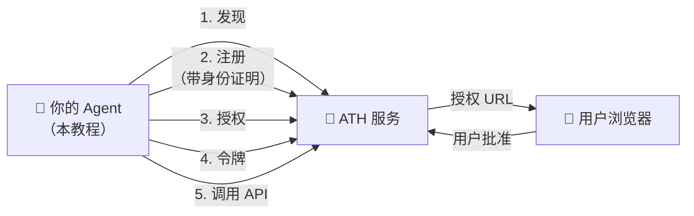
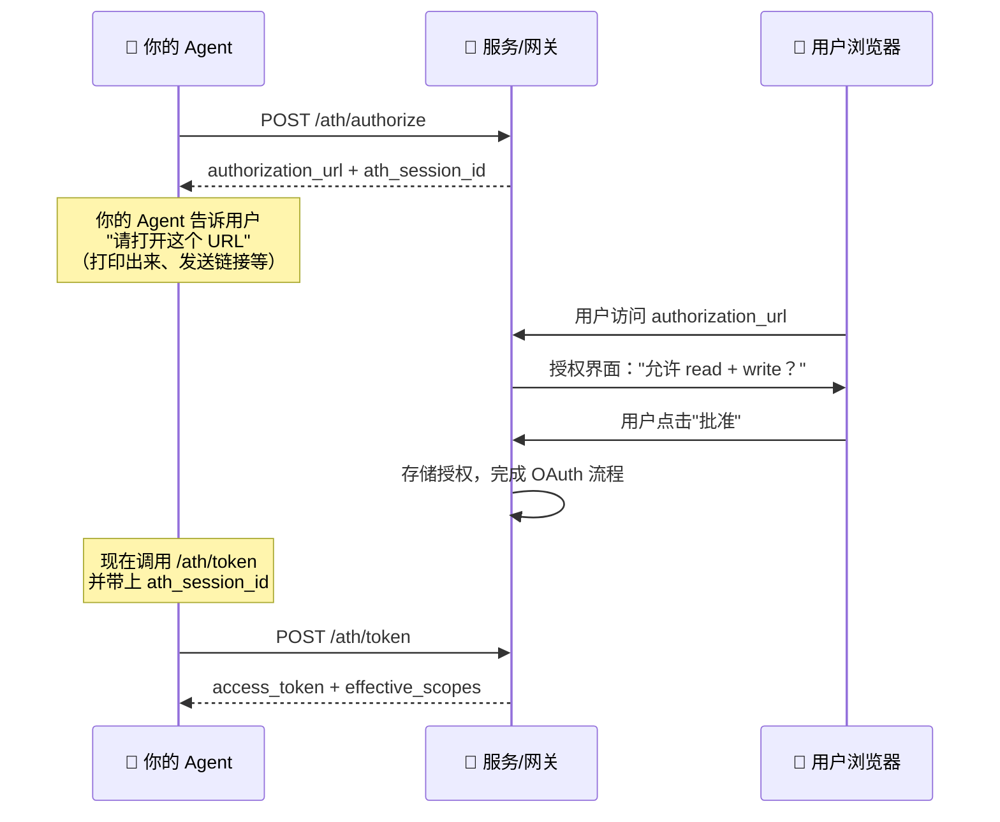

## 我们要构建什么

一个连接到 ATH 保护服务的 Agent，证明自己的身份，获取用户批准，然后调用服务的 API。



---

## 开始之前

### 你需要什么

| 需求 | 原因 | 详情 |
|------|------|------|
| **一个可连接的 ATH 保护服务** | 你的 Agent 需要一个通信对象 | 使用[演示](/zh/start-here/run-the-demo)，或任何启用了 ATH 的服务/网关 |
| **Node.js 20+ 或 Python 3.10+** | 运行 SDK | 或使用 `athx` CLI（仅需 Node.js） |
| **一对 ES256 密钥** | 证明 Agent 的身份。每个 ATH 请求都包含一个用你的私钥创建的签名证明（"我就是这个 Agent"）。 | SDK 可以为你生成。参见下方步骤 1。 |

### 关于 `agentId`——我需要公网 URL 吗？

`agentId` 是指向你 Agent 的**身份文档**的 URL——一个 JSON 文件，包含 Agent 的名称、开发者信息和公钥。在生产环境中，服务器会获取这个 URL 来拿到你的公钥并验证身份证明。

| 场景 | 需要托管 `agentId` 吗？ | 怎么办 |
|------|:----------------------:|--------|
| **开发环境**（服务器设置了 `skipAttestationVerification`） | 不需要 | 使用任意 URL 作为占位符。服务器不会实际获取。 |
| **网关模式**（生产环境） | 取决于网关配置 | 许多网关信任已注册的 Agent 而不获取身份文档。 |
| **原生模式**（生产环境） | 需要 | 将 `agent.json` 托管在服务器可达的 URL 上。参见步骤 1。 |

---

## 步骤 1：设置 Agent 身份

ATH 中每个 Agent 都有一个**身份**——一对密钥和将它们绑定在一起的文档。可以把它想象成一张身份证：文档就是卡片，私钥证明你就是卡上的人。

### 生成 ES256 密钥对

<Tabs>
  <Tab title="TypeScript">
    ```typescript
    import { generateKeyPair, exportJWK, exportPKCS8 } from "jose";
    import fs from "fs";

    // 生成密钥对
    const { publicKey, privateKey } = await generateKeyPair("ES256", {
      extractable: true,
    });

    // 保存私钥（务必保密！）
    const privatePem = await exportPKCS8(privateKey);
    fs.writeFileSync("agent-private.pem", privatePem);

    // 将公钥导出为 JWK（这会放入你的身份文档）
    const publicJwk = await exportJWK(publicKey);
    publicJwk.kid = "default";
    publicJwk.alg = "ES256";
    console.log("Public JWK:", JSON.stringify(publicJwk, null, 2));
    ```
  </Tab>
  <Tab title="Python">
    ```python
    from cryptography.hazmat.primitives.asymmetric import ec
    from cryptography.hazmat.primitives import serialization
    import json

    # 生成密钥对
    private_key = ec.generate_private_key(ec.SECP256R1())

    # 保存私钥（务必保密！）
    pem = private_key.private_bytes(
        serialization.Encoding.PEM,
        serialization.PrivateFormat.PKCS8,
        serialization.NoEncryption(),
    )
    with open("agent-private.pem", "wb") as f:
        f.write(pem)

    # PEM 字符串就是你传给 SDK 的内容
    pem_str = pem.decode()
    print("Private key saved to agent-private.pem")
    ```
  </Tab>
  <Tab title="OpenSSL（任何语言）">
    ```bash
    # 生成私钥
    openssl ecparam -genkey -name prime256v1 -noout -out agent-private.pem

    # 提取公钥（用于身份文档）
    openssl ec -in agent-private.pem -pubout -out agent-public.pem
    ```
  </Tab>
</Tabs>

<Accordion title="什么是 ES256？">
ES256 是一种使用 P-256 椭圆曲线的数字签名算法。它生成两个密钥：
- **私钥** ——由 Agent 保密。用于签署身份证明。
- **公钥** ——公开分享。服务器用它来验证证明。

你不需要理解密码学。只需知道：私钥 = 保密，公钥 = 可分享，SDK 会自动处理所有签名。
</Accordion>

### 创建身份文档

这个 JSON 文件告诉服务器你的 Agent 是谁以及如何验证其身份：

```json
{
  "ath_version": "0.1",
  "agent_id": "https://your-agent.com/.well-known/agent.json",
  "name": "My Shopping Agent",
  "developer": {
    "name": "Your Company",
    "id": "your-company",
    "contact": "dev@your-company.com"
  },
  "capabilities": ["product-browsing", "order-placement"],
  "public_key": {
    "kty": "EC",
    "crv": "P-256",
    "x": "... from your exported JWK ...",
    "y": "... from your exported JWK ...",
    "kid": "default",
    "alg": "ES256"
  }
}
```

| 字段 | 用途 |
|------|------|
| `agent_id` | 此文档托管的 URL。服务器获取此 URL 来获得你的公钥。 |
| `name` | 用户可读的名称，显示在授权界面上 |
| `developer` | 谁构建了这个 Agent——帮助服务运营者评估信任度 |
| `capabilities` | Agent 的功能——信息性的，不会被强制执行 |
| `public_key` | JWK 格式的公钥。服务器用它验证你的身份证明。 |

### 托管身份文档（仅生产环境）

在生产环境中，将此 JSON 文件托管在 `agent_id` 指定的 URL 上。例如，如果你的 `agent_id` 是 `https://your-agent.com/.well-known/agent.json`，则该文件必须在该 URL 可获取。

演示中包含一个最小的身份服务器（`agent/server.ts`）来做这件事——它只是一个有单一路由的 Express 服务器。

<Accordion title="我在开发环境——需要托管吗？">
**不需要。** 如果你连接的服务器设置了 `skipAttestationVerification: true`（如演示），它不会获取你的身份文档。创建客户端时你仍需提供 `agentId` 字符串，但可以是任意 URL——服务器只是将它作为标签存储，不会实际获取。

在网关模式中，许多网关也会跳过或缓存身份验证，所以即使在生产环境中你也可能不需要可达的 URL。请咨询你的网关运营者。
</Accordion>

---

## 步骤 2：连接到服务

现在使用你的密钥对创建 ATH 客户端并完成协议流程。

### SDK 为你做了什么

当你调用 `register()`、`authorize()` 或 `exchangeToken()` 时，SDK 会自动：
1. 创建一个新的**认证 JWT**（身份证明），包含你的 `agentId`、时间戳和唯一 ID
2. 用你的**私钥**签名
3. 将其包含在发送给服务器的 HTTP 请求中

服务器收到 JWT 后，从你的 `agent_id` URL 获取公钥（或在开发环境中跳过），验证签名。如果匹配，服务器就知道请求确实来自你的 Agent。

你永远不需要自己构建或签署 JWT——SDK 会处理一切。

### 完整流程

<Tabs>
  <Tab title="TypeScript SDK">
    ```bash
    npm install @ath-protocol/client jose
    ```

    ```typescript
    import { ATHGatewayClient } from "@ath-protocol/client";
    import { importPKCS8 } from "jose";
    import fs from "fs";

    // 加载持久化的私钥（或在开发环境中生成临时密钥）
    const pem = fs.readFileSync("agent-private.pem", "utf-8");
    const privateKey = await importPKCS8(pem, "ES256");

    const client = new ATHGatewayClient({
      url: "https://your-gateway.com",
      agentId: "https://your-agent.com/.well-known/agent.json",
      privateKey,
      keyId: "default",  // 必须与身份文档中的 "kid" 匹配
    });

    // 1. 发现——有哪些提供商和作用域可用？
    const discovery = await client.discover();
    console.log("Providers:");
    for (const p of discovery.supported_providers) {
      console.log(`  ${p.provider_id}: ${p.available_scopes.join(", ")}`);
    }

    // 2. 注册——"我是一个 Agent，可以访问这个提供商吗？"
    //    SDK 自动用你的私钥签署认证 JWT。
    const reg = await client.register({
      developer: { name: "My Company", id: "my-company" },
      providers: [{ provider_id: "my-provider", scopes: ["read", "write"] }],
      purpose: "AI shopping assistant",
    });
    console.log("Agent status:", reg.agent_status);
    // reg.client_id 和 reg.client_secret 由 SDK 内部存储

    // 3. 授权——"请让用户批准我"
    //    返回一个 URL 供用户在浏览器中访问。
    const auth = await client.authorize("my-provider", ["read", "write"]);
    console.log("Send the user to this URL:", auth.authorization_url);
    console.log("Session ID (save this!):", auth.ath_session_id);

    // ⏳ 等待——用户在浏览器中打开 URL，看到列出权限的授权界面，
    //    然后点击"批准"。
    //    如果用户 10 分钟内不操作，会话将过期。

    // 4. 令牌——"用户已批准，给我访问令牌"
    const token = await client.exchangeToken("auth-code", auth.ath_session_id);
    console.log("Access token:", token.access_token);
    console.log("Granted scopes:", token.effective_scopes);
    console.log("Scope breakdown:", token.scope_intersection);
    // {
    //   agent_approved: ["read", "write"],   ← 服务批准的
    //   user_consented: ["read", "write"],   ← 用户批准的
    //   effective: ["read", "write"]         ← 交集（你实际获得的）
    // }

    // 5. 使用 API——通过 ATH 代理转发调用端点
    const products = await client.proxy("my-provider", "GET", "/products");
    console.log("Products:", products);

    // 带请求体的 POST 请求：
    await client.proxy("my-provider", "POST", "/cart/add", {
      productId: "prod-123",
      quantity: 2,
    });

    // 6. 撤销——完成后清理（令牌也会自然过期）
    await client.revoke();
    console.log("Token revoked. Done!");
    ```
  </Tab>
  <Tab title="Python SDK">
    ```bash
    pip install ath-sdk cryptography
    ```

    ```python
    from ath import ATHGatewayClient

    # 加载私钥
    with open("agent-private.pem") as f:
        pem = f.read()

    with ATHGatewayClient(
        url="https://your-gateway.com",
        agent_id="https://your-agent.com/.well-known/agent.json",
        private_key=pem,
        key_id="default",
    ) as client:

        # 1. 发现
        discovery = client.discover()
        for p in discovery.supported_providers:
            print(f"  {p.provider_id}: {p.available_scopes}")

        # 2. 注册——SDK 自动签署认证 JWT
        reg = client.register(
            developer={"name": "My Company", "id": "my-company"},
            providers=[{"provider_id": "my-provider", "scopes": ["read", "write"]}],
            purpose="AI shopping assistant",
        )
        print(f"Agent status: {reg.agent_status}")

        # 3. 授权——获取用户授权 URL
        auth = client.authorize("my-provider", ["read", "write"])
        print(f"Send user to: {auth.authorization_url}")
        print(f"Session ID: {auth.ath_session_id}")

        # ⏳ 等待用户在浏览器中批准（10 分钟超时）

        # 4. 令牌
        token = client.exchange_token("auth-code", auth.ath_session_id)
        print(f"Granted scopes: {token.effective_scopes}")

        # 5. 使用 API
        products = client.proxy("my-provider", "GET", "/products")
        print(f"Products: {products}")

        client.proxy("my-provider", "POST", "/cart/add", {
            "productId": "prod-123", "quantity": 2,
        })

        # 6. 撤销
        client.revoke()

        # 保存凭据用于下次会话（避免重新注册）
        client.save_credentials("my-agent-creds.json")
    ```
  </Tab>
  <Tab title="athx CLI">
    ```bash
    npm install -g athx

    # 配置（一次性）
    athx config init
    athx config set-gateway my-gw https://your-gateway.com
    athx config set agent-id https://your-agent.com/.well-known/agent.json
    athx config set key-path ./agent-private.pem  # 你的 ES256 私钥
    ```

    ```bash
    GATEWAY="my-gw"

    # 1. 发现
    athx discover -g $GATEWAY

    # 2. 注册
    athx register -g $GATEWAY --provider my-provider --scopes "read,write"

    # 3. 授权——打印一个 URL 供用户访问
    athx authorize -g $GATEWAY --provider my-provider --scopes "read,write"
    # 输出：
    #   Session: ath_sess_abc123
    #   Please visit: https://...
    # → 在浏览器中打开该 URL，登录，点击批准

    # 4. 令牌——用户批准后
    athx token -g $GATEWAY --code AUTH_CODE --session ath_sess_abc123

    # 5. 使用 API
    athx proxy my-provider GET /products -g $GATEWAY
    athx proxy my-provider POST /cart/add -g $GATEWAY \
      --body '{"productId":"prod-123","quantity":2}'

    # 6. 撤销
    athx revoke -g $GATEWAY --provider my-provider
    ```

    如果不配置 `--key-path`，athx 每次运行会生成**临时密钥**。这在开发环境（配有 `skipAttestationVerification`）中可以工作，但意味着每次重启 Agent 身份都会改变。
  </Tab>
</Tabs>

---

## 理解关键概念

### 认证 JWT（身份证明）

SDK 每次调用 register、authorize 或 token 时，都会创建并签署一个如下的 JWT：

```json
{
  "iss": "https://your-agent.com",
  "sub": "https://your-agent.com/.well-known/agent.json",
  "aud": "https://your-gateway.com",
  "iat": 1714500000,
  "exp": 1714503600,
  "jti": "unique-random-id-12345"
}
```

| 字段 | 含义 |
|------|------|
| `iss` | "我由这个域名的 Agent 创建" |
| `sub` | "我的身份文档在这个 URL" |
| `aud` | "我正在与这个特定的服务器通信"（防止证明被重放到其他服务器） |
| `iat` | "我在此时创建了这个证明"（必须在服务器时间 5 分钟内） |
| `exp` | "此证明在此时间过期" |
| `jti` | "这是唯一的证明"（防止同一证明被重复使用） |

**你永远不需要自己构建这个。** SDK 会自动构建并签名。但理解其内容有助于你调试 `INVALID_ATTESTATION` 等错误。

### 用户授权步骤

步骤 3（授权）返回一个 URL。这是初学者最困惑的部分，以下是具体发生的事情：



关键点：
- **你的 Agent 不处理 OAuth 重定向。** 服务/网关处理回调。
- **你的 Agent 只是等待。** 获得 `authorization_url` 后，展示给用户并等待。
- **会话在 10 分钟后过期。** 如果用户未及时批准，需重新调用 `authorize`。
- **你将 `ath_session_id` 传给令牌交换**——这是服务器将授权与你的令牌请求匹配的方式。

### 网关模式 vs 原生模式

| | 网关 | 原生 |
|-|------|------|
| **连接到** | `ATHGatewayClient` / `--gateway` | `ATHNativeClient` / `--mode native` |
| **API 调用通过** | `proxy(provider, method, path)` | `api(method, path)` |
| **Agent 需要公网 URL？** | 不需要（多数配置下） | 需要（带验证的生产环境） |
| **适用场景** | 通过网关连接外部服务 | 直接连接 ATH 原生服务 |

---

## 常见错误及其含义

| 错误 | 最可能的原因 | 修复方法 |
|------|------------|---------|
| `INVALID_ATTESTATION` | 认证 JWT 过期、audience 错误或已被使用 | SDK 自动创建新 JWT——检查系统时钟是否准确，服务器 URL 是否与配置一致 |
| `AGENT_NOT_REGISTERED` | 在注册前调用了 authorize 或 token | 先调用 `register()` |
| `SCOPE_NOT_APPROVED` | 请求了服务未批准的作用域 | 检查 `reg.approved_providers` 看实际批准了什么 |
| `SESSION_EXPIRED` | authorize 和 token 之间超过 10 分钟 | 重新调用 `authorize()` 获取新会话 |
| `TOKEN_EXPIRED` | 令牌的 `expires_in` 已过（默认 1 小时） | 重新 `authorize()` → 用户批准 → `exchangeToken()` |
| `PROVIDER_MISMATCH` | 令牌是为不同提供商签发的 | 每个令牌只适用于一个提供商 |

---

## 用演示试试看

运行 [ATH Demo](/zh/start-here/run-the-demo) 来测试真实的电商服务：

```bash
git clone https://github.com/ath-protocol/demo.git
cd demo && cd demo/native
docker compose up --build
```

然后将你的 Agent 指向演示并按上述步骤操作。

---

## 下一步

- [TypeScript SDK 参考](/zh/build-an-agent/typescript-sdk) ——完整 API、错误处理模式
- [Python SDK 参考](/zh/build-an-agent/python-sdk) ——同步/异步、凭据持久化
- [athx CLI 参考](/zh/build-an-agent/athx-cli) ——所有命令、JSON 输出脚本化
- [LangChain 集成](/zh/build-an-agent/langchain) ——将 ATH API 封装为 LangChain 工具
- [Claude Code 集成](/zh/build-an-agent/claude-code) ——在 Claude Code Agent 中使用 athx
