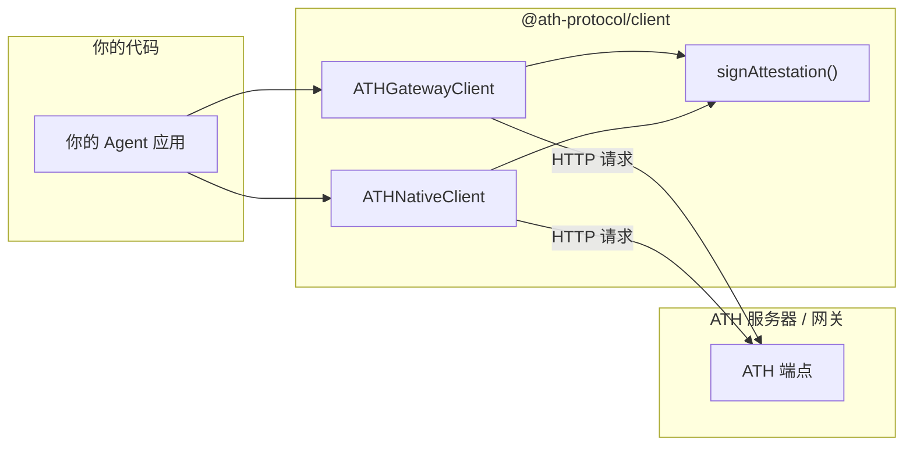

## 安装

```bash
npm install @ath-protocol/client jose
```

## SDK 在架构中的位置



SDK 处理认证签名、PKCE、状态管理和 HTTP 通信。你只需调用 `discover()`、`register()`、`proxy()` 等高级方法。

## 快速参考

```typescript
import { ATHGatewayClient, ATHNativeClient, ATHClientError } from "@ath-protocol/client";
import { generateKeyPair } from "jose";
```

| 类 | 适用场景 |
|---|---------|
| `ATHGatewayClient` | 通过网关连接 |
| `ATHNativeClient` | 直接连接 ATH 服务 |

两者共享相同的注册/授权/令牌流程。区别在于获得令牌后如何调用 API。

---

## 创建客户端

```typescript
const { privateKey } = await generateKeyPair("ES256");

// 网关模式
const gateway = new ATHGatewayClient({
  url: "http://gateway.example.com",
  agentId: "https://your-agent.com/.well-known/agent.json",
  privateKey,
  keyId: "my-key-2024",  // 可选，默认："default"
});

// 原生模式
const native = new ATHNativeClient({
  url: "https://service.example.com",
  agentId: "https://your-agent.com/.well-known/agent.json",
  privateKey,
});
```

<Accordion title="关于密钥管理">
- **开发环境：** `generateKeyPair("ES256")` 每次运行创建临时密钥。简单但服务器无法跨重启验证你的身份。
- **生产环境：** 使用 `jose` 的 `importPKCS8(pem, "ES256")` 加载持久化 PEM 密钥。在你的 `agentId` URL 上发布对应的公钥。
</Accordion>

---

## API 方法

### `discover()`

```typescript
// 网关：返回 DiscoveryDocument（提供商列表）
const doc = await gateway.discover();
doc.supported_providers.forEach(p => console.log(p.provider_id, p.available_scopes));

// 原生：返回 ServiceDiscoveryDocument（单个服务）
const doc = await native.discover();
console.log(doc.app_id, doc.auth.scopes_supported);
```

### `register(options)`

```typescript
const reg = await client.register({
  developer: { name: "Acme Corp", id: "acme" },
  providers: [
    { provider_id: "github", scopes: ["read:user", "repo"] },
  ],
  purpose: "Code review assistant",
  redirectUris: ["https://your-agent.com/callback"],  // 可选
});

console.log(reg.client_id);        // "ath_abc123"
console.log(reg.agent_status);     // "approved" | "pending" | "denied"
console.log(reg.approved_providers[0].approved_scopes);
```

### `authorize(provider, scopes, options?)`

```typescript
const auth = await client.authorize("github", ["read:user"], {
  redirectUri: "https://your-agent.com/done",  // 可选
  resource: "https://api.github.com",         // 可选 RFC 8707
});

console.log(auth.authorization_url);  // 引导用户访问此 URL
console.log(auth.ath_session_id);     // 保存用于令牌交换
```

### `exchangeToken(code, sessionId)`

```typescript
const token = await client.exchangeToken("auth-code", "ath_sess_...");

console.log(token.access_token);      // 不透明的 ATH 令牌
console.log(token.effective_scopes);  // 你实际获得的权限
console.log(token.scope_intersection); // 各方批准权限的详细分解
```

### `proxy()` / `api()`

```typescript
// 网关：proxy(provider, method, path, body?)
const user = await gateway.proxy("github", "GET", "/user");
const repo = await gateway.proxy("github", "POST", "/user/repos", { name: "new-repo" });

// 原生：api(method, path, body?)
const products = await native.api("GET", "/products");
const order = await native.api("POST", "/orders", { shippingAddress: "..." });
```

### `revoke()`

```typescript
await client.revoke();  // 使当前令牌失效
```

---

## 错误处理

```typescript
import { ATHClientError } from "@ath-protocol/client";

try {
  await client.proxy("github", "GET", "/user");
} catch (e) {
  if (e instanceof ATHClientError) {
    switch (e.code) {
      case "TOKEN_EXPIRED":   /* 重新授权 */ break;
      case "SCOPE_NOT_APPROVED": /* 请求不同的作用域 */ break;
      case "AGENT_NOT_REGISTERED": /* 先注册 */ break;
    }
  }
}
```

完整列表参见[错误码](/zh/reference/error-codes)。
